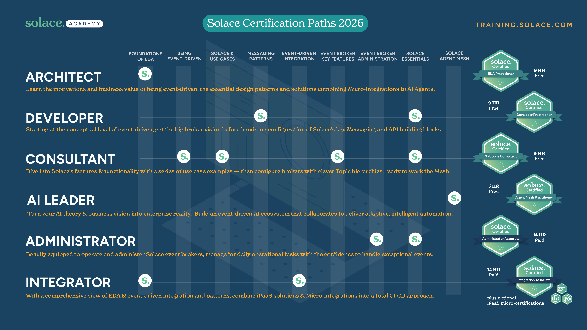
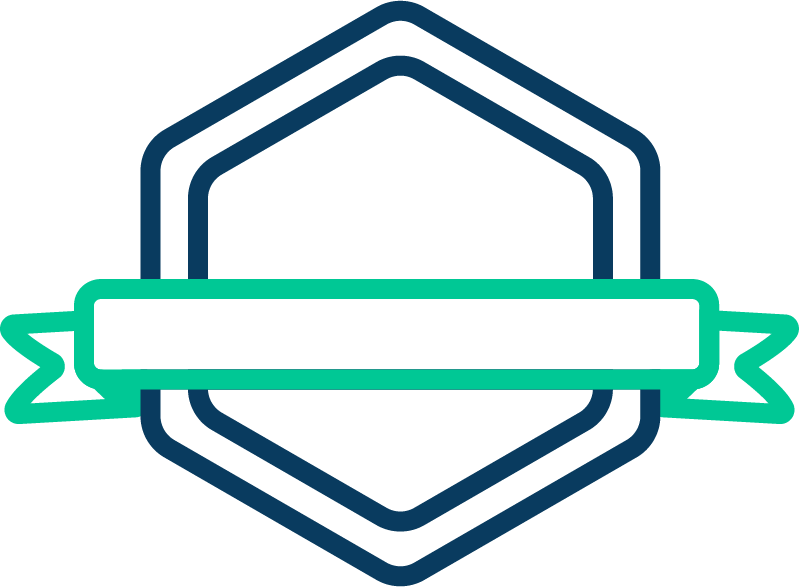

  

Solace Academy offers role-oriented technical certifications through structured learning paths. A path groups courses that build product and event-driven integration skills with an exam that validates them. Passing an exam earns a digital certificate and badge. See the [official Solace certification catalog](https://solace.com/learn/certifications/) for current program details.

## Certification paths

The Academy catalog capture used for this repository lists these learning paths:

- Solace Certified Agent Mesh Practitioner Path
- Solace Certified Event-Driven Integration - Boomi
- Solace Certified Event-Driven Integration - SAP
- Solace Certified Event-Driven Integration - MuleSoft
- Solace Certified Integration Associate Path
- Solace Certified Developer Practitioner Path
- Solace Certified EDA Practitioner Path
- Solace Certified Event Broker Administrator Associate Path
- Solace Certified Solutions Consultant Path

Certification names, course lineups, availability, and estimates can change. Use the [current catalog](https://solace.com/learn/certifications/) as the source of truth.

## Technical certification paths

## Digital credentials

Solace issues digital credentials to learners who pass certification exams. The badge can be shared on professional profiles and resumes. Read the [official certification information](https://solace.com/learn/certifications/) for current exam and credential details.
