# Solace Developer Practitioner

## Academy lesson record

The course syllabus lists one lesson with this title. Its content type is SCORM. The Academy initially marked it In progress and showed 0 of 1 lessons completed; after the SCORM module was completed and exited on 2026-09-28, the course page showed Course completed and the syllabus marked this lesson Completed. The estimated course duration is 5 hours.

The module contains 11 internal sections. Per the Academy syllabus, they are recorded here within this single lesson:

1. Being Event Driven - Completed.
2. Messaging Patterns - Completed.
3. Event Driven Architecture Design Patterns - Completed.
4. Event Driven Microservices - Completed.
5. Security - Completed.
6. Direct Messaging - Completed.
7. Guaranteed Messaging - Completed.
8. APIs and Protocols - Completed.
9. Connectors - Completed.
10. API Tutorials and Codelabs - Completed.
11. Additional Developer Resources - Completed.

Review of the captured screens across all 11 internal sections found no quiz or knowledge-check prompts; no answer choices, submitted quiz answers, or quiz feedback were presented for capture.

The SCORM player header showed 0% complete when first opened. On 2026-09-28, the module reached 100% complete and all 11 internal sections were marked Completed. Before exiting the SCORM player, the Academy course page still showed 0 of 1 syllabus lessons completed; after exit, it showed Course completed and the syllabus lesson showed Completed.

## Course page captured before entering the module

The course is mandatory English e-learning in the Solace Certified Developer Practitioner Path. Its description says it contains information needed to answer questions on the Solace Certified Developer Practitioner Exam. The course player offered “Resume training”; no lesson instructional content was visible on this pre-launch screen.

## 1. Being Event Driven

### Screen and content

Lesson 1 of 11, presented by Dishant Langayan. The title card reads “Be Event Driven.” The visible summary says event-driven means being **Actionable**, **Relevant**, and **Real-Time**.

Additional reading resources listed:

- [Event-Driven Architecture Myth Busting — Part 1: Five Common EDA Claims](https://solace.com/blog/event-driven-architecture-myth-busting-part-1/)
- [Event-Driven Architecture Myth Busting — Part 2: Five More EDA Claims](https://solace.com/blog/event-driven-architecture-myth-busting-part-2/)

The lesson screen contained a main course video player and an embedded YouTube video. The YouTube embed was titled “The Benefits of Event-Driven Architecture and Why You Need to be Ready For It” by Solace (https://www.youtube.com/watch?v=AzoTdV6PWrY). A transcript export check reported that no transcript is available for the embedded video. The main player controls exposed no captions toggle. During the initial course capture, the main course video was paused with 11:59 remaining. Its narration was not reviewed; the SCORM outline nevertheless marked this section Completed.

### Visuals

### Notes

_The SCORM outline marks this section Completed. Its visible summary and linked reading titles are captured above; the main video narration was not reviewed, and no transcript or captions were available._

## 2. Messaging Patterns

### Academy state

This is internal SCORM lesson 2 of 11 by Dishant Langayan. An early capture showed this section at 17% complete and the module at 9% overall. It was unstarted when the module was first opened.

### Screen: Message Exchange Patterns

Most messaging applications can be reduced to interactions that follow one of three messaging exchange patterns (MEPs):

1. Publish-Subscribe
2. Point-to-Point
3. Request-Reply

A quote attributed to *Enterprise Integrations Patterns* says: “Patterns are not 'invented'; they are harvested from repeated use in practice.”

### Publish-Subscribe

The diagram shows one producer path branching into three separate message paths, each reaching a different consumer. The screen explains that each consumer receives its own copy of a producer's message for processing, so the message can be processed multiple times by different consumers.

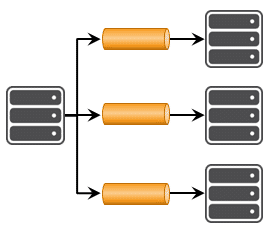

The SCORM screen displayed a “CONTINUE” button after this content. Selecting it revealed the Point-to-Point content below.
### Screen: Point-to-Point

With Point-to-Point messaging, messages sent by the Producer are processed by a single Consumer.

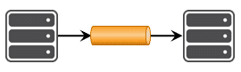

### Non-Exclusive Consumption

The screen presents consumer groups as an extension to traditional Point-to-Point messaging: multiple consumers share one channel or queue. This increases the scale of the receiving application, while each individual message is still delivered to a single endpoint.

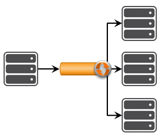

At this screen, the SCORM outline showed Messaging Patterns at 67% complete. The “CONTINUE” control was selected after this screen was recorded, revealing the Request-Reply content below.
### Screen: Request-Reply

With request-reply messaging, applications achieve two-way communication using separate point-to-point channels: one for requests and another for replies.

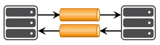

The SCORM outline marked Messaging Patterns Completed at this screen. The visible next section link was “Lesson 3 - Event Driven Architecture Design Patterns”; after recording this screen, the link was selected.

## 3. Event Driven Architecture Design Patterns

### Academy state

This is internal SCORM lesson 3 of 11 by Dishant Langayan. The module showed 18% complete overall at entry. After all three pattern screens and the recap were viewed, the outline marked this section Completed and showed the module at 27% overall.

### Definition screen

The screen defines a design pattern as “a general, reusable solution to a commonly occurring problem.”

### Video

The visible video poster is titled “Design Patterns for Event Driven Architectures.”

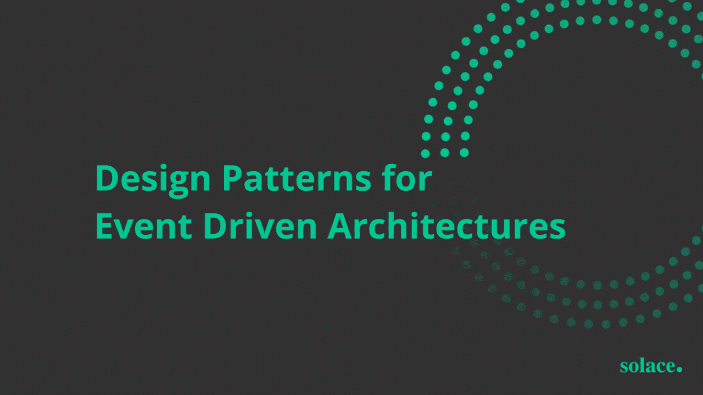

The player exposed an MP4 video lasting 8:14. It has no caption or subtitle tracks, and no transcript was visible. The narration is not transcribed here; the following notes capture the text shown on its slides.

### Screen: Design Patterns for Being Distributed

The video opens by framing problems that arise when components are distributed, with a user communicating through a boundary to several service components that exchange messages with one another. Its overview slide names three patterns: Retry Pattern, Idempotent Processor Pattern, and Publish-Subscribe Pattern.

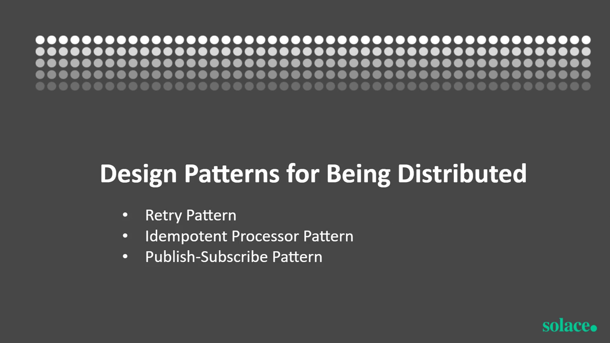

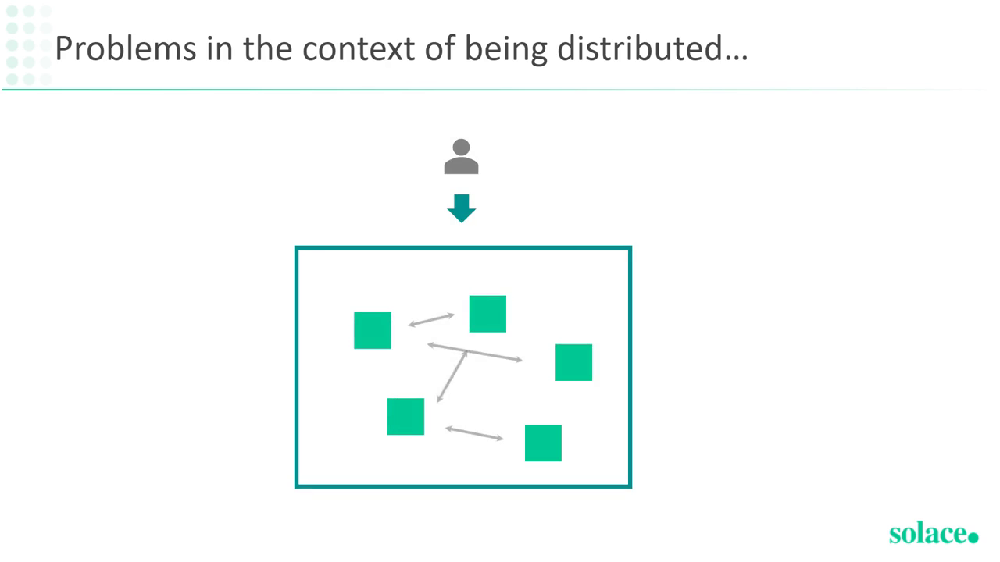

The Retry Pattern addresses transient unavailability or failure of a component. The examples are requests for configuration or initialization information and requests for login. The slide lists timeout logic, retry logic (finite vs. infinite), and back-off or anti-flood parameters as implementation steps.

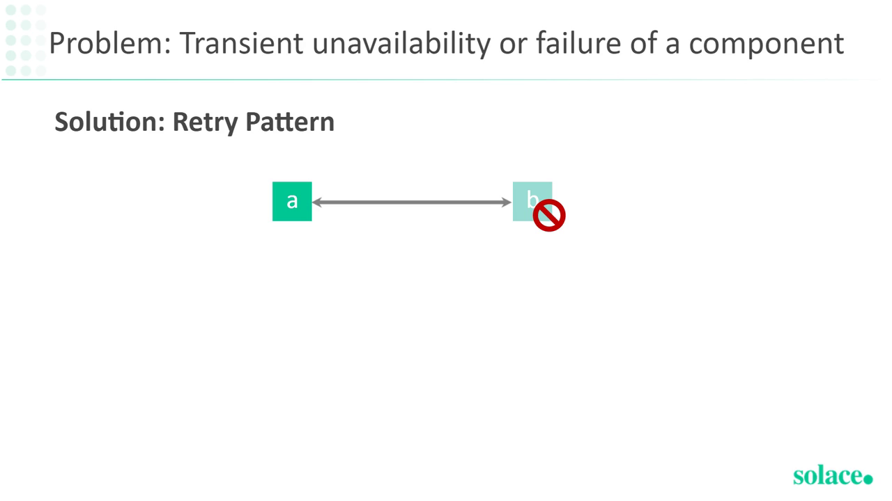

The Idempotent Processor Pattern addresses receiving duplicate or repeated data. The example is a new order submission. The slide lists sequence numbers or unique IDs, duplicate detection or suppression, and retransmit flag inspection as implementation steps.

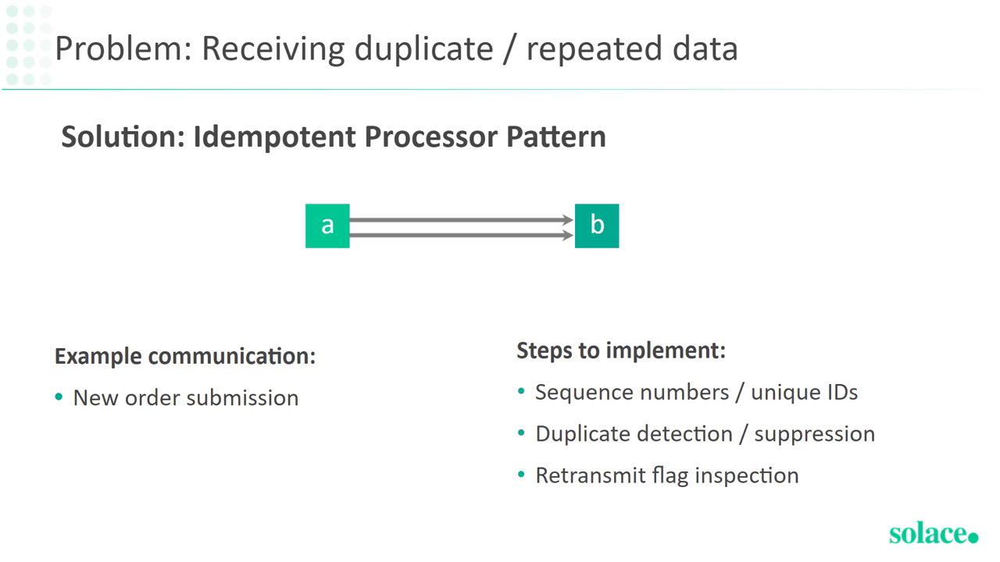

The Publish-Subscribe Pattern addresses sending to multiple or unknown n-consumers. The examples are catalogue updates and heartbeat or status messages. The slide lists addressing by the data rather than the target consumer, and decoupling via an intermediate component, as implementation steps.

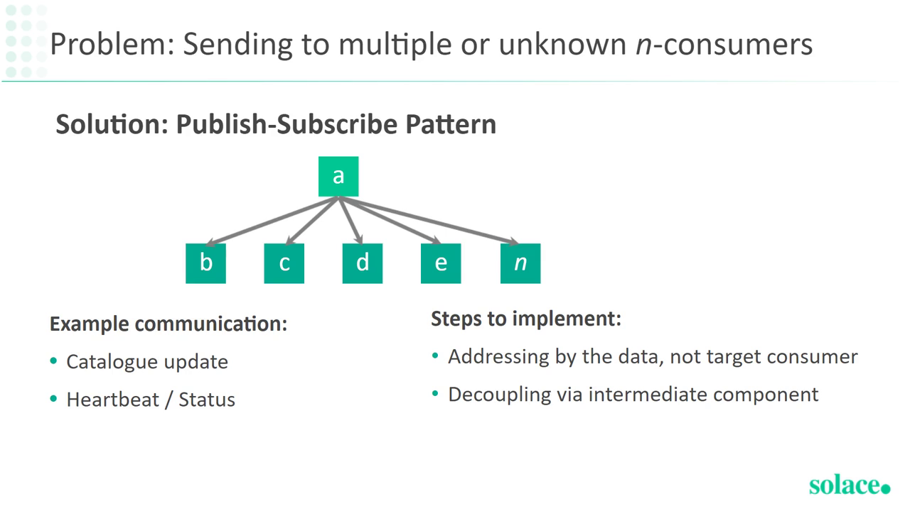

The SCORM screen displayed “CONTINUE” after this video content. Selecting it revealed the next screen, “Design Patterns for Being Scalable.”

### Screen: Design Patterns for Being Scalable

This screen contains a second video, lasting 5:59. Its overview slide names the Asynchronous Request-Reply Pattern, Queue-Based Load Leveling Pattern, and Competing Consumers Pattern. The video has no caption or subtitle tracks, and no transcript was visible. The narration is not transcribed here; the notes below capture the slide text.

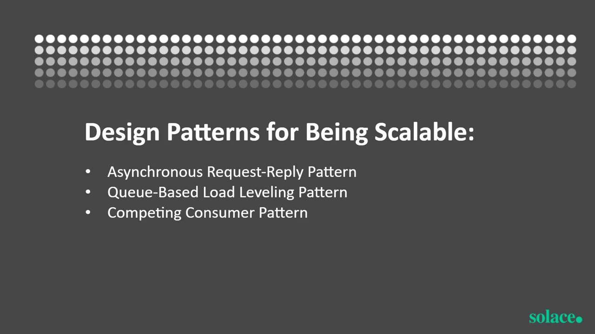

The Asynchronous Request-Reply Pattern addresses being blocked while waiting on a slower service. The example is a new order submission and acceptance confirmation. The slide lists asynchronous and parallel versus sequential processing, tracking outstanding requests or deferred execution, and timeout, retry, or cancel logic as implementation steps.

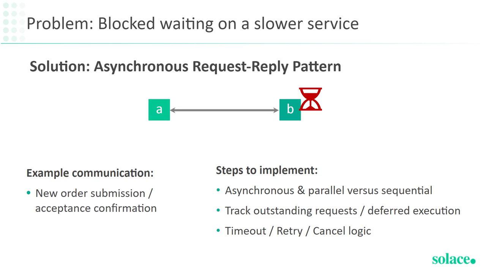

The Queue-Based Load Leveling Pattern addresses bursty or overwhelming traffic. Its example is also a new order submission and acceptance confirmation. The slide lists shock absorption through a queue component and asynchronous communication as implementation steps.

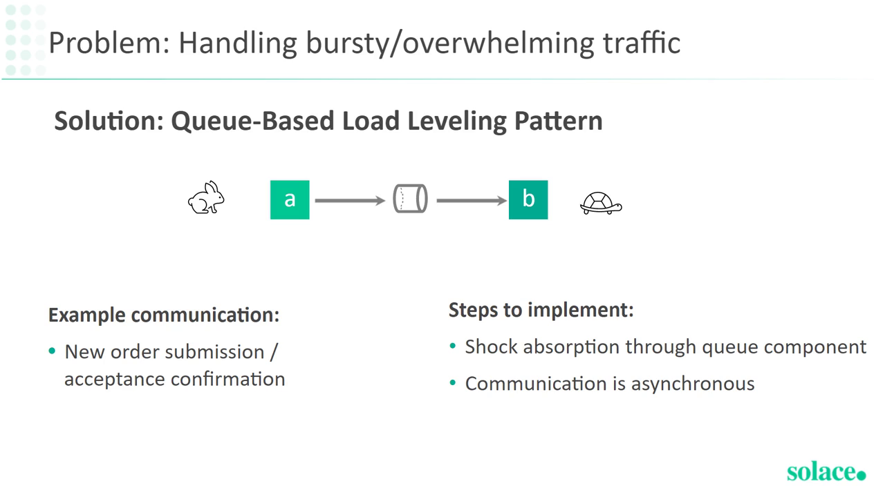

The Competing Consumers Pattern addresses a slow processor or falling behind. The example is a new order submission and acceptance confirmation. The slide lists running multiple workers or instances and independently processing each task as implementation steps.

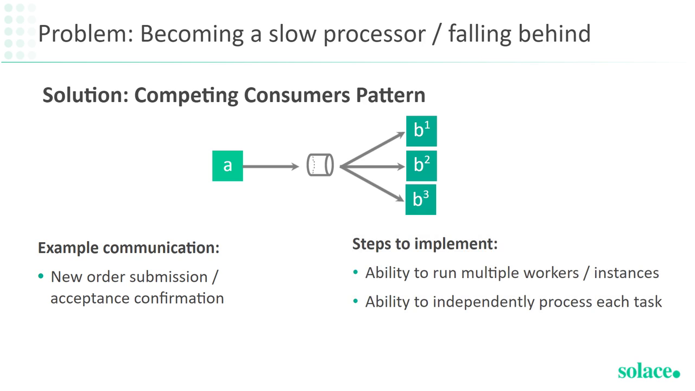

Selecting “CONTINUE” after this video content revealed “Design Patterns for Data Handling.”

### Screen: Design Patterns for Data Handling

The screen contains a third video, lasting 6:39, followed by “Let's Recap the EDA Design Patterns.” The video has no caption or subtitle tracks, and no transcript was visible. Its opening slide frames problems in distributed data and state; the overview slide names the Eventual Consistency Pattern, Sharding Pattern, and Command & Query Responsibility Segregation Pattern. The narration is not transcribed here; the following notes capture the slide text.

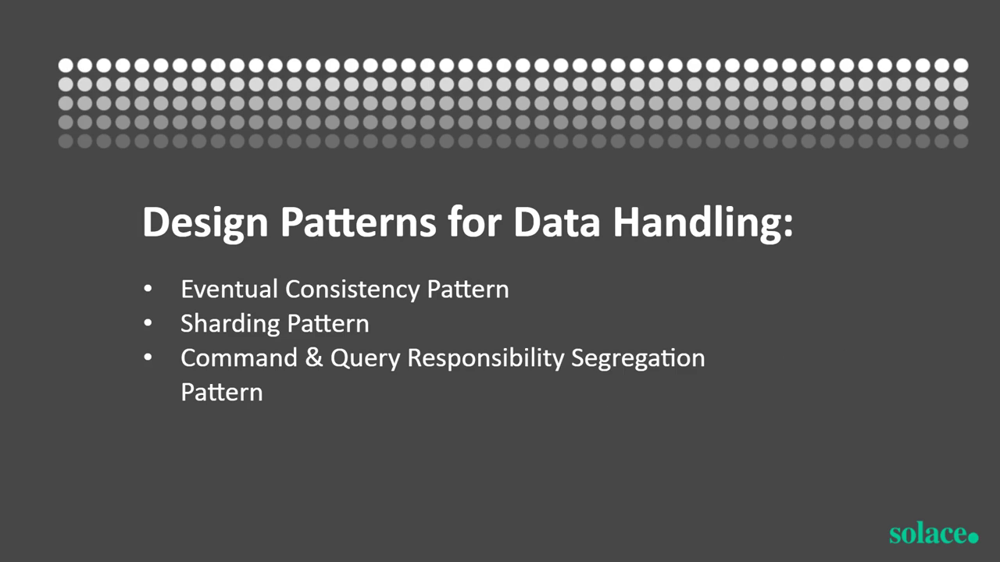

The Eventual Consistency Pattern addresses keeping multiple data replicas synchronized. Its example is a product catalogue replicated across sites and regions. The slide lists relaxation of “Consistency” in the CAP theorem and guaranteed delivery of a data update eventually to all replicas as implementation steps.

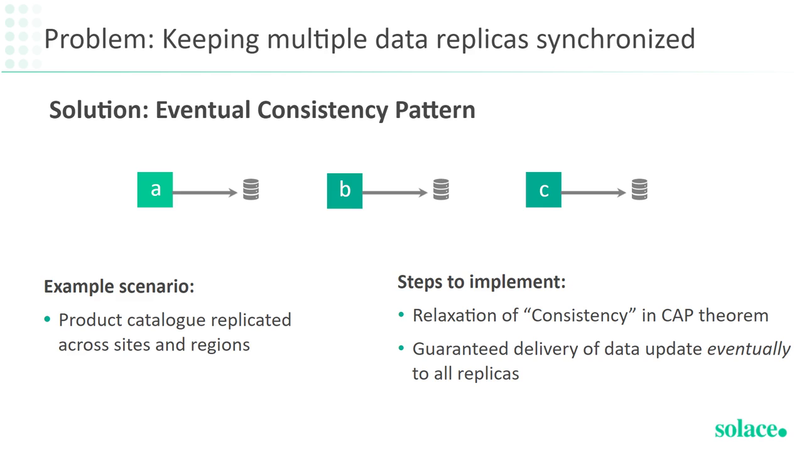

The Sharding Pattern addresses limited database scale or a bottleneck. Its example is a server hosting a customer-details database that is bandwidth limited. The slide lists splitting the database by an appropriate “Shard” or “Partition” identifier based on the data, and computing the correct shard from stable data fields in the database access logic.

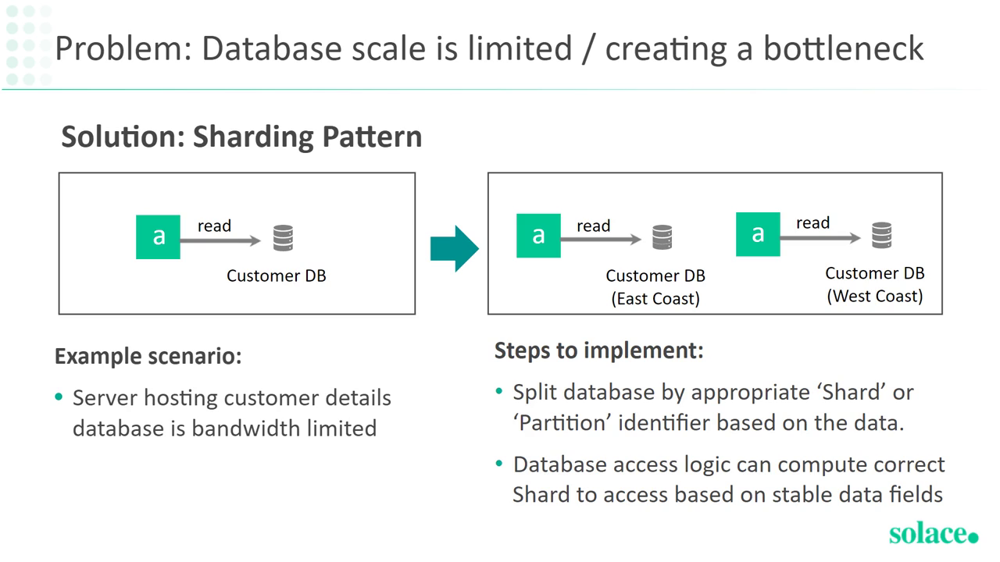

The video labels its third pattern “Command & Query Responsibility Segregation Pattern” for imbalanced read-versus-write database operations. Its example is read queries that require complex views and impact write commands. The slide lists maintaining different Command and Query databases or models, and guaranteed delivery of commands to the Query database to keep it in sync with changes.

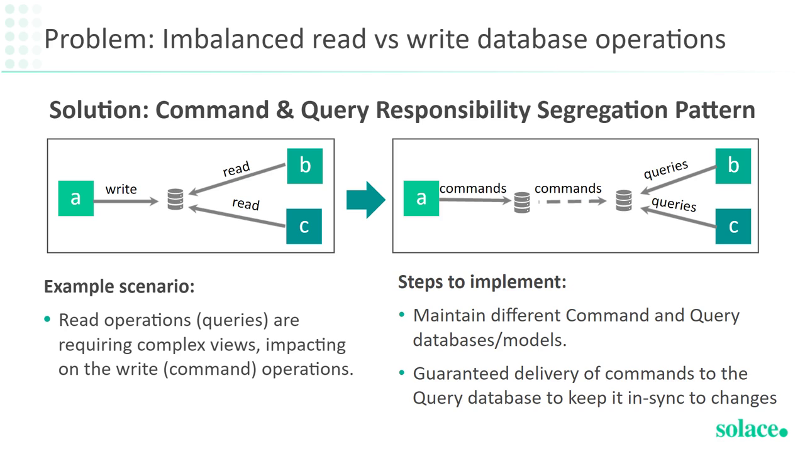

The video ends with a “Key Take-aways?” title slide and no additional text on that frame.

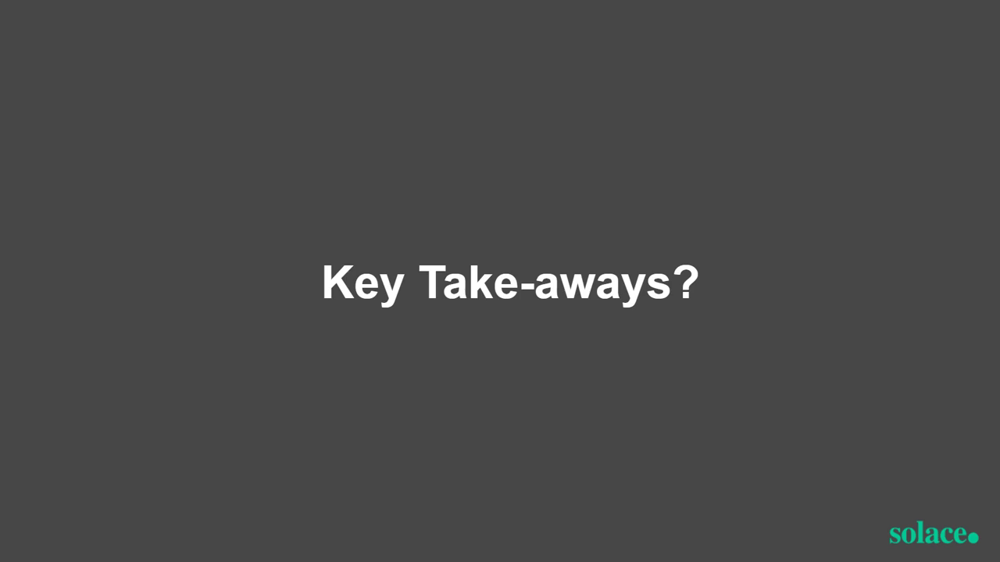

The recap beneath the video maps each pattern to the problem it applies to:

| Topic | Pattern | Applies to |
| --- | --- | --- |
| Being Distributed | Retry Pattern | Transient unavailability or failure of a component |
| Being Distributed | Idempotent Processor Pattern | Duplicate or repeated data |
| Being Distributed | Publish-Subscribe Pattern | Sending to multiple or unknown n-consumers |
| Being Scalable | Asynchronous Request-Reply Pattern | Waiting on a slow service |
| Being Scalable | Queue-based Load Leveling Pattern | Bursty or overwhelming traffic |
| Being Scalable | Competing Consumer Pattern | A service becoming a slow processor or falling behind |
| Data Handling | Eventual Consistency Pattern | Keeping multiple data replicas synchronized |
| Data Handling | Sharding Pattern | Limited database scale or a bottleneck |
| Data Handling | Command, Query, Responsibility and Segregation Pattern | Imbalanced read-versus-write database operations |

The outline marked Event Driven Architecture Design Patterns Completed and exposed “Lesson 4 - Event Driven Microservices.” Selecting it opened the fourth internal section. The module showed 27% complete overall; the Academy course page still showed 0 of 1 syllabus lessons completed.

## 4. Event Driven Microservices

### Academy state

This is internal SCORM lesson 4 of 11 by Dishant Langayan. The outline showed Event Driven Microservices as Unstarted when opened, then 38%, 69%, and 77% complete before marking it Completed. At section completion, the module showed 36% overall, with internal sections 1–4 completed and Security unstarted. At that point, the Academy course page showed 0 of 1 syllabus lessons completed.

### Screen: Microservices Overview

The screen opens with a quote attributed to Jonathan Schabowsky: “If we are to exponentially increase agility through microservices, we need to replace our static, stove-piped, monolithic thinking.”

The screen then embeds the 12:40 video [“What are microservices, and why do you need them?”](https://www.youtube.com/watch?v=K_gk0PJYP38). An English auto-generated transcript is available through the embedded video's YouTube transcript. The notes below summarize it in place of reproducing the transcript.

The presenter defines microservices as an architectural style that promotes loose coupling, continuous delivery, and technology evolution. The cited definitions focus on services organized around business capabilities. Microservices are not a universal solution: they can help medium and large complex applications, while a small, non-critical application may be simpler as a monolith.

The video connects microservice characteristics to business outcomes:

- **Loose coupling** lets teams make changes and deploy services independently, reducing schedule dependencies and ripple effects across teams.
- **Business-capability ownership** organizes teams around the capability they deliver rather than a technology stack. Teams may work across the stack to deliver the capability as a whole.
- **Smart endpoints and dumb pipes** keep business logic in applications and services, while infrastructure provides common connectivity and routing. The presenter warns against putting mediation, content-based routing, enrichment, orchestration, or message transformation in middleware. Message routing by an event broker is presented as compatible with this principle.
- **Decentralized data management** avoids forcing every team to coordinate around one canonical enterprise model. Specialized data stores can fit individual business capabilities, with eventual consistency as a trade-off.
- **Continuous delivery and deployment** support agility, efficiency, and time to market for new or updated capabilities.
- **Technology evolution** lets teams refresh individual services independently instead of carrying out a risky, expensive big-bang update to a monolith.

The video describes event-driven microservices as making data available in motion as events happen, rather than only at rest behind APIs. API-based and event-driven interactions can coexist; the presenter cautions against an API-exclusive approach and says event-driven interactions can improve real-time reaction and resource efficiency. Microservices also create distributed-system concerns that monolithic applications may hide, so teams need to understand those failure and consistency effects.

The segment closes by recommending that teams assess an application's needs before choosing microservices. It previews a following segment on the REST request-response paradox and the limitations of an API-exclusive microservices approach.

Selecting “CONTINUE” after this content revealed the next screen, “How To Use REST APIs With Microservices.”

### Screen: How To Use REST APIs With Microservices

The screen shows a video player with a title card for “How To Use REST APIs With Microservices.”

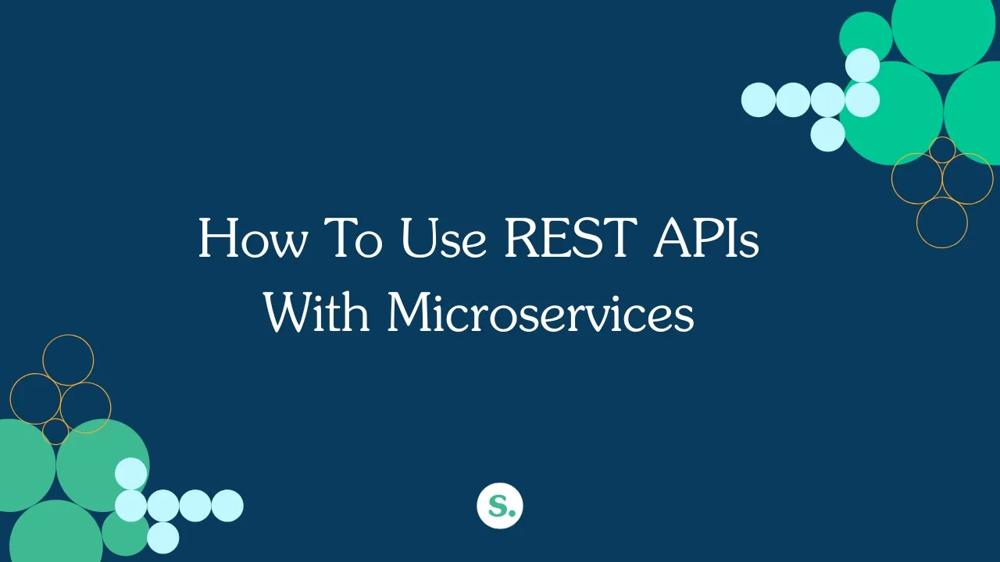

The video is embedded from YouTube, but its transcript exporter reported that no transcript is available. The current screen exposes no other instructional text, so these notes record only the visible title and thumbnail without inferring the video content.

Selecting “CONTINUE” after this screen revealed “How to Enhance Microservices with Events.” The outline showed Event Driven Microservices at 69% complete and the module at 27% overall.

### Screen: How to Enhance Microservices with Events

The screen shows a video player for [“How to Enhance Microservices with Events”](https://www.youtube.com/watch?v=3IbKcTy0vz8).

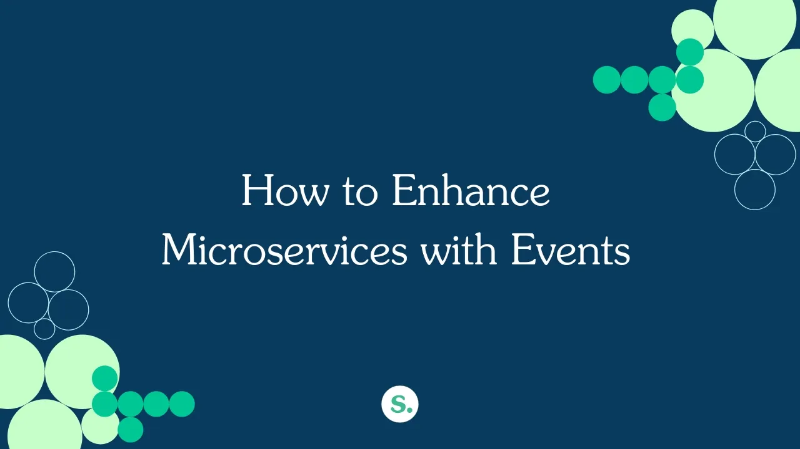

The video transcript exporter reported that no transcript is available. The screen exposes no other instructional text, so these notes record the visible title and thumbnail without inferring the video content. Selecting “CONTINUE” advanced to the material below; the outline showed Event Driven Microservices at 77% complete and the module at 27% overall.

### Screen: Additional Reading Resources

The screen presents a cautionary quote attributed to Nathaniel T. Schutta of VMware: “The road to microservices is paved with good intentions. But more than a few teams are jumping on the bandwagon without analyzing their needs first.”

It also lists three additional resources:

- [The Architect's Guide to Building a Responsive, Elastic and Resilient Environment](https://solace.com/resources/enterprise-architect/wp-download-event-driven-microservices-lp) (white paper)
- [Eventual Consistency in Microservices and My Front Yard: Event-Driven Architecture vs. REST](https://solace.com/blog/eventual-consistency-in-microservices/)
- [Microservices Choreography vs Orchestration: The Benefits of Choreography](https://solace.com/blog/microservices-choreography-vs-orchestration/)

After scrolling through the resources, the outline marked Event Driven Microservices Completed and the module showed 36% overall. The SCORM navigation exposed “Lesson 5 - Security” as the next section. At that point, the Academy course page showed 0 of 1 syllabus lessons completed.

## 5. Security

### Academy state

This is internal SCORM lesson 5 of 11 by Dishant Langayan. On opening it, Security showed 8% complete and the module showed 36% complete overall. After the encryption and data-at-rest screens were advanced through, Security was marked Completed and the module showed 45% overall. At that point, the Academy course page showed 0 of 1 syllabus lessons completed.

### Screen: Capabilities for Meeting Security Requirements

The opening image carries the statement that Solace PubSub+ event broker security features, when applied correctly, can adequately secure systems and the sensitive data they transport.

The lesson says Solace Essentials already introduced application Authentication and Authorization mechanisms. This section expands the discussion to securing data in motion and data at rest.

The listed organizational security goals are:

- Restrict data access to users with predefined privileges and security-level access.
- Prevent malicious access and accidental loss of or damage to data.
- Separate access roles.
- Audit activities of users, applications, and administrators.

The listed system capabilities for meeting those goals are:

- **Authenticate** every user and administrator accessing the system.
- **Authorize** access to data and system settings against policies that limit users and administrators to predefined activities.
- **Audit** access by users and administrators, including data accessed and changes made.
- **Encrypt data in motion and at rest**, and distribute encryption keys only to authorized entities.
- **Monitor and restrict** environmental changes, with processes to authorize system-level changes.

The lesson says it will focus on developer-relevant concepts and go deeper on encryption for data in motion and at rest, since Authentication and Authorization were covered in Solace Essentials. At this capture, “CONTINUE” was visible and was selected after the screen was recorded.

### Screen: Encryption and TLS/SSL

The screen states that encryption prevents unauthorized data access, whether intentional or unintentional, and protects data integrity.

For developers, the lesson identifies three areas to consider: network encryption between brokers and client applications; encryption for bridges and message routing in an Event Mesh; and encryption of disks and data at rest.

The TLS/SSL overview says clients use plain text over TCP by default to exchange uncompressed data with a Solace PubSub+ event broker. A client can instead use TLS/SSL over a single TCP connection to exchange uncompressed Solace Message Format (SMF) or Solace Element Management Protocol (SEMP) data.

The listed benefits of TLS/SSL connections are:

- **Confidentiality:** messages can only be received by the intended recipient.
- **Message integrity:** messages cannot be modified after sending.
- **Server authentication:** the application can verify the server it intended to contact.
- **Optional client authentication:** client certificates can serve as a client-authentication method.

The lesson says a client session is unsecured by default. An application can optionally establish a secure session that requires a trusted server certificate, and Solace PubSub+ APIs can create these secure connections.

The “More on Server Authentication” process shows the client connecting to the broker's TLS/SSL listening port, receiving the broker's server certificate, validating its validity, expected name, and trusted-root issuer, then continuing the handshake if validation succeeds.

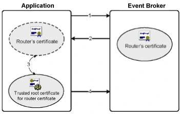

“CONTINUE” was selected after recording this screen. The Security section showed 42% progress at that point; module progress remained 36% overall.

### Screen: Securing Data at Rest

The lesson describes at-rest protection as a last defense when the network or host is compromised. It says that when TLS protects the messaging layer, the broker decrypts data as it passes through and stores it unencrypted on non-volatile disks; it therefore recommends self-encrypting disks.

The broker deployment notes distinguish three cases:

- **Appliance:** in a high-availability pair, persistent data is stored on the attached SAN; configuration and logs are stored on internal redundant solid-state drives.
- **Software:** the broker uses a shared-nothing disk strategy, with each broker mounting its own partitions for data, configuration, and logs. Software brokers do not provide disk encryption, but interoperate with standard cloud-provider disk encryption and standard Linux block-device encryption.
- **Cloud:** PubSub+ Cloud addresses these security concerns through the managed service and security-minded integration with cloud-provider environments and services.

After continuing from the TLS/SSL screen, Security showed 92% progress and the module remained at 36% overall. Scrolling to the end marked Security Completed and exposed “Lesson 6 - Direct Messaging” as the next section. At that point, the Academy course page showed 0 of 1 syllabus lessons completed.

## 6. Direct Messaging

### Academy state

This is internal SCORM lesson 6 of 11 by Dishant Langayan. On opening it, Direct Messaging was still marked Unstarted and the module showed 45% complete overall. At that point, the Academy course page showed 0 of 1 syllabus lessons completed.

### Screen: Direct Messaging Overview

The introduction defines direct messaging as reliable but not guaranteed delivery from PubSub+ brokers to consuming clients, and identifies it as the brokers' default delivery system. It says no extra configuration is required beyond setting up other features; direct messaging is available by default to clients connected to an event broker.

The listed characteristics are:

- Messages reach subscribing clients in publisher order.
- Subscribing clients do not acknowledge receipt.
- Messages are not spooled on the message bus for consuming clients.
- Messages are not retained for clients while they are disconnected from a broker.
- Messages can be discarded during congestion or system failures.

The listed use cases are extremely high message rates with very low latency; consumers that can tolerate losses during network congestion; messages that do not need persistence for slow or offline consumers; and efficient publication to many clients with matching subscriptions.

The lesson lists two situations where direct messages are not delivered: a client disconnecting while messages are being published, and a consumer falling behind until its egress message buffer overflows. It says the next material will explore key direct-messaging features and capabilities. “CONTINUE” was selected after recording this screen.

### Screen: Shared Subscription

The screen says shared subscriptions can load-balance large volumes of client data across multiple instances of back-end data-center applications, especially when those applications parallelize processing of published messages.

An embedded video player is shown. No caption or subtitle tracks were present on the player, and no transcript was available in the captured lesson. The notes therefore record the visible explanatory paragraph and title card only. “CONTINUE” was selected after recording this screen. Direct Messaging showed 44% progress at that point; module progress remained 45% overall.

### Screen: Message Eliding

Message eliding lets client applications receive only the most current direct messages on subscribed topics, at a rate they can handle, rather than queueing outdated messages. The lesson says it can help with slow consumers or when a lower message rate is needed, and that only direct messages can be elided.

The screen lists two application use cases:

- **Congestion management:** deliver every message while the client can keep up; if it falls behind, elide queued messages so only the latest message for each topic is provided. The stated delay interval is 0.
- **Message-rate control:** limit delivery to five messages per second per topic. The broker rate-controls output, using a 200 ms delay interval.

For **market-data streaming to human traders**, the lesson says people can handle only a few updates per second even when market data arrives much faster. Eliding keeps the latest information while reducing delivery to a few updates per topic per second.

For **controlling updates over a WAN**, the lesson says bandwidth and receiver-processing limits may require sending only a subset of the full feed; eliding can control the update rate to the client.

The screen exposed a “MORE ON ELIDING” button, which was selected after capture. Direct Messaging showed 60% progress at that point; module progress remained 45% overall.

### Screen: Using Message Eliding

To use message eliding, publishing clients must mark messages as eligible. The lesson notes that messages published by MQTT clients are treated as not eligible for eliding.

The receiving application must be assigned, through its client username, a client profile that permits message eliding. The profile controls the topic-by-topic delay interval after the first message and the maximum number of topics tracked for eliding. The lesson gives these limits: up to 32,000 topics per client as configured in its profile, up to 2,000,000 per event broker, and a default of 256 per client.

The functional example describes Client P publishing eligible messages to topic T at one message per millisecond. Consuming Client S has eliding enabled with a 200 ms delay, limiting updates to five per second per topic. M1 is sent immediately if the TCP window is open. M2 arrives shortly after, is held because a message for that topic was sent within the delay interval, and is not sent yet. Each newer message M3 through Mn replaces the previous held message. Once 200 ms have elapsed since the prior delivery, the most recently held message is sent if the TCP window is open.

At this capture, the Direct Messaging outline showed 88% progress and the module was 45% overall. Scrolling to the end marked Direct Messaging Completed, raised module progress to 55%, and exposed “Lesson 7 - Guaranteed Messaging” as the next section. At that point, the Academy course page showed 0 of 1 syllabus lessons completed.

## 7. Guaranteed Messaging

### Academy state

This is internal SCORM lesson 7 of 11 by Dishant Langayan. On opening it, Guaranteed Messaging was marked Unstarted and the module showed 55% complete overall. At that point, the Academy course page showed 0 of 1 syllabus lessons completed.

### Screen: Guaranteed Messaging Overview

The opening image states that Guaranteed Messaging can ensure delivery between two applications even when the receiving application is offline.

The lesson says Guaranteed Messaging was covered in Solace Essentials together with hands-on Queue activities, and that this section provides a quick recap plus related concepts. It says Guaranteed Messaging can deliver messages when a receiver is offline or network equipment fails, while preserving publication order.

The two key points are:

- Persistent and non-persistent messages, rather than Direct messages, are spooled to persistent storage and retained across event broker restarts.
- A message copy is retained until successful delivery to all clients and downstream event brokers has been verified.

“CONTINUE” was selected after recording this screen.

### Screen: Basic Operation of Guaranteed Messaging

The labeled graphic presents five steps from a publishing client through the event broker to a consuming client:

1. **Publish message:** a client connected to a Message VPN publishes a Guaranteed message, with persistent or non-persistent delivery mode, to a topic or queue destination.
2. **Spool message:** the broker spools the ingress message to a queue or topic endpoint.
3. **Acknowledge spooling:** the broker acknowledges to the publishing client that the message was successfully spooled.
4. **Receive message:** the broker can deliver the message to a consumer that is connected to the same Message VPN, authorized for Guaranteed messages, has created a consumer flow bound to the endpoint, and has the active flow for that endpoint.
5. **Acknowledge receipt:** the consumer acknowledges successful delivery to the broker, after which the broker deletes the message from the spool.

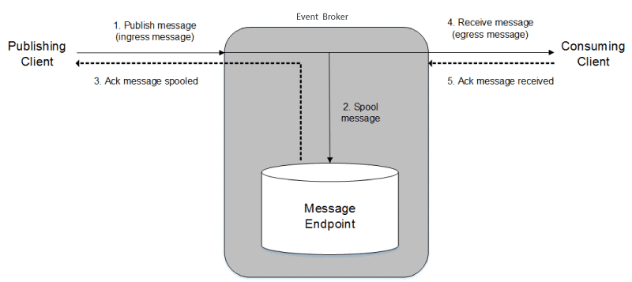

The diagram also labels the publish as an ingress message and the consumer delivery as an egress message. Its final visible control is “LETS LOOK AT QUEUE CONSUMER PATTERNS NEXT,” which was selected after capture. Guaranteed Messaging showed 29% progress at that point; module progress remained 55% overall.

### Screen: Queue Consumer Patterns — Part 1

The screen introduces two videos about queue-consumer patterns and considerations for Active/Standby Consumers and Competing Consumers.

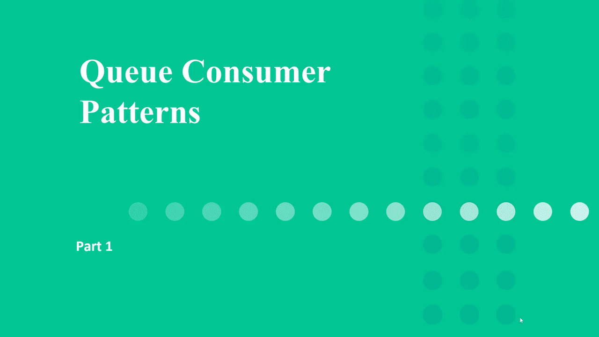

The Part 1 embedded player has no caption or subtitle tracks, and no transcript is available in the captured lesson. Its duration was not exposed before playback. The notes therefore record the visible introduction and title card only. “CONTINUE TO PART 2” was selected after capture. Guaranteed Messaging showed 38% progress at that point; module progress remained 55% overall.

### Screen: Queue Consumer Patterns — Part 2

The screen continues the introduction to the Active/Standby Consumers and Competing Consumers topics, now with a second embedded player whose title card identifies Queue Consumer Patterns, Part 2.

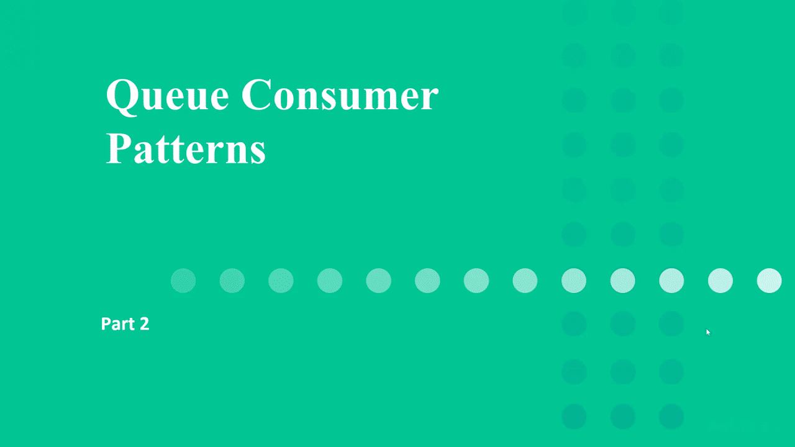

Neither video player exposes caption or subtitle tracks, and no transcript was available in the captured lesson. Their durations were not exposed before playback, so these notes retain only the visible topic labels and title cards. “CONTINUE TO QUEUE DURABILITY” was selected after capture. Guaranteed Messaging showed 54% progress at that point; module progress remained 55% overall.

### Screen: Queue Durability and Message Replay

The Queue Durability section introduces two queue types supported by PubSub+ event brokers: **Durable Queues** and **Non-Durable (Temporary) Queues**. Its visible Part 1 video title card reads “Queue Durability & Dynamic Provisioning.” The embedded player has no caption or subtitle track, and no transcript is available in the captured lesson; its duration was not exposed.

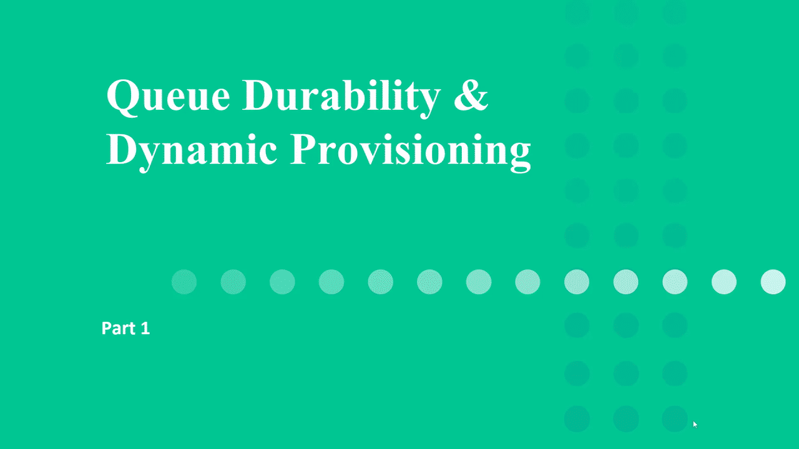

The Message Replay section says event brokers can resend messages to new or existing clients that request them hours or days after the broker first received them. The lesson names training algorithms, restoring a corrupted database, and fixing a misconfigured application as uses for replay.

With replay enabled, the broker stores persistent messages in a replay log. When that log is full, it removes the oldest messages to make room for new ones. A replay request delivers messages from the requested start time onward when they match a subscription on the queue or topic endpoint. The lesson presents replay as a way for applications to recover from database issues caused by misconfiguration, crashes, or corruption.

The screen embeds [“Solace does REPLAY! A Solace Platform Replay Feature”](https://www.youtube.com/watch?v=HuYgF_IsfXw), with no available transcript.

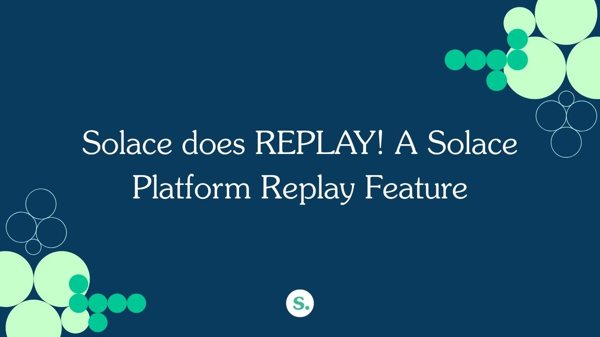

Additional resources listed on the screen are [Message Replay Overview](https://docs.solace.com/Overviews/Message-Replay-Overview.htm) and [Message Replay Config](https://docs.solace.com/Configuring-and-Managing/Msg-Replay-Concepts-Config.htm).

At this capture, Guaranteed Messaging showed 67% progress and module progress was 55%. Scrolling to the end marked Guaranteed Messaging Completed, raised module progress to 64%, and exposed “Lesson 8 - APIs and Protocols” as the next section. At that point, the Academy course page showed 0 of 1 syllabus lessons completed.

## 8. APIs and Protocols

### Academy state

This is internal SCORM lesson 8 of 11 by Dishant Langayan. The outline marked APIs and Protocols 14% complete and the module 64% complete. The first seven sections were marked Completed; Connectors, API Tutorials and Codelabs, and Additional Developer Resources were Unstarted. The outer Academy course remained in progress with 0 of 1 syllabus lessons completed.

### Screen: APIs and Protocols

The opening screen says PubSub+ event brokers have built-in support for proprietary and open-standard protocols and APIs, allowing applications to use their chosen languages and interfaces without protocol translation. Solace messaging APIs provide uniform access to PubSub+ capabilities and quality of service. The screen lists C, .NET, iOS, Java, JavaScript, JMS, Python, and Node.js, and identifies AMQP, JMS, MQTT, REST, and WebSocket as supported open protocols, with Paho and Qpid as open APIs.

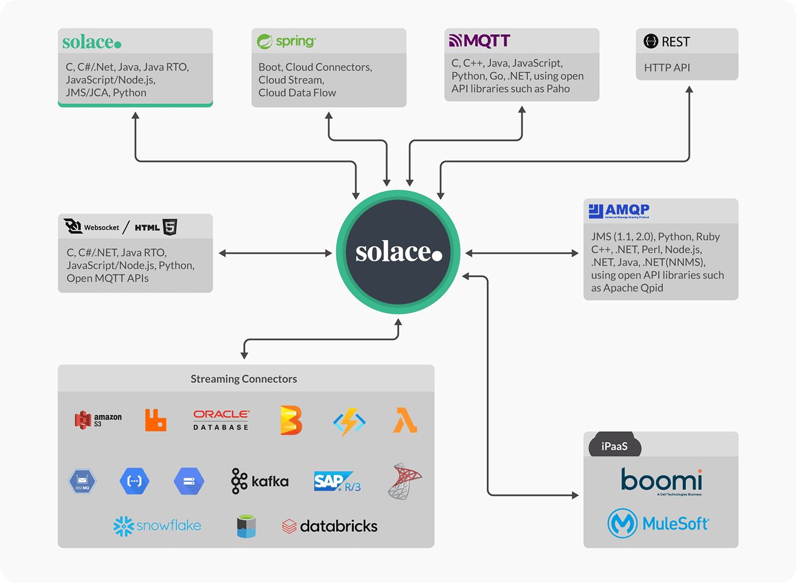

Under “Solace PubSub+ APIs,” the screen says Solace provides enterprise messaging APIs for PubSub+ application development, with sample applications, release notes, and developer documentation for each API. The visible API list and descriptions are:

- [C API](https://docs.solace.com/Solace-PubSub-Messaging-APIs/C-API/c-api-home.htm) - high message throughput and low latency with low CPU use.
- [C# / .NET API](https://docs.solace.com/Solace-PubSub-Messaging-APIs/dotNet-API/net-api-home.htm) - object-oriented managed wrapper for the C API.
- [Go API](https://docs.solace.com/API/Messaging-APIs/Go-API/go-home.htm) - for cloud-based and enterprise-scale server applications.
- [iOS API](https://docs.solace.com/Solace-PubSub-Messaging-APIs/iOS-API/iOS-api-home.htm) - native C API wrapper designed for throughput and low latency, integrated with the iOS application life cycle.
- [Java API](https://docs.solace.com/Solace-PubSub-Messaging-APIs/Java-API/java-api-home.htm) - high-throughput, low-latency messaging using modern Java features and programming models.
- [Java RTO API](https://docs.solace.com/Solace-PubSub-Messaging-APIs/JavaRTO-API/java-rto-home.htm) - low-latency Java Native Interface wrapper for the C API.
- [JCSMP API](https://docs.solace.com/Solace-PubSub-Messaging-APIs/JCSMP-API/jcsmp-api-home.htm) - classic object-oriented Java API for high-throughput messaging.
- [JavaScript API](https://docs.solace.com/Solace-PubSub-Messaging-APIs/JavaScript-API/js-home.htm) - for Web and mobile applications.
- [Node.js API](https://docs.solace.com/Solace-PubSub-Messaging-APIs/NodeJS-API/node-js-home.htm) - for server-side Web-connected enterprise applications and event-based programming.
- [Python API](https://docs.solace.com/Solace-PubSub-Messaging-APIs/Python-API/python-home.htm) - for cloud-based and enterprise-scale server applications.

The lesson describes these APIs as a base messaging layer for client applications communicating over the Solace message bus. It says the following pages explain using APIs to create new applications or integrate existing ones with PubSub+ event brokers.

The screen's feature-summary text says the APIs share common messaging features, with some support differences because APIs evolve to meet different application use cases. It points learners to individual API pages for API- and platform-specific details.

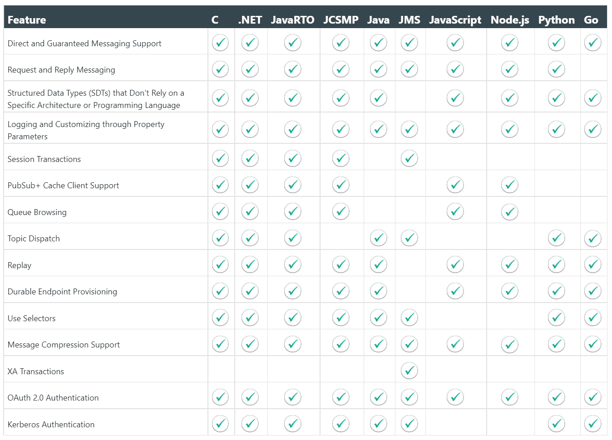

The screen also exposed a “Lesson 9 - Connectors” link below the feature-summary graphic. The visible screen contained no quiz. This material was recorded before opening the next internal section.

## 9. Connectors

### Academy state

This is internal SCORM lesson 9 of 11 by Dishant Langayan. The outline showed Connectors at 50% on first opening. After all three connector-type cards were flipped, it showed 83% complete; the module remained 73% complete. The first eight sections were marked Completed; API Tutorials and Codelabs and Additional Developer Resources were Unstarted. The outer Academy course remained in progress with 0 of 1 syllabus lessons completed.

### Screen: Connector Overview and Types

The overview says connectors stream data into and out of the PubSub+ Platform to external third-party services. Solace provides connector types for integrating cloud services and other broker solutions, avoiding custom integration code.

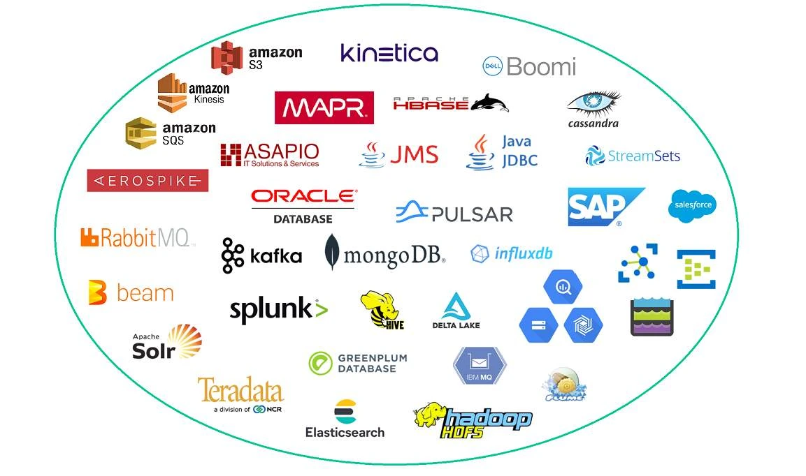

The screen asks learners to flip three cards to learn the connector types:

- **External Embedded:** Solace provides connector code that is installed and run in an external data-processing runtime such as Apache Spark or Kafka Connect. Examples are PubSub+ Connector for Kafka and Beam I/O.
- **Broker Integrated:** Connector capability is configured on PubSub+ event brokers through a REST delivery point (RDP), without external code. Examples are PubSub+ Connector for Azure Event Hub Producer and AWS Lambda Producer through API Gateway.
- **Partner Integrated:** The connector is part of a data-integration framework supplied by a Solace partner, which provides a range of connectors. Examples listed are Amazon S3 Origin, IBM MQ Series Producer, SAP ERP On Premise Source, and Dell Boomi iPaaS.

### Connector Hub

The lesson says the Solace Connector Hub lists available connectors and provides their documentation and tutorials. It links to [solace.com/connectors](https://solace.com/connectors/).

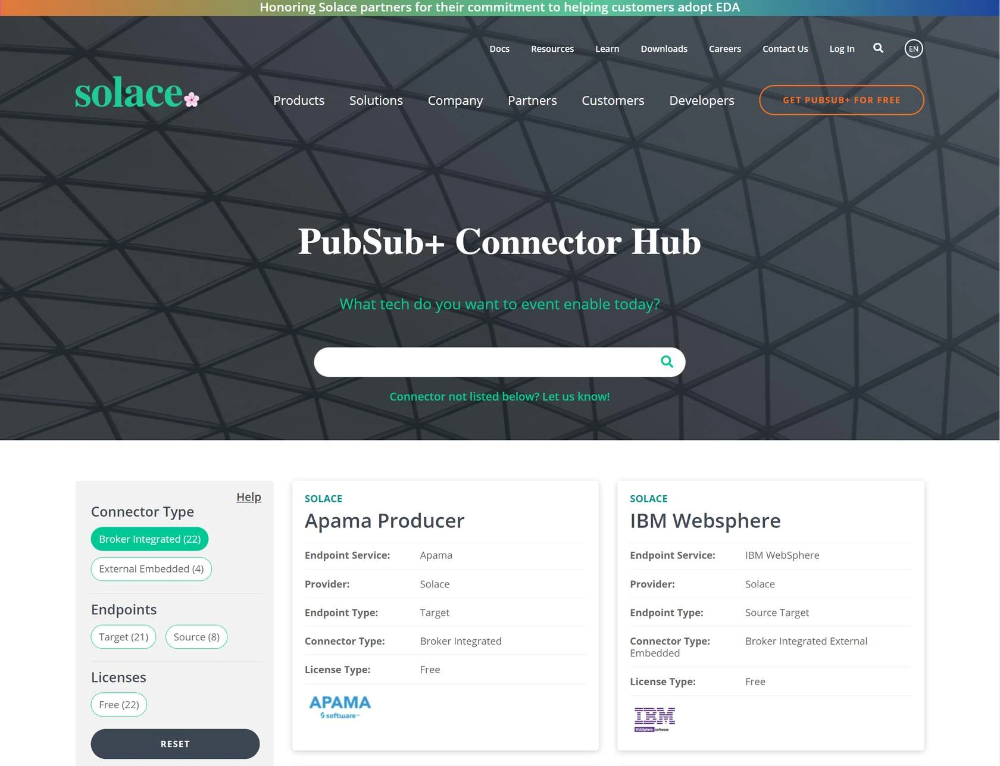

The visible screen exposed a “Lesson 10 - API Tutorials and Codelabs” link below the Connector Hub material. This screen contained no quiz. The content above was recorded before opening the next internal section.

## 10. API Tutorials and Codelabs

### Academy state

This is internal SCORM lesson 10 of 11 by Dishant Langayan. The outline marked API Tutorials and Codelabs 50% complete and the module 82% complete. The first nine sections were marked Completed; Additional Developer Resources was Unstarted. The outer Academy course remained in progress with 0 of 1 syllabus lessons completed.

### API Tutorials

The lesson points to developer tutorials for Solace APIs and open APIs and protocols. It says these tutorials help learners get up to speed with sending and receiving messages using PubSub+ event brokers. The resource link is [tutorials.solace.dev](https://tutorials.solace.dev/).

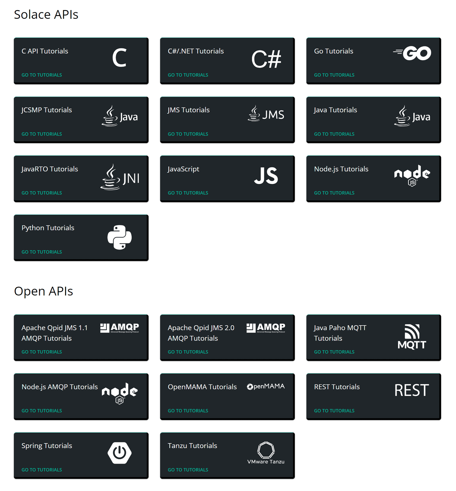

### Developer Codelabs

Solace Developer Codelabs are described as step-by-step tutorials offering guided, hands-on experience with the PubSub+ platform. The lesson says they guide learners through building a PubSub+ application, learning a specific feature, or integrating PubSub+ with other technologies. The resource link is [codelabs.solace.dev](https://codelabs.solace.dev/).

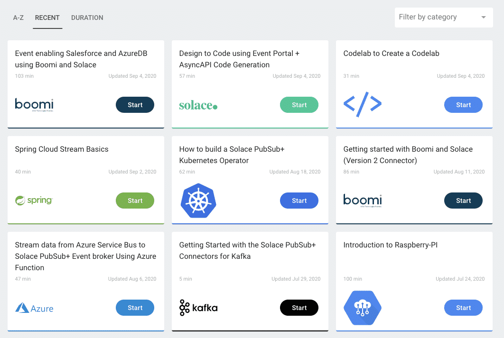

The visible screen exposed a “Lesson 11 - Additional Developer Resources” link below the codelabs content. This screen contained no quiz. The content above was recorded before opening the next internal section.

## 11. Additional Developer Resources

### Academy state

This is internal SCORM lesson 11 of 11 by Dishant Langayan. On opening it, the outline marked Additional Developer Resources 50% complete and the module 91% complete. The first ten sections were marked Completed. After scrolling the final section to its end, the outline marked all 11 sections Completed and the module reached 100%. Before exiting the SCORM player, the outer Academy course remained in progress with 0 of 1 syllabus lessons completed.

### Developer Community

The lesson describes the Solace Community as a technical forum for discussing PubSub+ Cloud, PubSub+ Event Broker, PubSub+ Event Portal, event-driven architecture and development, security, microservices, and related topics. It links to [solace.community](https://solace.community/).

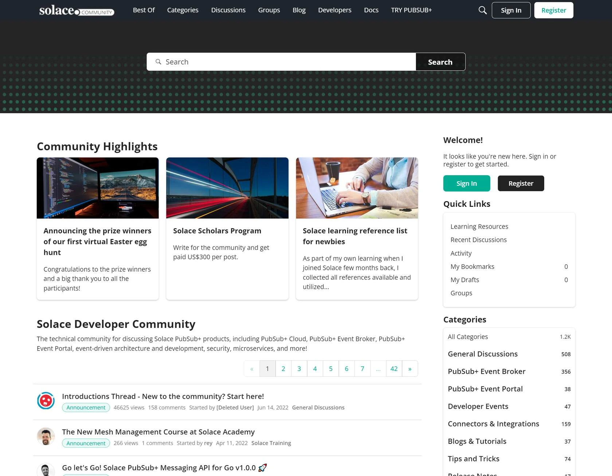

### GitHub Samples

The lesson points to Solace code samples for Spring, JMS, MQTT, AMQP, JavaScript, and other technologies in the [SolaceSamples GitHub organization](https://github.com/SolaceSamples).

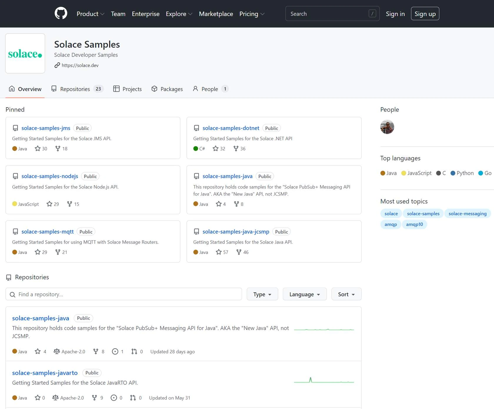

### Best Practices and Videos

The course says Solace documentation includes articles with guidance, examples, and recommendations for using Solace products, linking to the [Solace best practices guide](https://docs.solace.com/Get-Started/best-practices.htm). It also points to the [Solace YouTube channel](https://www.youtube.com/c/Solacedotcom) for developer videos, live coding sessions, and hands-on demos.

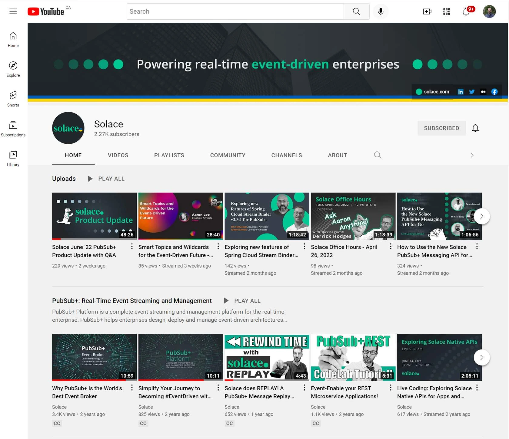

The final section contained no quiz. The SCORM outline showed all 11 internal sections Completed at 100% module progress. Exiting the player returned to the Academy, which showed Course completed and marked the syllabus lesson Completed.
