# Foundations of Event Driven Architecture

- **Syllabus order:** 01
- **Content type:** SCORM
- **Status before opening:** The Academy course player displayed “Start learning now”; the course page showed 0 of 2 lessons completed. This is the state visible in Chrome on 2026-09-29.

## Course landing screen captured before starting the SCORM

The overview welcomes learners to Event-Driven Architecture Foundations and describes it as essential training for designing and developing event-driven solutions. It says the course covers basic EDA concepts, Solace's event-driven methodology, and applying those concepts to application architecture and solutions. It is the foundation for Solace Architect paths and does not cover deep-dive concepts.

The page lists these objectives: understand motivations and business value for becoming event-driven; understand EDA and event mesh concepts; understand event-driven design patterns; apply Solace's event-driven methodology to a use case; understand good topic taxonomy and topic best practices; identify event flows, events, schemas, and microservices; and model events and microservices in PubSub+ Event Portal.

The target audience is architects and developers, while anyone beginning with EDA may take the course. The estimated duration is approximately 3 hours. The page says passing the Solace Certified Event-Driven Practitioner Exam earns a digital badge within a week. The instructor listed is Dishant Langayan.

## SCORM welcome screen

**Byline:** Eric Shantz. The cover welcomes learners to the Foundations of Event Driven Architecture course as essential training for designing and developing EDA solutions. It asks whether the learner can explain what EDA is and how it works, its benefits over traditional architecture, how it scales, and how to bring an EDA system to life. By the end, learners should be able to explain EDA's core concepts and essential design patterns, approach a transition to an event-driven model, and describe how EDA can solve real-world challenges. The cover says this is foundational training for Solace Architect Paths and does not cover deep-dive concepts.

### Internal syllabus shown before starting

The SCORM table of contents groups 12 sections under four headings. Every item displayed the status “Unstarted” on this opening screen.

- **Welcome:** Welcome.
- **THE CONTEXT:** Understanding the Challenges.
- **THE CONCEPTS:** Introduction to EDA; Being Event Driven; Event Driven Methodology; Distributed Computing Primer; Design Patterns; Topic Taxonomy; Putting it All Together.
- **THE CLICK:** Methodology in Practice; Gener-AI-ate your EDA design; Course Summary.

### Key visual recovery

The cover shows “FOUNDATIONS OF EVENT DRIVEN ARCHITECTURE” in large magenta lettering over a pale background with teal circles and geometric shapes. Smaller labels around the title include “Be Event Driven,” “Distributed Computing,” “Topics,” “Event Portal,” “Event Driven Methodology,” “Benefits of EDA,” and “Design Patterns.” The hero art is a CSS background in a nested SCORM iframe rather than an image element. The page asset inventory did not expose it, and the supported media download attempt could not retrieve a CSS background. A faithful screenshot was inspected in Chrome, but the screenshot API returned it for viewing without a local file path; therefore no local image or Markdown image link could be saved. No substitute image was created.

## SCORM launch recovery

At first launch, the modal showed only the lesson title over a blank white frame; no learning text or controls were visible. Five seconds later the frame body still appeared empty. A later fresh accessibility snapshot revealed the full cover and table of contents without closing or reopening the lesson. Chrome's console showed a Docebo access-token retrieval error and a failed telemetry fetch, but these messages coexisted with the subsequently rendered course content and did not establish that recovery was needed. When the opening table of contents first appeared before starting the module, all 12 sections were labeled Unstarted. After starting the module, Welcome changed to 40% Completed.

## SCORM section: Welcome (lesson 1 of 12)

The screen is titled “Welcome” and names Eric Shantz as the author. It shows the line “Welcome to the course,” an embedded video with a “Play Video” control, a download prompt (“Download to follow along with the videos:”), and the file `EDA_Foundations_Slides.zip` (6.8 MB) at `assets/EDA_Foundations_Slides.zip`. The screen offers a “CONTINUE” control. When this screen first opened, the table of contents marked Welcome “40% Completed”; after selecting Play Video it showed “80% Completed.” The overall course meter remained “0% COMPLETE,” and the other 11 internal lessons showed “Unstarted.” The video captions and transcript are unavailable, as recorded below.

The course-linked `EDA_Foundations_Slides.zip` includes `0_Welcome.pdf`. Its embedded “Course Modules” visual lists Introduction (motivations for being event driven, EDA methodology, and a distributed computing primer), EDA Methodology in Practice (hands-on activity and Event Portal), and an EDA Design Pattern Walk through (being scalable, data handling, and topic taxonomy). The original course image is saved here. 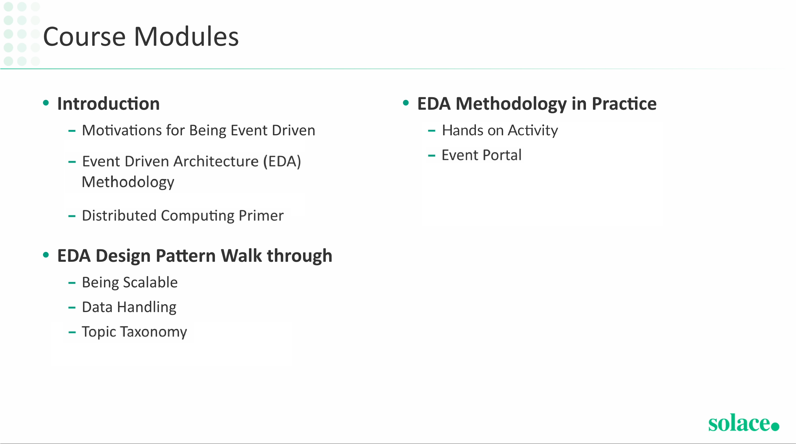

The Welcome video runs about 2 minutes 25 seconds. Its opening title card reads “Event Driven Architecture Foundations” and credits Dishant Langayan, Director, Global Training & Enablement; the SCORM page byline separately names Eric Shantz. The video element exposes no `<track>` element or text tracks, its captions control is hidden, and no transcript link is displayed. Captions and transcript are unavailable in the Academy player. The visible course text and the linked follow-along slides are recorded here; no spoken details are inferred.

The course-linked `0_Welcome.pdf` also lists the hands-on activity requirements: a MacOS or Windows computer, Chrome or Firefox, and a PubSub+ Cloud account. The visible SCORM welcome text does not list these requirements.

No scored knowledge check, answer choices, or feedback appeared on this Welcome screen. The visible “CONTINUE” control advances to the next internal SCORM screen. The embedded player exposes no transcript or caption track; only the screen text, video title card, and course-linked slides are documented.

## SCORM section: Understanding the Challenges (lesson 2 of 12)

**Byline:** Eric Shantz. The opening text says it is important to understand organizational challenges before exploring EDA's core concepts. It introduces Dave, a software architect at “RealStore Retailer,” who faces the complexities of legacy systems; the lesson frames EDA as a possible game-changer for modernizing and streamlining business operations.

The video title card identifies “THE CONTEXT — Understanding the Challenges.” Its visible scene introduces Dave as a software architect in a bright office with RealStore-branded online storefronts and a summer-sale display. 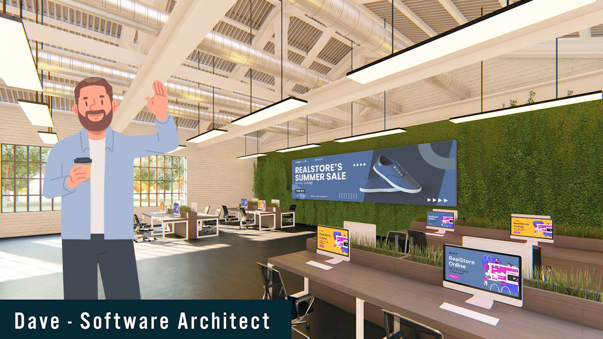

The introductory screen uses a blurred coding-workstation image behind its text. 

### Moving Forward

The closing text says that after seeing the challenges Dave faces at RealStore, the course will explore how EDA works, how it can solve those problems, and how it can be applied to the learner’s organization.

### Video availability

The embedded video is `FoEDA - Context Vide.mp4` and its browser-reported duration is about 118 seconds. The player exposes no caption track or transcript link; no caption control is visible. I recorded the surrounding lesson text and the original visible title-card image. Spoken details beyond the visible text could not be captured reliably in this interface, so none are inferred here.

No knowledge check, question, answer choices, or system feedback appeared on this screen. After starting the video, the table of contents showed this section at 80% Completed while the overall SCORM meter showed 8% Complete; the next internal control is “CONTINUE.”

### Video visual sampled during playback

A paused frame in the video showed a diagram titled “Tightly Coupled, Point-to-Point Systems,” illustrated with interlocking gears. This frame was visible in Chrome, but the lesson exposed no downloadable still image; the browser screenshot was returned for viewing without a local file path, so I describe the visual here instead of adding a screenshot asset.

## SCORM section: Introduction to EDA (lesson 3 of 12)

**Byline:** Eric Shantz. The screen defines event-driven architecture (EDA) as a software design pattern in which decoupled applications asynchronously publish and subscribe to events through an event broker. It lets information flow in real time among applications, microservices, and connected devices instead of waiting for periodic polling.

### What is an Event?

The course calls everything that happens within or to an enterprise an event, including customer requests, inventory updates, and sensor readings. The value of knowing about and reacting to an event degrades over time. Faster delivery of information to the places that need it can help a business retain a customer, shift production, or reallocate resources. The examples are a customer purchase and shipping containers being loaded.  

EDA pushes information as events happen, rather than waiting for periodic polling as in the API-led approach the screen says most companies use today. When an event occurs, EDA sends information about it to all systems and people that need it. An event may move through applications written in different languages, using different APIs and protocols, to endpoints such as applications, analytics engines, and user interfaces. The original diagram shows a point-of-sale system publishing an “Order 44334” event through a central event broker to Financial Management, Inventory Management, and Human Resources systems. 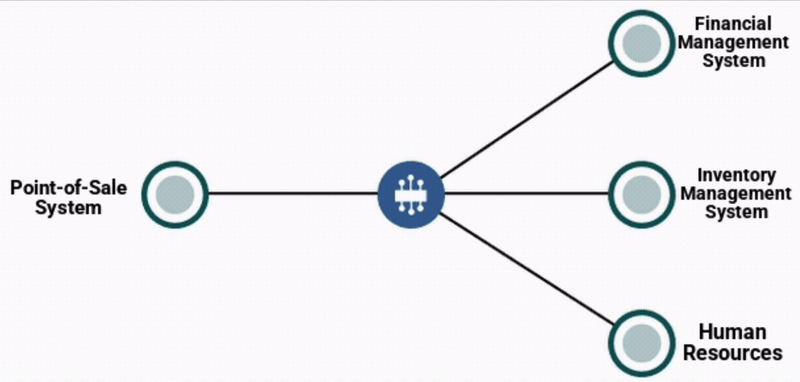

### If events cannot reach their destination

The expanded panel says connected “things” cannot connect, relied-on applications and systems fail, and people across the company cannot react to situations requiring their attention.

The screen cites a global survey: 85% of organizations recognize the critical business value of EDA and 13% have achieved full maturity. It says that the rate and degree of disruption make EDA a necessity and that it is expected to become the primary way businesses build IT systems over the next 3-to-5 years.

The adjacent “EDA Maturity Curve” graphic gives these survey categories and reported values: 7% plan but have no progress yet; 13% have some EDA projects but no broad strategy; 18% have several EDA instances across multiple use cases; 19% have a central team promoting EDA and supporting a limited set of event-distribution tools and use cases; 23% have a central team, a robust centralized event store/ecosystem, and frequent integration with API initiatives; and 13% have prevalent EDA design skills and incorporate EDA into most use cases. 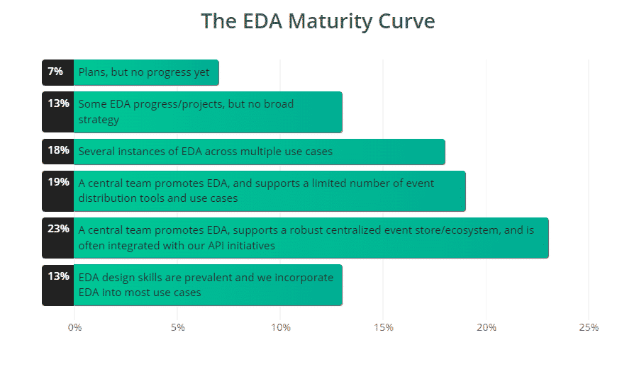

### Benefits of Event-Driven Architecture

The screen presents four interactive tabs. Their full text is:

- **Responsiveness:** Since everything happens as soon as possible and nobody is waiting on anyone else, EDA provides the fastest possible response time.
- **Scalability:** Because you do not have to consider what is happening downstream, you can add service instances to scale. Topic routing and filtering can divide services quickly and easily, as in “command query responsibility segregation.”
- **Agility:** To add another service, have it subscribe to an event and generate new events of its own. Existing services do not know or care that this happened, so it has no impact on them.
- **Flexibility:** An Event Mesh lets services run in the cloud, on premises, or in another country. Since the Event Mesh learns where subscribers are, services can move without the other services needing to know.

The screen adds that these advantages matter when one change can have large downstream consequences. Real-time information and quickly adding services and analytics can improve business processes and customer experience.

A linked “The Great EDA Migration” survey is summarized on screen. Useful areas include COVID-19-related issues, data governance, and supply chain. The original “How can EDA help business?” chart lists: 47% COVID-19-related issues such as travel regulations and airport handling; 42% data governance and regulation; 38% supply-chain issues; 36% regulatory changes; 31% burst handling such as unexpected sales spikes; 26% trade disputes such as customs declarations; 26% product recalls; and 24% natural disasters. 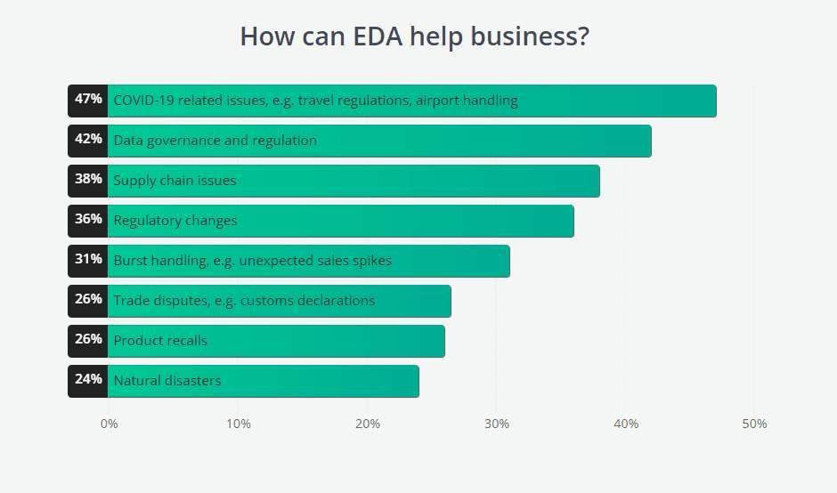

The cost-benefit chart from “The Great EDA Migration (2021 Survey)” reports 51% believe EDA benefits outweigh costs, 20% say costs and benefits are equal, 23% say costs exceed benefits, and 6% do not yet understand the correlation. This matches the page statement that 71% believe benefits outweigh costs or at least equal them. 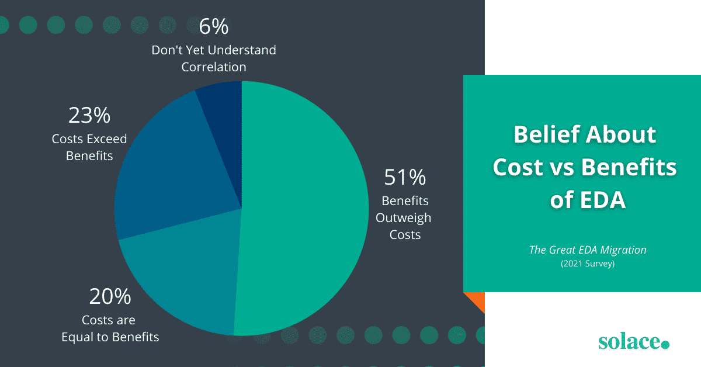

No knowledge check, quiz question, answer choices, or system feedback appeared on this screen. I revealed the missing-events panel and all four benefits tabs. At the latest captured state, this section showed 93% Completed and the overall SCORM meter showed 17% Complete; “CONTINUE” is the next internal control.

## SCORM section: Being Event Driven (lesson 4 of 12)

**Byline:** Eric Shantz. The screen opens with “Pop Quiz!” and a multiple-choice knowledge check.

**Question:** “Event Driven” as an idea has been around since...

**Choices:** Early 1970's; Mid 2000's; 2015; Sometime last year.

**Selection instructions:** The Academy labels this “Knowledge check: Multiple choice” and displays a radio group, indicating one choice. No separate answer-count instruction is visible. The page says “Complete the content above before moving on.”

**Resume state before a fresh attempt:** The first full snapshot on resuming this section showed “Incorrect,” “Try Again!” and a “TAKE AGAIN” button. No radio was selected in that state, so the earlier submitted choice and its explanation could not be recovered. After the page repainted during a scroll, the check appeared unanswered, with all four radios clear and a “SUBMIT” button. I will record the answer and feedback from the visible fresh attempt below.

**First fresh submission:** I selected **Early 1970's** and submitted it. The Academy marked the result “Incorrect” and displayed “Try Again!” It marked Early 1970's “Incorrectly selected,” Mid 2000's “Incorrectly unselected,” and both 2015 and Sometime last year “Correctly unselected.” This feedback identifies **Mid 2000's** as the correct option. At this point the system offered no explanation beyond “Try Again!”

**Confirmed correct submission:** I chose **Mid 2000's** and submitted it. The Academy marked it “Correctly selected”; the other three choices were marked “Correctly unselected.” Feedback: “Programming in the ‘Event Driven’ way is not a new concept, and has been around since the mid 2000's.” After the correct result, the lesson offered “CONTINUE.”

### RealStore event sorting activity

**Question:** “Which of these are Events that RealStore Retailer might want to know about?” **Instructions:** “Drag the white cards and drop them into the corresponding spaces.” The two categories are “We want to know about this” and “We don't want to know about this.” The activity card set is: When a customer uses a coupon; When a user adds something to their online cart; When inventory levels fall below 15%; Wifi connection / disconnections; Every scroll or click a user makes on the website; When a purchase is made; Every time a store's front door opens.

The Academy confirmed these classifications: coupon use — wanted (“Correct”); online-cart additions — wanted (“Correct”); inventory below 15% — wanted (“Correct”); Wi-Fi connection/disconnection — not wanted (“Correct”); every website scroll or click — not wanted (“Correct”); purchase made — wanted (“Correct”); store front door opens — not wanted. I initially put the door-opening card in the wanted category and the system said “Incorrect. Choose another category.” It then confirmed the not-wanted category as “Correct.” After all seven cards, the activity reported “6/7 Cards Correct” and offered “REPLAY”; there was no further explanation of the score. I replayed the shuffled activity and got 7/7 Cards Correct; the Academy gave explicit “Correct” feedback for all seven classifications.

### Video content: Be Event Driven

The first video is titled “Be Event Driven.” Its browser-reported duration is about 6 minutes 29 seconds. The player has no text tracks or caption control, and no transcript link is provided. The video was played to its end; its player then returned to the opening title card. The official course-linked `1_Being-Event-Driven.pdf` slide deck captures the visible examples below; this is a summary of displayed slide content, not a transcript of narration.

The slide “Events from the real world” shows these event examples:

- **Air Travel:** Passenger Jane has started check-in at the desk; Passenger Jane has arrived at the destination.
- **Connected Vehicles:** Fuel tank is less than 1/4 full; miles driven exceeded 10,000.
- **Retail:** Stock delivery arrival in store; product-line quantity less than 15%.

The next slides pair those events with timely actions. For Air Travel, offer a cabin-class upgrade, push the gate number, or reward the passenger’s next status tier; the business should be relevant, meaningful and actionable, and act “in the moment.” 

For Connected Vehicles, the same events can prompt a cross-sell for fuel delivery to home or office, or a car-service reminder that offers an appointment tomorrow. The stated characteristic is “Be indispensable.” 

For Retail, a reserved-item arrival can trigger an information message, and a product-line quantity below 15% can help identify demand spikes or trending products. The stated characteristics are “Be responsive” and “Be present.” 

### Video content: Characteristics of an Event-Driven Business

The second embedded video is titled “Characteristics of an Event-Driven Business.” Its browser-reported duration is about 5 minutes 37 seconds. It exposes no text track, captions, or transcript link. One visible video slide calls a digital business event-centric: “always sensing,” “always learning,” and “always ready,” attributed to Yefim Natis, VP & Distinguished Analyst at Gartner.

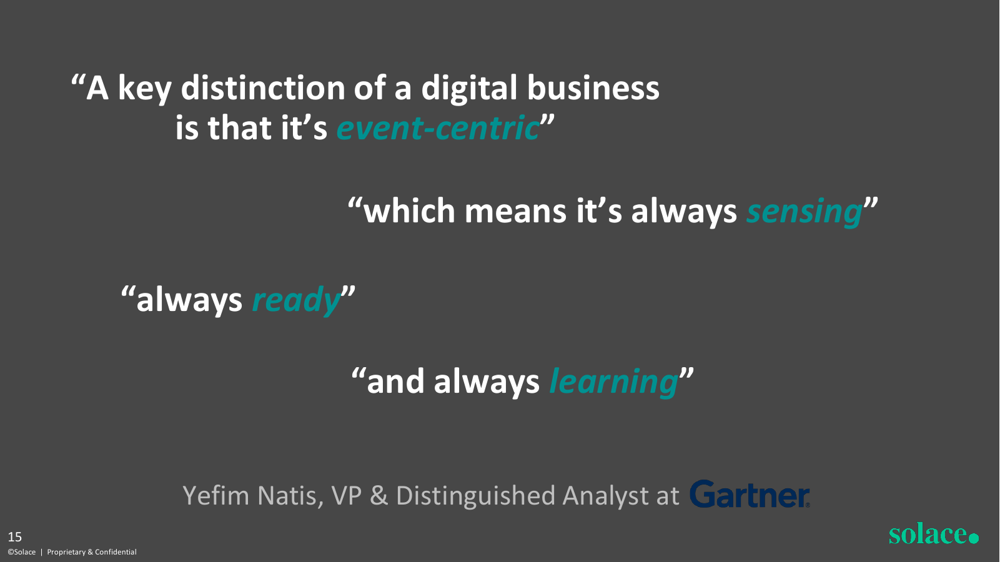

Another displayed definition, attributed in the course slides to The Enterprisers Project, says digital transformation is the integration of digital technology into all areas of a business, fundamentally changing how it operates and delivers value to customers. It is also a cultural change requiring organizations to continually challenge the status quo, experiment, and become comfortable with failure.

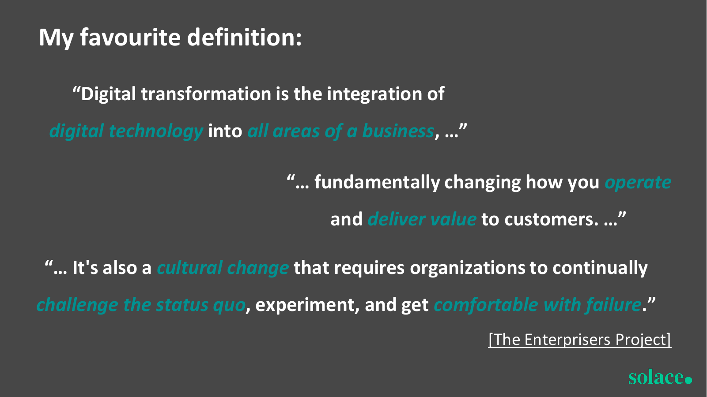

The accompanying slides list technology shifts: Integration Platform-as-a-Service, containers/orchestration, public cloud, artificial intelligence/machine learning, microservices, API gateways, and event brokers. They describe three technology goals for becoming event-driven:

- **Agility:** Improve system flexibility and scalability and reduce time to market.
- **Efficiency:** Get the right event to the right app at the right time.
- **Liberation:** Break down silos and make events/data available across all business functions.

These goals support “Deliver the Best Customer Experience.” 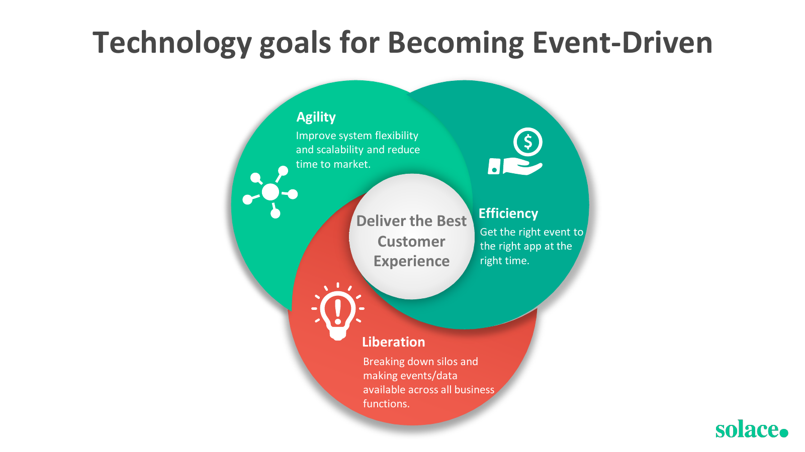

The video player still had no transcript/caption track when inspected; only the visible course slide text and the linked course slide deck are recorded here, not unverified spoken details. Playback checkpoint: I resumed this video from the beginning at 2x and let it run until the player returned to its opening state at 0:00 of 5:36, confirming playback reached the end. The lesson sidebar still read “Being Event Driven — 91% Completed” and the overall SCORM meter read 25% Complete; “CONTINUE” was visible as the next control.

## SCORM section: Event Driven Methodology (lesson 5 of 12)

**Byline:** Eric Shantz. The opening text says: “In this section, you'll learn about how you can become Event-Driven through our 6+1 Step process.” The page then introduces “The Event-Driven Methodology” and a four-slide FAQ carousel. The carousel begins with “Frequently Asked Questions” and “Some extra information you might want to know!” with a “START” control. Its visible controls include slide tabs for Introduction, 1, 2, and 3, plus previous/next buttons. At this first screen, the Academy meter showed 33% Complete and the lesson header showed “Lesson 5 of 12.”

### FAQ carousel content visible on the opening screen

- **Slide 1 — Frequently Asked Questions:** “Some extra information you might want to know!”
- **Slide 2 — What is meant by “Loose Coupling” or “Decoupling” of applications?** By introducing a middleman known as an Event Broker, Event-Driven Architecture enables Loose Coupling of applications, meaning applications and devices do not need to know where they are sending information, or where information they are consuming comes from. Loose Coupling does not come without some difficulties, but can dramatically improve system agility and scalability. In EDA, an event is sent without the expectation of anything in the way of a reply, except optionally an acknowledgment from the event broker. The benefit is that there is no dependency between sender and receiver; they are Decoupled.
- **Slide 3 — Where does an Event Broker fit in?** An Event Broker is middleware (software, an appliance, or SaaS) that routes events between systems using the Publish-Subscribe Messaging Pattern. All applications connect to the broker, which accepts events from senders and delivers them to all systems subscribed to receive them. Good system design and governance help ensure events reach the places they are needed, along with effective communication between event senders and those who need to respond. Event Portal tooling can capture, communicate, document, and govern the event-driven architecture.
- **Slide 4 — Where does an Event Portal fit in?** Organizations adopting EDA can find it difficult to document the design process and understand how system changes affect other parts. Event Portals let people design, create, discover, catalog, share, visualize, secure, and manage events and event-driven applications. Architects use the portal to define, discuss, and review events, data definitions, and application relationships. Developers use it to discover, understand, and reuse events across applications, lines of business, and external organizations. Data Scientists use it to understand event-driven data and discover insights by combining events.

 The heading and adoption diagram are illustrated in the original course-linked `2_Event-Driven-Methodology.pdf`. 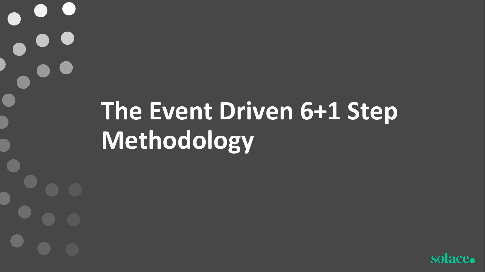 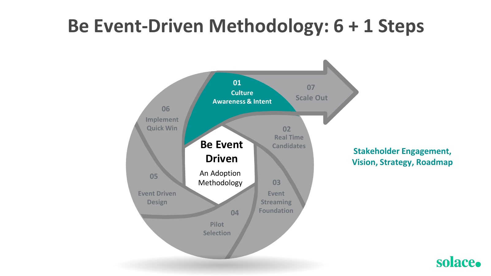

The screen includes links labeled “Event Broker,” “Publish-Subscribe Messaging Pattern,” and “Event Portal,” each opening a new tab. No quiz question, answer choices, submission, or feedback appeared on the opening screen. The methodology figure is introduced below the opening text; its original course slide is linked above. I started the FAQ carousel and viewed all three numbered questions. The final card, “Where does an Event Portal fit in?,” listed Architects, Developers, and Data Scientists; its next-slide control was disabled. At this captured state, the section showed 50% Completed and the overall SCORM meter showed 33% Complete. “CONTINUE” was visible as the next course control.
### Knowledge check: Event-Driven Methodology steps

**Question:** “Which of these steps don't belong in the Event Driven Methodology?” The screen presents a labeled graphic with seven plus-marker buttons. No separate selection-count instruction is visible in the initial state; each marker is labeled “Plus, Not viewed.” The options shown are:

1. Culture, Awareness & Intent
2. Real Time Candidates
3. Refactor all processes into microservices
4. Pilot Selection
5. Event Driven Design
6. Implement a Big Win
7. Scale Out

At this checkpoint, no choice had been submitted and no feedback was visible. The section showed 75% Completed, the overall SCORM meter showed 33% Complete, and “CONTINUE” was visible. I will inspect the marker interactions and record the system-confirmed answer before continuing.
**First marker result:** I opened the “Refactor all processes into microservices” marker (shown as a plus button and initially labeled “Not viewed”). The popover explicitly confirmed: “This step does not belong in the Event Driven Methodology! This step should be ‘Event Streaming Foundation’.” It provided “Previous” and “Next” controls; no separate Submit button or score was displayed. This identifies the confirmed incorrect step and its correct replacement.

**Marker feedback:** The “Pilot Selection” marker was marked as belonging in the Event Driven Methodology. The exact popover text was: “This step belongs in the Event Driven Methodology.”

**Marker feedback:** The “Event Driven Design” marker was marked as belonging in the Event Driven Methodology. The exact popover text was: “This step belongs in the Event Driven Methodology.”

**Marker feedback:** The “Implement a Big Win” marker was also marked as not belonging in the Event Driven Methodology. The exact explanation was: “This step does not belong in the Event Driven Methodology! You should be looking to implement a quick win, not a big win.” The course source slide names the valid step “Implement Quick Win.”

**Marker feedback:** The “Scale Out” marker was marked as belonging in the Event Driven Methodology. The exact popover text was: “This step belongs in the Event Driven Methodology.”

**Marker feedback:** The “Culture, Awareness & Intent” marker was marked as belonging in the Event Driven Methodology. The exact popover text was: “This step belongs in the Event Driven Methodology.”

**Marker feedback:** The “Real Time Candidates” marker was marked as belonging in the Event Driven Methodology. The exact popover text was: “This step belongs in the Event Driven Methodology.”

**All marker feedback / confirmed answer:** The five valid steps were each confirmed with the exact feedback “This step belongs in the Event Driven Methodology”: Culture, Awareness & Intent; Real Time Candidates; Pilot Selection; Event Driven Design; and Scale Out. The two steps that do not belong are **Refactor all processes into microservices** (replace it with **Event Streaming Foundation**) and **Implement a Big Win** (implement a quick win, not a big win). I opened every marker. The screen uses informational plus-marker popovers with Previous/Next navigation, not a radio/checkbox submission; it showed no separate Submit control, score, or aggregate feedback.

After viewing all seven marker popovers, the section meter increased to 88% Completed. The overall SCORM meter remained 33% Complete. The “CONTINUE” course control remained available.

## SCORM section: Distributed Computing Primer (lesson 6 of 12)

**Byline:** Eric Shantz. The opening statement says: “Having a Distributed System means your components reside across different machines. They can be spread across the globe in a truly internet-scaled fashion.” The screen shows a server-rack background behind this statement. The lesson header reads “Lesson 6 of 12.” The next content block is titled “Distributed Computing Primer - Part 1.” The overall SCORM meter read 42% Complete at this screen. The opening server-rack backdrop could not be saved: it appears as Academy/video background art, the linked slide PDF does not contain that exact backdrop, and the browser screenshot interface returned an image for viewing without a local file path. I describe it rather than substituting a different image.

### Primer Part 1 video and slide content

The embedded video is “Distributed Computing Primer - Part 1,” with a browser-reported duration of about 9 minutes 35 seconds. It has no text tracks, captions, or transcript link. I started playback at 2x; playback is still in progress. The downloadable original `3_Distributed-Computing-Primer.pdf` gives the visible course-slide content, recorded here as slide notes rather than a transcript.

A distributed system has multiple applications and computers working together to appear as one service or function. Its components communicate to coordinate actions and share state/data, and may be physically deployed in different locations. The course gives three reasons: horizontal rather than only vertical scaling; better fault tolerance and high availability; and improved responsiveness by getting closer to users. Its single “How” point is effective communication between processes/computers.

The course lists three communication objectives: trigger or signal another process to perform work; pass the necessary data/state to that process; and support distribution at “any scale.” File-based communication lets Process 1 write files to a shared/networked disk and Process 2 read them. It passes data/state through file contents, but triggering requires polling filesystem changes, and any-scale distribution is limited by shared-disk access such as NFS or workarounds such as FTP between servers. Database-centric communication passes data/state through table records, but triggering requires polling for record changes; although network-accessible and more flexible than files, the database becomes a protected resource that can limit connectivity and scale. Network socket-based communication passes data/state over the socket, and the arrival of data can trigger activity; “Internet scale” is possible subject to network reach.

The next listed objectives are to shield application developers from socket-programming code and decouple applications from other processes’ location, availability, and pace. The linked original slides preserve the course diagrams: concentric communication layers; file and database write/read flows with objective assessments; and direct socket communication with all three objectives marked successful. 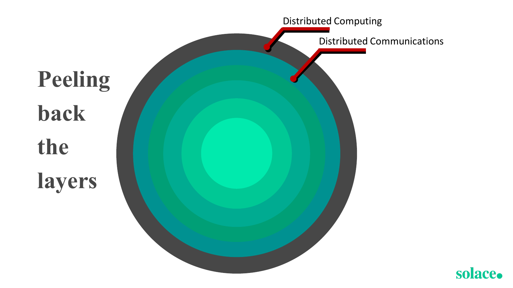 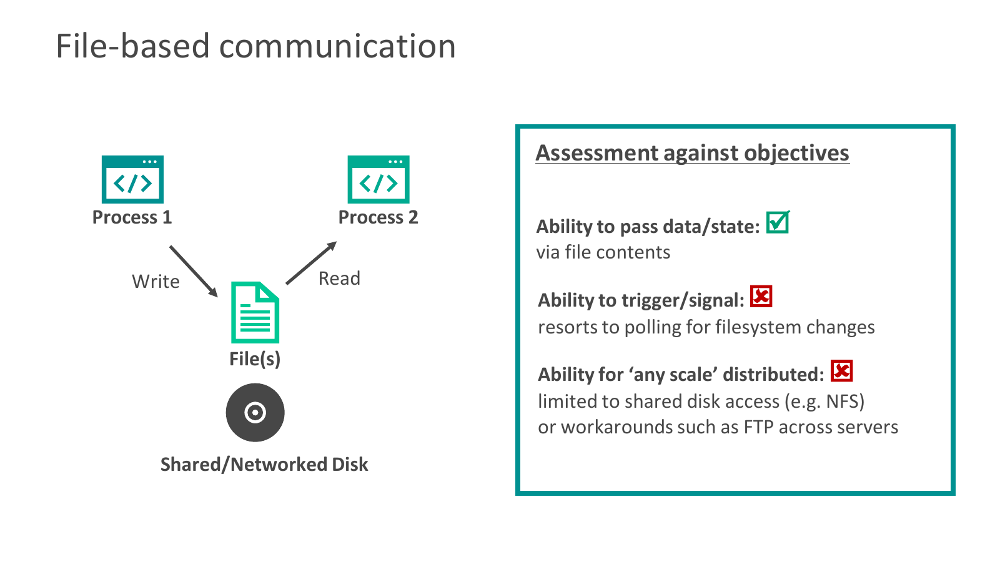 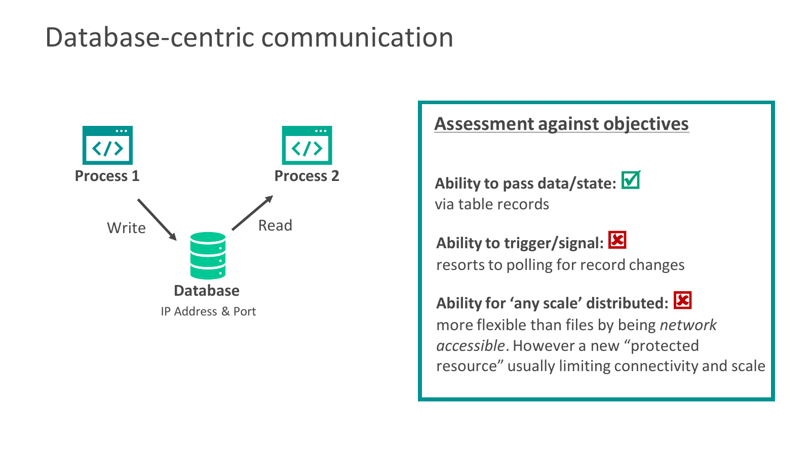 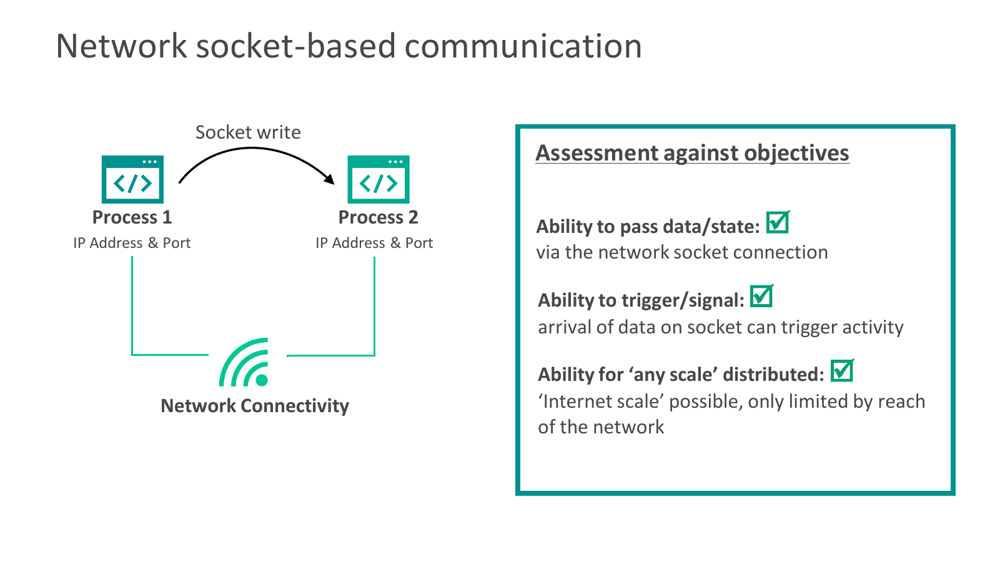
### Knowledge Check 1 of 3: File-Based Communication

**Question:** “File-Based Communication allows you to do which of the following?” **Selection instructions:** The Academy labels this “Knowledge check: Multiple choice” and presents a radio group; no separate answer-count instruction is visible. **Choices:** “Trigger or signal the next process to start”; “Can be used for ‘Any Scale’ distributed systems”; “Pass data and state information.”

**Resume state:** The check showed “Incorrect” with a “TAKE AGAIN” control and the page instruction “Complete the content above before moving on.” No radio was visibly selected and no per-choice feedback or prior answer could be recovered from this resumed state. No new answer has been submitted.
**Part 1 playback checkpoint:** The 9:34.8 video played to the end at 2x and returned to its opening title state at 0:00. Its browser media element exposed no caption text tracks, and the page offered no transcript link. The visible Academy state then showed this lesson at 24% Completed and the overall SCORM meter at 42% Complete. Knowledge Check 1 still showed the resumed “Incorrect” result and “TAKE AGAIN”; the earlier selected answer remained unavailable.

**Fresh retry selection before submit:** I selected “Pass data and state information.” That radio was checked; the other two options were unselected. The screen showed “Correct” while the “SUBMIT” button was still present, and no explanation had appeared yet.

**Submitted answer and system feedback:** I submitted “Pass data and state information.” The Academy marked it “Correctly selected”; the other two options were “Correctly unselected.” The feedback was “Correct” with no additional explanatory paragraph. The course-slide rationale is that files can pass state/data in their contents, while signaling requires polling filesystem changes and “any scale” is limited by shared-disk access or FTP workarounds. At the captured state, the lesson showed 29% Completed, the overall SCORM meter showed 42% Complete, and “CONTINUE” was the next course control.
### Part 2 introduction and Knowledge Check 2 of 3

After Knowledge Check 1, the page displayed this Gartner statement: “The strategic role of Event-Driven Computing in digital business, that strives for continuous awareness, intelligence and agility, creates a demand for Event Broker technology that is designed specifically for event-driven use cases.” It then introduced the embedded video “Distributed Computing Primer - Part 2.”

**Question:** “Messages can be:” **Selection instructions:** The Academy labels this “Knowledge check: Multiple response” and presents checkboxes, so multiple choices may be selected; no fixed answer count is stated. **Choices:** “Durable”; “Guaranteed”; “Queued”; “Recalled.”

**Resume state:** This check showed “Incorrect” and a “TAKE AGAIN” control. All four boxes were clear in the visible snapshot, so the earlier submitted selections and per-choice feedback could not be recovered. The page said “Complete the content above before moving on.” No new answer has been submitted. At this captured state, the lesson showed 43% Completed and the overall SCORM meter showed 42% Complete.

While Part 2 was playing, a visible slide showed Front End, Order Processor, and Cancellation Processor applications connected through individual APIs to a horizontal Messaging Middleware layer. The original course diagram is saved here: 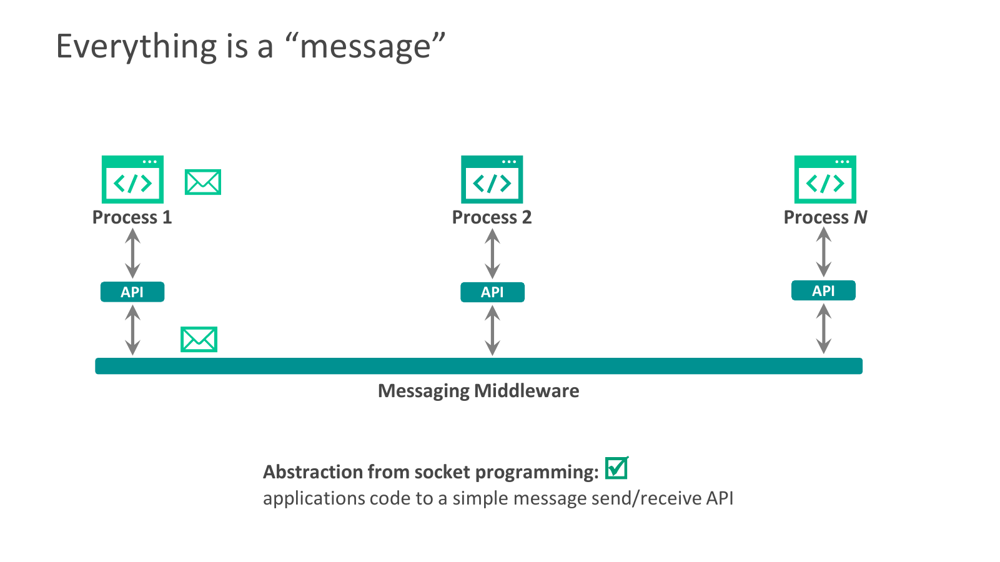

A later Part 2 frame titled “Messages can be durable or guaranteed” showed an Order Processor outage, a “New Order” message waiting in Messaging Middleware, and an Order Processor (Recovered). This illustrates availability decoupling and eventual delivery; the original course visual is saved here: 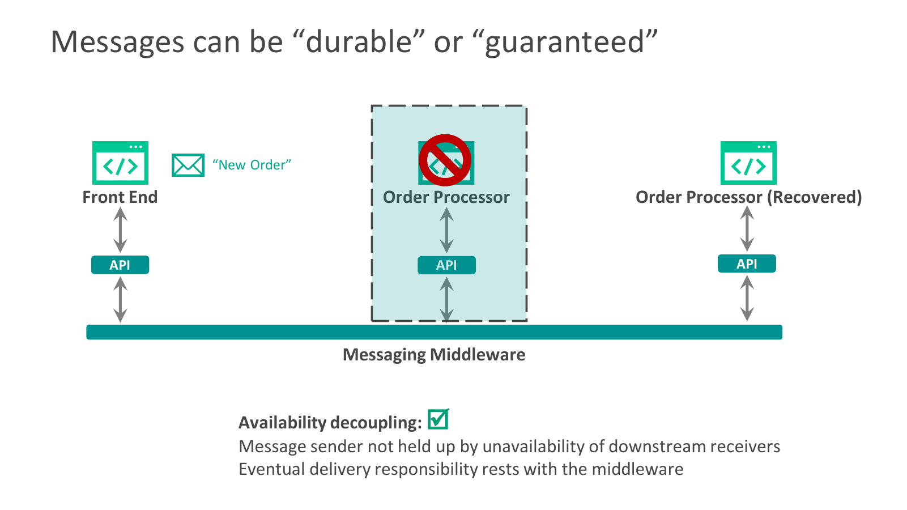

### Primer Part 2 video and slide content

The embedded video “Distributed Computing Primer - Part 2” runs about 8 minutes 33 seconds. It has no text tracks, captions, or transcript link. I played it to the end at 2x; the player returned to its opening state at 0:00.

The course peels back the communication layers from distributed computing and distributed communications through network communications to middleware/integration. A “Middleware” or “Integration” products slide uses a basket and a crumpled-paper image under “What came out?” The next slides introduce message-oriented middleware: applications use a simple message send/receive API instead of socket-programming code; a message destination lets the sender avoid addressing the receiver’s physical location; durable/guaranteed messages keep senders from being held up by unavailable downstream receivers, with eventual delivery left to middleware; and queued/buffered messages act as a shock absorber between fast publishers and slow receivers. These are socket-code abstraction and location, availability, and speed/pace decoupling.

The HTTP/REST alternative also abstracts socket programming through a simple HTTP API, but HTTP operations target a specific hostname and port, so the slide marks location decoupling as absent. It says applications need failure handling when a service is unavailable and performance is only as fast as the slowest service, so availability and speed/pace decoupling are absent. The slide calls out synchronous versus asynchronous communication as the key distinction.

Original course visuals for the middleware layer, message destinations, durability/availability, queueing/pace, and the HTTP/REST comparison are linked above and below: 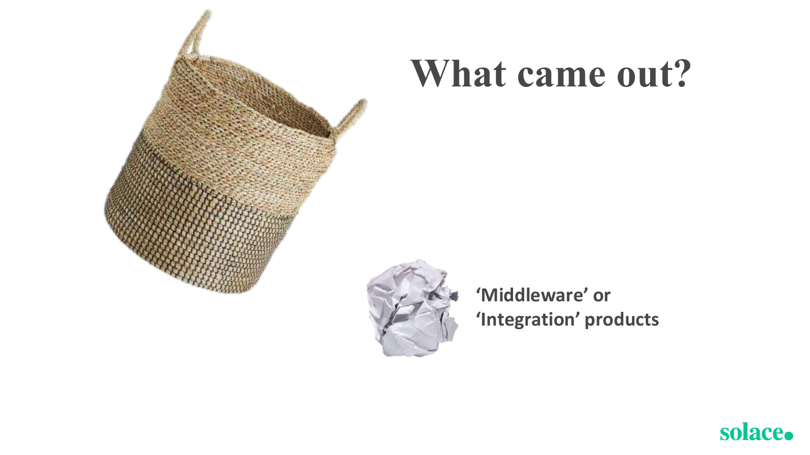 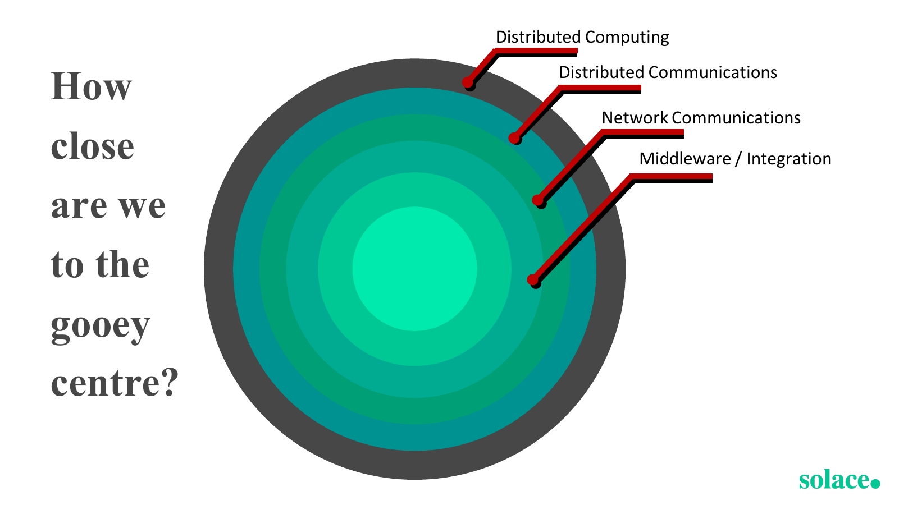 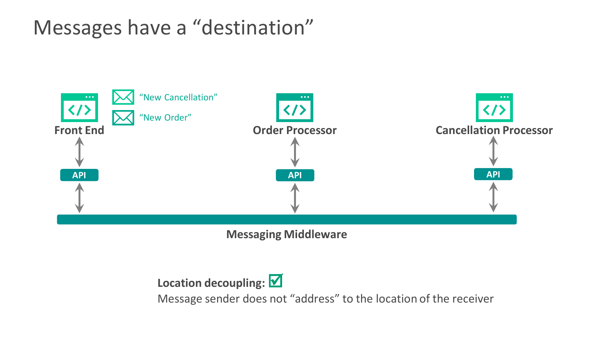 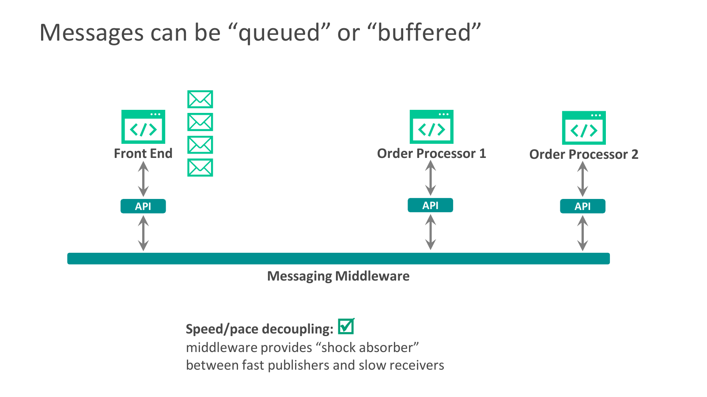 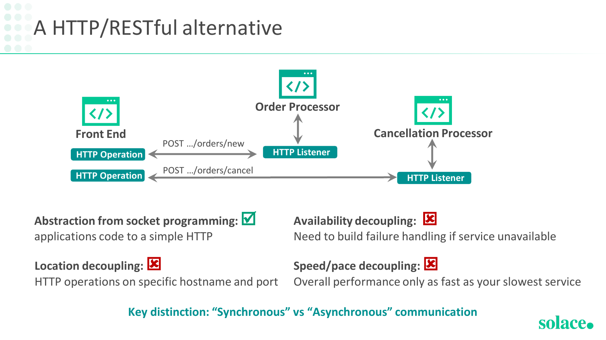

**Part 2 checkpoint:** After playback ended, the section meter showed 57% Completed and the overall SCORM meter remained 42% Complete. Knowledge Check 2 still showed the resumed “Incorrect” state and “TAKE AGAIN”; no prior selections could be recovered. The video player exposed zero caption tracks and the page provided no transcript.

**Fresh retry selection before submit:** I checked “Durable,” “Guaranteed,” and “Queued,” leaving “Recalled” unchecked. The screen showed “Correct” while “SUBMIT” remained available; no explanation had appeared yet.

**Submitted answer and system feedback:** I submitted “Durable,” “Guaranteed,” and “Queued,” leaving “Recalled” unchecked. The Academy marked each checked item “Correctly checked,” marked “Recalled” “Correctly unchecked,” and displayed “Correct.” No additional explanation paragraph appeared. The Part 2 slide deck explains these message properties as durable/guaranteed delivery and queued/buffered delivery. At the captured state, the lesson showed 62% Completed, the overall SCORM meter showed 42% Complete, and “CONTINUE” was the next course control.
### Part 3 introduction and Knowledge Check 3 of 3

After Knowledge Check 2, the page said: “An Event Mesh is invaluable tool to ensure that distributed applications receive events no matter where they are connected.” It then introduced “Distributed Computing Primer - Part 3.”

**Question:** “Which description best fits an Event Mesh?” **Selection instructions:** The Academy labels this “Knowledge check: Multiple choice” and presents a radio group; no separate answer-count instruction is visible. **Choices:** “A dynamic infrastructure of interconnected event brokers”; “A centralized database system for real-time analytics”; “A hierarchical structure of message queues and topics.”

**Resume state:** The check showed “Incorrect” and “TAKE AGAIN.” No option was visibly selected, so the earlier answer and per-choice feedback could not be recovered. The page said “Complete the content above before moving on.” No fresh answer has been submitted. At this checkpoint, the lesson showed 81% Completed and the overall SCORM meter showed 42% Complete.
### Primer Part 3 video and slide content

The embedded video “Distributed Computing Primer - Part 3” has a browser-reported duration of about 9 minutes 56 seconds. It exposes no text tracks, captions, or transcript link. I started it at 2x; completion is pending.

The course’s “Nearly at the finish line!” slide extends the communication-layer sequence through Network Communications, Middleware / Integration, Asynchronous Communications, and Event Brokers. Its additional broker objectives are to run across environments from on-premises to cloud; integrate across multiple protocols including REST; provide security and role-based access control; provide high availability, uptime, and robustness; support monitoring and governance; and mediate/facilitate event-driven computing.

The final visual says Event Brokers work together to create an Event Mesh. The original diagram places the network beneath PaaS/CaaS/Virtualization, then Service Mesh and Event Mesh; above these it shows Request/Reply, Hybrid, and Event-Driven Microservices across the network. A cited Gartner 2019 comparison pairs traditional “Messaging” with digital-business “Event Mesh.” 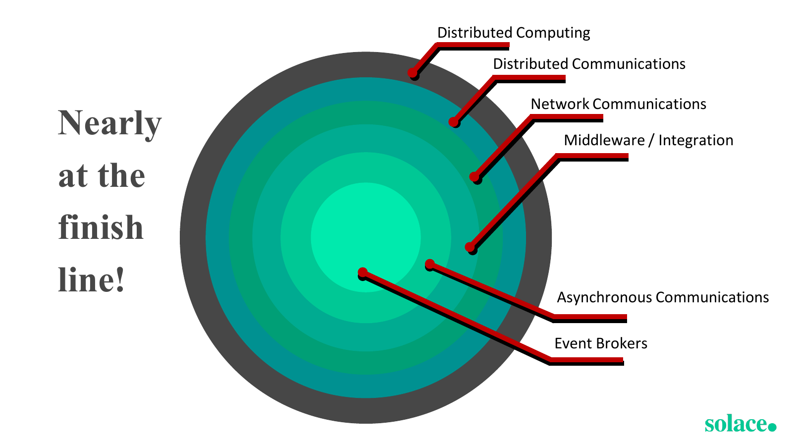 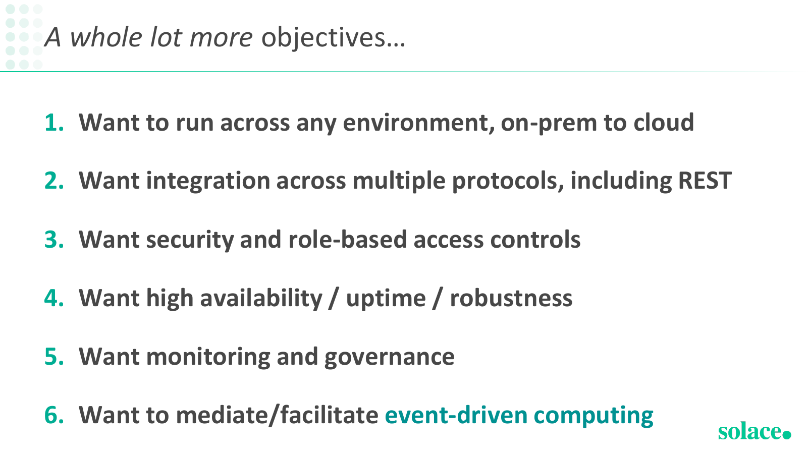 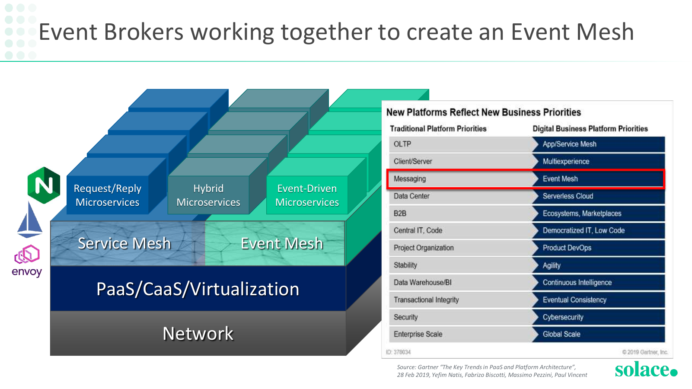

**Part 3 playback checkpoint:** The 9:55.7 video played to the end at 2x and returned to its opening state at 0:00. It exposed no caption tracks and the Academy page offered no transcript. The lesson then showed 90% Completed and the overall SCORM meter showed 42% Complete; Knowledge Check 3 still showed the resumed “Incorrect” result and “TAKE AGAIN.”

**Fresh retry selection before submit:** I selected “A dynamic infrastructure of interconnected event brokers.” That radio was checked; the centralized-database and hierarchical-queues options were unselected. The screen showed “Correct” while “SUBMIT” remained available, with no explanation yet.

**Submitted answer and system feedback:** I submitted “A dynamic infrastructure of interconnected event brokers.” The Academy marked it “Correctly selected,” marked the centralized-database and hierarchical-queues options “Correctly unselected,” and displayed “Correct.” No additional explanation paragraph appeared. The linked course slide states that event brokers work together to create an Event Mesh. At this checkpoint, the lesson showed 95% Completed, the overall SCORM meter showed 42% Complete, and “CONTINUE” was visible as the next control.
## SCORM section: Design Patterns (lesson 7 of 12)

**Byline:** Eric Shantz. The opening definition reads: “Distributed Design Patterns are architectural solutions that enable applications to communicate reliably and efficiently across distributed systems. These patterns provide proven approaches for handling common challenges.” The page then introduces “Design Patterns for Being Distributed.” The lesson header says “Lesson 7 of 12.” Its opening screen uses a dark background showing people/nodes connected across a network; no local source image or downloadable screenshot path was exposed, so this background is described here. The linked course slide deck summarizes the walkthrough as Being Distributed, Being Scalable, and Data Handling. 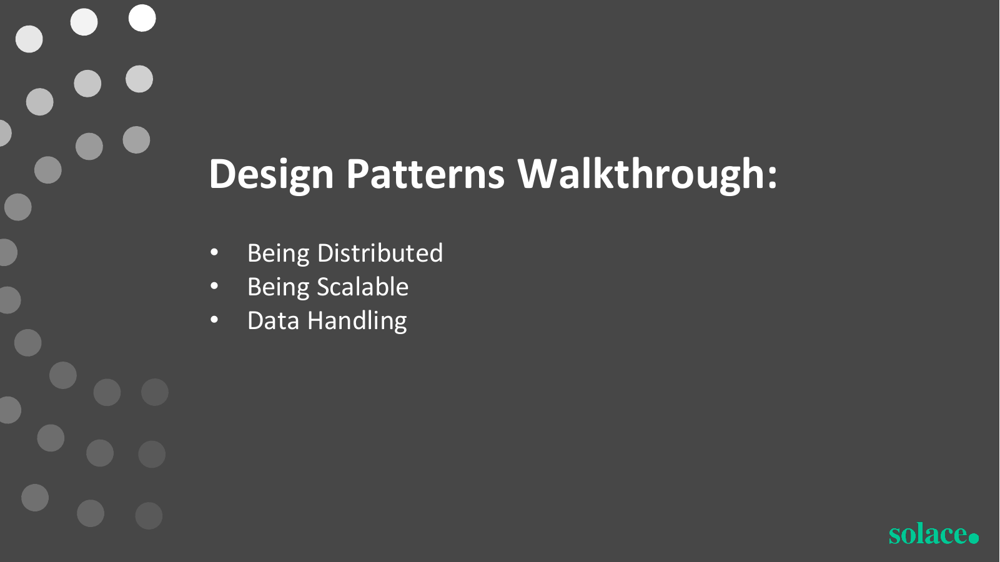 The Academy meter showed 50% Complete, and the section showed 5% Completed.

### Distributed patterns introduced in the linked course slides

The original `4_Design-Patterns.pdf` introduces three patterns for being distributed. The **Retry Pattern** addresses transient unavailability/failure; examples are requests for configuration/initialization information and login. Implementation steps are timeout logic, finite or infinite retry logic, and back-off/anti-flood parameters. This matches the Academy feedback to fail fast for operations requiring immediate customer feedback and let the customer or clerk retry manually.

The **Idempotent Processor Pattern** addresses duplicate or repeated data, with new-order submission as the example. The slides recommend sequence numbers or unique IDs, duplicate detection/suppression, and retransmit-flag inspection. The **Publish-Subscribe Pattern** addresses sending to multiple or unknown n consumers, with catalogue updates and heartbeat/status as examples. It addresses by the data rather than the target consumer and decouples through an intermediate component.

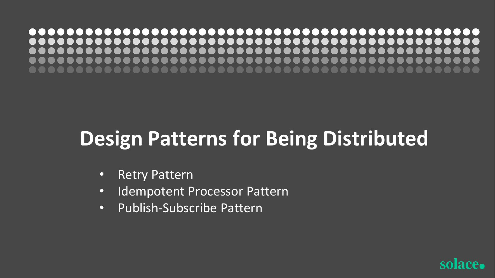 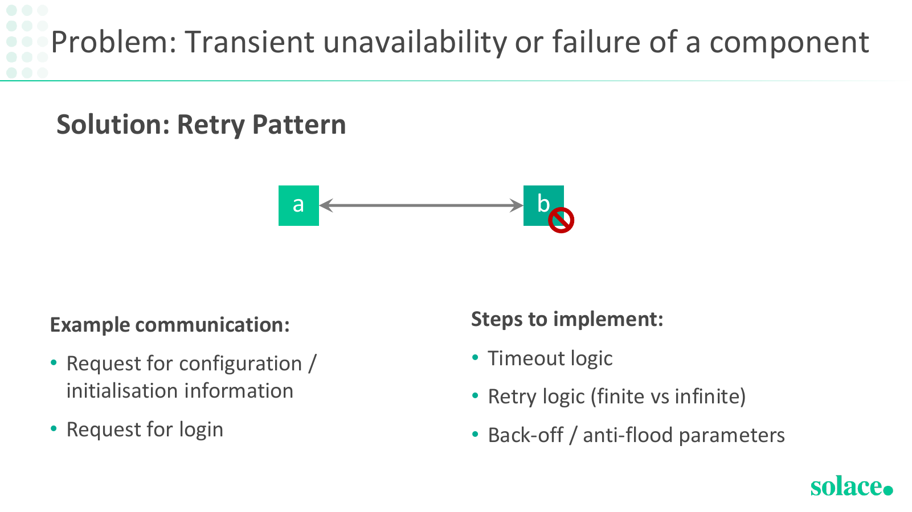 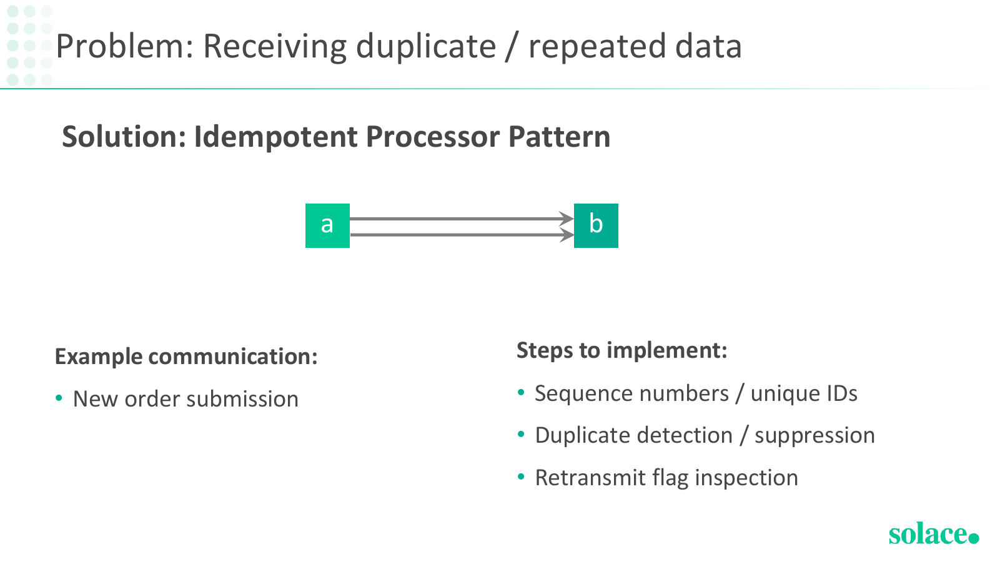 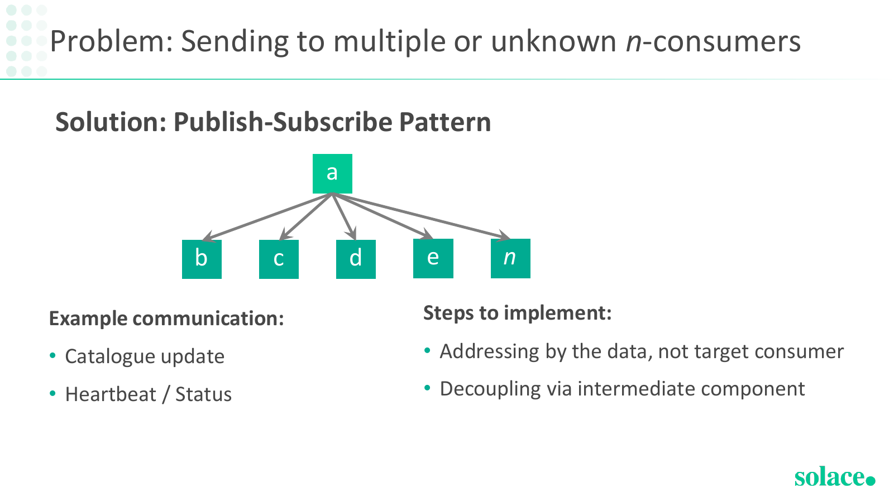
### Video: Design Patterns for Being Distributed

The embedded “Design Patterns for Being Distributed” video runs about 10 minutes 5 seconds. It exposes no text tracks, captions, or transcript link. I returned to this player after the first quiz attempt and watched it through to the end at 2x; the player returned to 0:00. Its visible slides match the original course PDF diagrams linked above for transient failures/Retry, duplicate data/Idempotent Processor, and multiple or unknown consumers/Publish-Subscribe. At completion, the Design Patterns section still showed 36% Completed and the overall SCORM meter showed 50% Complete.
### Knowledge Check 1 of 3: Retry Pattern

**Question:** “In which of these operations should you implement the Retry Pattern?” **Selection instructions:** The Academy labels this “Knowledge check: Multiple choice” and presents one radio group; no separate answer-count instruction is visible. **Choices:** “Redeeming a one-time coupon”; “Synchronizing inventory levels between stores and warehouses”; “Price checking an item.”

**Resume state:** The check showed “Incorrect” and the feedback: “Incorrect. Don't retry operations that require immediate customer feedback - better to fail fast and let the customer/clerk retry manually.” It offered “TAKE AGAIN.” No radio was visibly selected, so the earlier submitted option and per-choice feedback could not be recovered. The page said “Complete the content above before moving on.” No fresh answer has been submitted.

**Fresh retry before submit:** I selected “Synchronizing inventory levels between stores and warehouses”; the coupon and price-check options were unselected. The Academy immediately displayed “Correct!” with this explanation: “When synchronizing inventory levels between store and warehouse systems, retries ensure data consistency if network issues occur.”

**Submitted answer and system feedback:** I submitted “Synchronizing inventory levels between stores and warehouses.” The Academy marked it “Correctly selected” and the coupon and price-check answers “Correctly unselected.” Feedback: “Correct! When synchronizing inventory levels between store and warehouse systems, retries ensure data consistency if network issues occur.” At the captured state, the section showed 23% Completed and the overall SCORM meter showed 50% Complete; “CONTINUE” was the next course control.
### Scalable design patterns in the linked course slides

The source slides list three patterns for scalability. The **Asynchronous Request-Reply Pattern** addresses a caller blocked while waiting for a slower service; the example is a new-order submission and acceptance confirmation. Its implementation steps are asynchronous/parallel rather than sequential work, tracking outstanding requests and deferred execution, and timeout/retry/cancel logic.

The **Queue-Based Load-Levelling Pattern** addresses bursty or overwhelming traffic. A queue provides shock absorption and communication is asynchronous. The **Competing Consumers Pattern** addresses a processor becoming slow or falling behind; multiple workers/instances can process tasks independently. The original course diagrams are saved here: 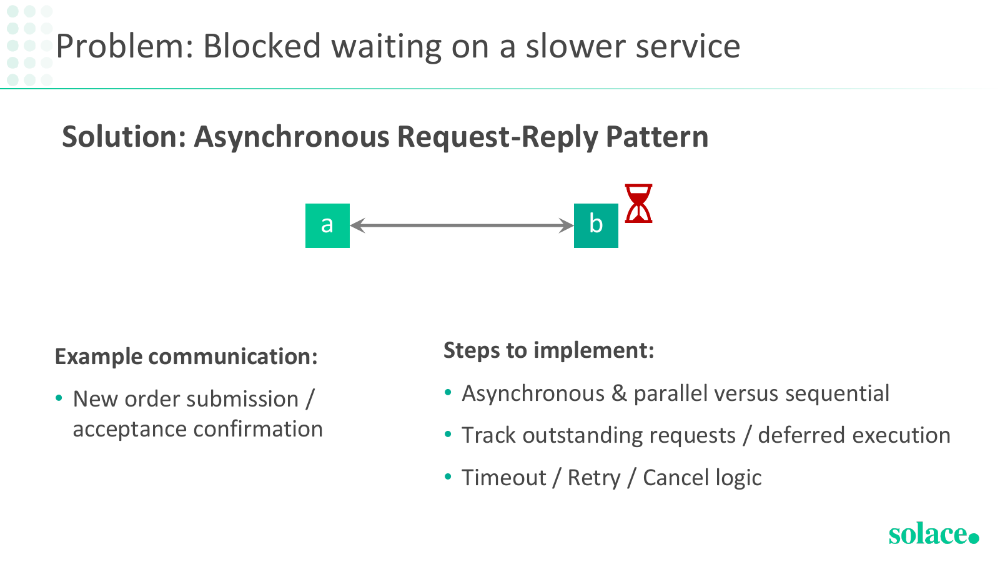 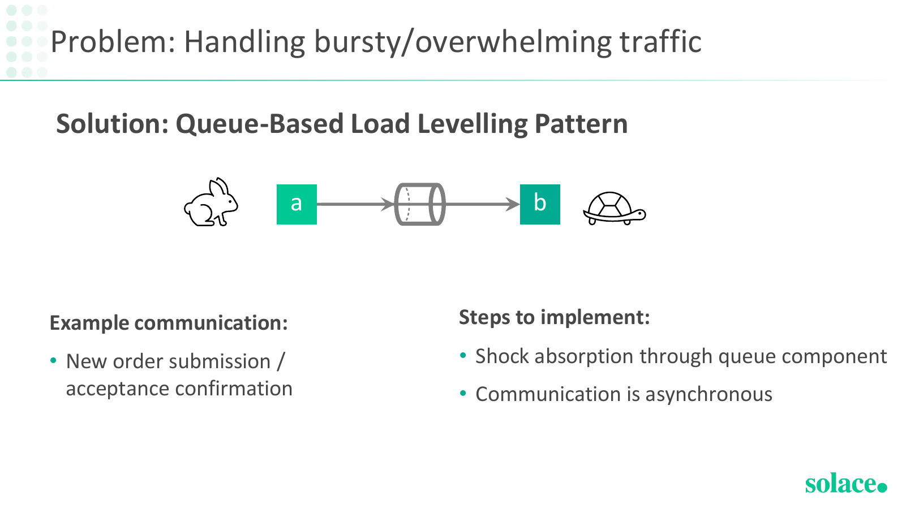 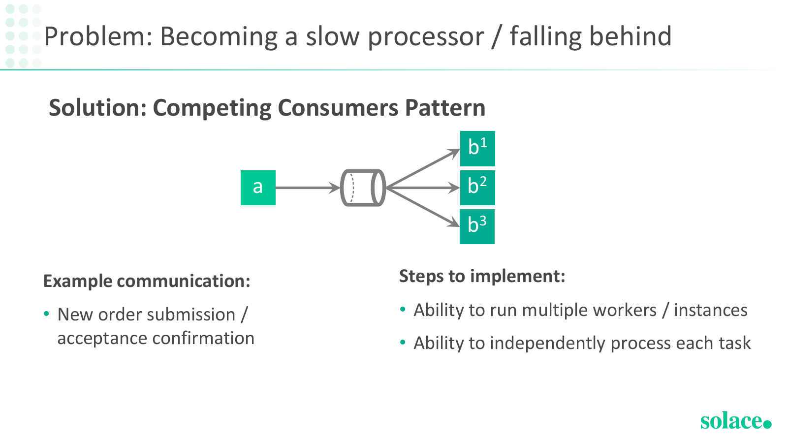
### Video: Design Patterns for Being Scalable

The embedded “Design Patterns for Being Scalable” video runs about 6 minutes 8 seconds. It exposes no text tracks, captions, or transcript link. I played it to the end at 2x; it returned to its opening state at 0:00. The visible material matches the original course diagrams linked above for asynchronous request-reply, queue-based load-levelling, and competing consumers. At completion, the section showed 45% Completed and the overall SCORM meter showed 50% Complete.
### Design Patterns for Being Scalable and Knowledge Check 2 of 3

The next introduction says: “Design Patterns for Being Scalable provide solutions for handling increasing loads and growing demands. These patterns create highly scalable systems that process large volumes of events while maintaining reliability and performance.” The page introduces the embedded video “Design Patterns for Being Scalable.”

**Question:** “In which of these operations should you implement the Queue Based Load-Levelling Pattern?” **Selection instructions:** The Academy labels this “Knowledge check: Multiple choice” and presents a radio group; no separate answer-count instruction is visible. **Choices:** “Inventory restock requests”; “Price lookups”; “Payment Processing.”

**Resume state:** The check showed “Incorrect” with this feedback: “Incorrect. Customer payments and price lookup responses should be immediate, not queued.” No radio was visibly selected, so the earlier answer and per-choice feedback could not be recovered. It offered “TAKE AGAIN” and the page said “Complete the content above before moving on.” No new answer has been submitted. The section showed 36% Completed and the overall SCORM meter showed 50% Complete.

**Fresh retry before submit:** I selected “Inventory restock requests”; “Price lookups” and “Payment Processing” were unselected. The Academy immediately displayed “Correct!” and explained: “During busy periods, stores requesting stock replenishment can be queued and processed based on warehouse capacity.”

**Submitted answer and system feedback:** I submitted “Inventory restock requests.” The Academy marked it “Correctly selected,” marked “Price lookups” and “Payment Processing” “Correctly unselected,” and displayed “Correct!” with the explanation: “During busy periods, stores requesting stock replenishment can be queued and processed based on warehouse capacity.” At this checkpoint, the section showed 50% Completed and the overall SCORM meter showed 50% Complete; “CONTINUE” was the next course control.
### Design Patterns for Data Handling and Knowledge Check 3 of 3

The introduction says: “Design Patterns for Data Handling provide the foundation for managing data consistency, scalability, and complexity.” The linked `4_Design-Patterns.pdf` illustrates three patterns. **Eventual Consistency** addresses synchronizing multiple replicas, such as a product catalogue across sites and regions; it relaxes “Consistency” in the CAP theorem and relies on guaranteed delivery of updates eventually to all replicas. **Sharding** addresses database-scale limits/bottlenecks; it splits a bandwidth-limited customer-details database by a suitable shard/partition identifier, and stable data fields let access logic compute the correct shard. **Command & Query Responsibility Segregation (CQRS)** addresses complex reads that affect writes; it maintains separate command and query databases/models and guarantees command delivery to the query database so it stays in sync. 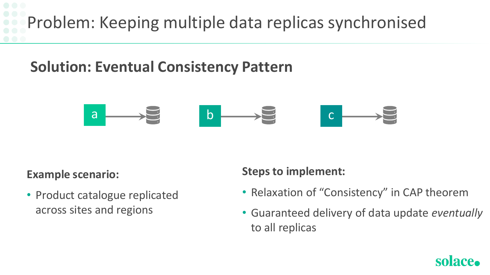 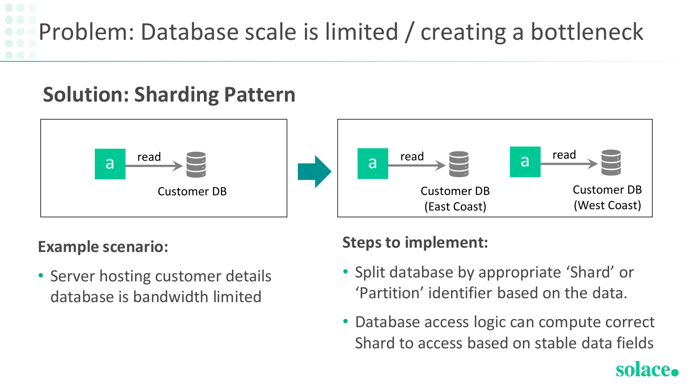 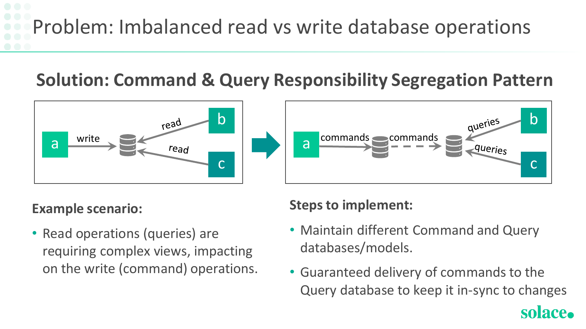

**Question:** “What is the primary benefit of implementing the CQRS (Command Query Responsibility Segregation) Pattern?” **Selection instructions:** The Academy labels this “Knowledge check: Multiple choice” and presents a radio group; no separate answer-count instruction is visible. **Choices:** “It automatically encrypts all data at rest and in transit”; “It allows for independent scaling and optimization of read and write operations by separating them into different models”; “It eliminates the need for a database by storing all data in memory.”

**Resume state:** The check showed “Incorrect” and “TAKE AGAIN.” No radio was visibly selected, so the prior answer and per-choice feedback could not be recovered. The page said “Complete the content above before moving on.” No fresh answer has been submitted. At this screen, the section showed 68% Completed and the overall SCORM meter showed 50% Complete.

**Data Handling video checkpoint:** The embedded video ran about 6 minutes 49 seconds, exposed no text tracks/captions and had no transcript link, and played to the end at 2x before returning to 0:00. The Design Patterns section then showed 73% Completed and the overall SCORM meter showed 50% Complete; Knowledge Check 3 still showed “Incorrect” and “TAKE AGAIN.”

**Fresh retry before submit:** I selected “It allows for independent scaling and optimization of read and write operations by separating them into different models.” The encryption and in-memory-database choices were unselected. The screen showed “Correct” while “SUBMIT” remained available; no extra explanation had appeared.

**Submitted answer and system feedback:** I submitted “It allows for independent scaling and optimization of read and write operations by separating them into different models.” The Academy marked it “Correctly selected,” marked the encryption and in-memory-database alternatives “Correctly unselected,” and displayed “Correct.” The check added no explanatory paragraph; the course slide explains CQRS through separate command and query models and guaranteed delivery of commands to keep the query model synchronized. At this checkpoint, the lesson showed 77% Completed and the overall SCORM meter showed 50% Complete; “CONTINUE” was visible as the next course control.
### “What other Design Patterns should I know about?” tabs

After the CQRS check, the page displayed “What other Design Patterns should I know about?” with two tabs, “Deferred Execution” (selected) and “Choreography.” The selected tab says Deferred Execution differs from REST APIs, where the caller waits for responses. Events are published and “held” (persisted) by the broker until consumers process them at their own pace. “All we know is that Event A will, at some point, cause something to happen”; the logic consuming Event A need not execute instantly, because execution is deferred. The listed benefits are independent operation on each system’s own schedule, later processing so publishers can “set it and forget it,” and no blocking or waiting.

The real-world example updates a product’s Bill of Materials (BoM): Engineering publishes a BoM change event, the Quality team analyzes component changes, and ERP updates inventory records. These cascading event processes are functionally independent, run in sequence, and proceed on their own schedule. The page’s analogy is: “Think of Deferred Execution like dropping off the mail. You don't wait at each mailbox to see when people read their letters - they'll get to it when they're ready!” The visible card is text and tabs, with no separate diagram to save. The section showed 95% Completed and the overall course meter showed 50% Complete at this checkpoint.
The “Choreography” tab says service coordination in event-driven systems can use **Orchestration** or **Choreography**. Orchestration uses a master service to track and monitor other services and provide traceability, but that controller can become a bottleneck. Choreography lets services operate independently, reacting to events and producing new events without central control; errors can also be events that services consume and react to. The page compares Orchestration to an orchestra conductor directing the group and Choreography to free-style jazz, where members play independently but the combined result is coordinated. Its comparison table says Orchestration has one master service, centralized control/tracking, and possible single-point-of-failure/bottleneck risk; Choreography has services reacting independently with no central controller. A new-tab reference is labeled “Microservices Choreography vs Orchestration: The Benefits of Choreography.” The tab contains text and a comparison table, not a separate diagram. No quiz question, answer choices, or feedback appeared on these tabs. “CONTINUE” was the next course control.

After reviewing both tabs, Design Patterns remained at 95% Completed and the overall SCORM meter remained at 50% Complete. “CONTINUE” was visible to proceed.

## SCORM section: Topic Taxonomy (lesson 8 of 12)

The opening screen is by Eric Shantz and introduces the topic after the earlier discussion of Publish/Subscribe and event taxonomy: “Now let’s talk more about Topics.” The timeline explains the roles and addressing model:

1. **Publisher:** An application or service that creates and sends events, like a broadcaster. At RealStore, an item return at a POS creates a Return event and an Inventory Update event.
2. **Subscriber:** An application that wants events, like a listener tuned to a channel. The Accounting System subscribes to Return events; Inventory Management subscribes to Inventory Update events.
3. **Topics:** Events carry metadata describing the event, called a Topic. A topic is a designed addressing system analogous to a postal address. Forward slashes separate hierarchical levels, with each level adding specificity. Example: `retail/menswear/return/v1.2/{location}/{store_id}/{product_id}`. The page describes this as a refund transaction at a specific POS terminal and store.
4. **How publishers and subscribers communicate:** Publishers send events to topics. The Event Broker checks the topic’s subscriptions to determine recipients.
5. **Why this works well:** A publisher sends once to one topic; the broker can deliver to one or thousands of subscribers. Subscription-based filtering gives each subscriber the exact events it needs and keeps filtering logic in subscriptions rather than business logic.

The screen used a dark road photograph as a background; I recovered the original course asset and saved it here: 
The Publisher illustration is an original animated course asset showing a cellular tower sending out concentric radio-wave rings, and the Subscriber illustration shows a similar tower without the rings. I opened both course zoom views to inspect them and saved the originals:  

**Screen checkpoint:** The full timeline, including the publisher/subscriber illustrations and topic hierarchy example above, was visible. There was no knowledge-check question, answer list, submission, or feedback on this screen. The progress indicator read 9% for Topic Taxonomy and 58% for the overall SCORM course; “CONTINUE” was the next course control. The visible images were recovered from the original SCORM assets; the zoomable illustration screenshot was not needed because its original image files were available.
### Topic hierarchy labels

The follow-on screen says, “Let's take a closer look at our Topic,” and reminds learners: “Remember: this is a Topic that a Return event could be Published to.” The graphic displays `retail / menswear / return / v1.2 / winnipeg / w-ne-2 / mw072`. Its seven selectable markers explain each level: **Domain** is the highest-level category identifying a business sector or operational area; **Product Category** is a specific department or product line within the domain, segmenting merchandise or services; **Transaction Type** represents the current state or action and identifies what event or transaction occurred; **Version Number** identifies the schema or message-format version; **Store Location** is the geographic location or city and enables regional filtering and reporting; **Store Identifier** is a unique code for a specific store within a location; **Product Code** is described in the popover as a unique identifier for the specific transaction or order. I opened every marker and read each popover. The original course graphic is saved here: 

**Open reflection prompt:** “What do you think? What's a Topic that a consuming application could Subscribe to in order to receive this event?” The screen provided no answer choices, text-entry field, submission action, or system feedback; it was a reflection prompt, not a scored knowledge check. After viewing the markers, the Topic Taxonomy progress indicator read 41% and the overall SCORM meter read 58% Complete. “CONTINUE” was the next course control.
### Topic learning tools

The next screen recommends two optional external tools under “Try these tools to learn more!”: **Ask Solly** is offered for more information on Topic best practices, and **Topic Tester** lets learners build their own Topics. The Academy links to [Ask Solly](https://solaceservices.github.io/Ask-Solly/) and [Topic Tester](https://solaceservices.github.io/Solace_Topic_Tester/); both are marked as opening in a new tab. No knowledge-check question, choices, answer submission, or feedback appeared on this screen. Topic Taxonomy showed 73% Completed and the overall SCORM course showed 58% Complete; “CONTINUE” was the next course control.
### Original Topic Taxonomy visuals

The zoomable POS image shows a customer holding a payment terminal at a retail counter, illustrating the return/POS event context: . The other original animated visual shows a producer publishing through Solace PubSub+ and topic-based routes reaching several subscribing payment systems; it includes a Capital One credit-card microservice, a Bank of America credit-card microservice, and an all-payments system-of-record consumer: .

The “Ask Solly” sample screenshot shows a prompt asking about Topic architecture best practices and a sample response. Visible guidance recommends a `Domain/ObjectType/Verb/Version/Properties` hierarchy, defines those levels, orders properties from less to more specific, includes only routing/filtering/access-control fields, uses consistent naming, documents valid formats/values, and avoids special characters such as spaces, `*`, `>`, and `!` in published topics. This is a static course illustration of the tool, not a new external Ask Solly response: 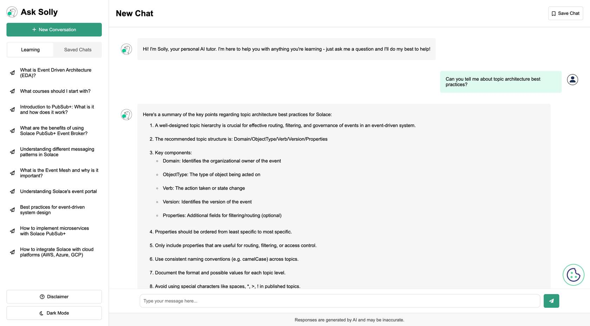.

The “Topic Tester” sample screenshot contrasts a producer Topic (`bloomingdale / accessories / orderPlaced / v.3.1 / ottawa / warehouse / mw001`) with a consumer subscription that uses `*` for the version level, and shows demo datasets and sample retail records. It illustrates subscriber wildcard matching against a Topic segment: 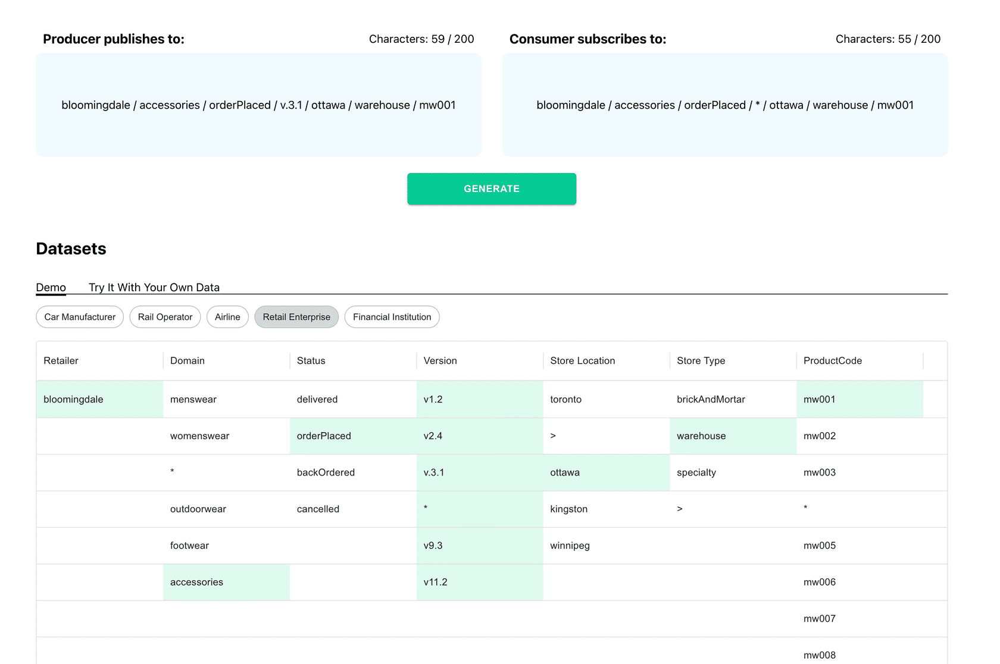
## SCORM section: Putting it All Together (lesson 9 of 12)

The section opens with “Let's check in with Dave.” The introduction says: “Now that we've seen what Event Driven Architecture is, what it can do, and how we can use it, let's see how Dave is doing at RealStore Retailer!” An embedded video player appears below. On this screen, Putting it All Together showed 67% Completed and the overall SCORM course showed 67% Complete; “CONTINUE” was the next course control.
### “Let's check in with Dave” video

The embedded video runs about 1 minute 15 seconds. It has no text tracks/captions and no transcript link. I played it through to the end at 2x; the player returned to 0:00 paused, confirming completion. A visible frame places Dave in the RealStore shop with a laptop and shows a Network of Event Brokers (Event Mesh) that “ingests, filters, and routes events to subscribing consumers.” Example producer events visible in the diagram include Stock Inquiry, New Order, Return, and Shipping Inquiry; subscribers include Finance, Warehouse Database, and Customer Service. The diagram says consumers subscribe to relevant events affecting their systems/actions, and event-triggered real-time responses can generate subsequent events. The player screenshot could not be exported as a local image from the browser UI; the closely related original course Event Mesh diagram saved earlier is linked here for reference: . I have recorded only the visual content observed; no additional narration transcript was available.

**Video checkpoint:** The opening/video screen and frame described above were the only content on this page. No knowledge-check question or answers appeared before the next “CONTINUE” control. Putting it All Together remained in progress and the overall SCORM meter showed 67% Complete.
## SCORM section: Methodology in Practice (lesson 10 of 12)

The section opens with “Let's take a closer look at the Event Portal” and an embedded video. A second embedded video is introduced by “The Event Portal Flow.” The page says: “Want to know more about Event Portal, and everything it can do? Check out our Event Portal Essential class!” and links to [Take the Class](https://training.solace.com/learn/courses/577/event-portal-essential-from-discover-and-design-to-promote-and-push), marked as opening in a new tab. At this screen, Methodology in Practice showed 50% Completed and the overall SCORM meter showed 75% Complete; “CONTINUE” was the next course control.
### Video 1: Event Portal overview

The first embedded video runs about 3 minutes 17 seconds. It has no text tracks/captions and no transcript link. I played it at 2x through to the end; the player returned to 0:00 paused. The observed frames are a marketing-style montage branded “Event Portal Essential”: an office/people montage with the words “ODDS ON LOOKING, DOING GOOD,” a visual contrast of an X and a check, a screenshot-like view of connected event/data entities, and the words “GOVERN AND CONTROL.” The browser video player did not expose a local file for saving these frames, and the on-screen montage did not provide a standalone course image to recover; I recorded the visible elements rather than inventing narration or a transcript. No additional text-based explanation or knowledge-check question appeared in this video screen.
### Video 2: The Event Portal Flow

The second embedded video runs about 6 minutes 30 seconds. It exposes no text tracks/captions and has no transcript link. I played it through at 2x to the end; the player returned to 0:00 paused. The visible sequence starts with an “INNOVATE” graphic and the labels “OPEN API,” “CONFIGURE,” “CODEGEN & IMPLEMENT,” and “RUN,” with MuleSoft, Boomi, and SAP logos under the implementation step. It then shows Event Portal application pages: an Event Flows view with “Test Email Update Event” version 0.1.0 in Draft and no referenced environments; application-version details listing version 0.1.0, Draft state, no version name or description, and the default client profile; and architecture/event graph views with events and connected applications such as Payment Created/Updated, Shipment Created/Updated, and Email Service. These are observations of the product screens shown, not a transcript of the narration. The video player did not expose a local exportable frame or separate still-image asset, so I recorded the visible product views and why a screenshot asset was unavailable.

**Video checkpoint:** No knowledge-check question, answer choices, submission, or feedback appeared on the two video/tool page. Methodology in Practice remained at 50% Completed and the overall SCORM course remained 75% Complete; “CONTINUE” was visible after the videos and optional Event Portal Essential course link.
## SCORM section: Gener-AI-ate your EDA design (lesson 11 of 12)

The section says, “The quickest way to learn Event Portal is by interrogating a working example.” Under “Time to go to GitHub,” it asks learners to choose a sample environment via the [SolaceLabs event-portal-samples repository](https://github.com/SolaceLabs/event-portal-samples), which opens in a new tab, or download the included 4.3 MB `event-portal-samples-main.zip`. The on-screen instructions are: (1) download or unzip from the selection; (2) go to Designer and click the “...” next to “Create Application Domain”; (3) import the Application Domain(s); (4) explore the Component and Graphic views. A six-slide image carousel appears next, followed by “What did you find...?” and “TAKEN A LOOK? THEN CONTINUE.” On this screen, Gener-AI-ate your EDA design showed 33% Completed and the overall SCORM course showed 83% Complete. The carousel content is being reviewed before advancing.
### Event Portal sample workflow: original carousel visuals

The six recovered original SCORM screenshots illustrate the sample-import and inspection path. When I traversed the carousel controls, the selected slide number did not consistently align with the image shown in the viewport, so the notes below identify each image by its visible content rather than asserting a control-to-image order.

- **Designer: Application Domains:** This overview defines an application domain as a namespace for applications and points to documentation. 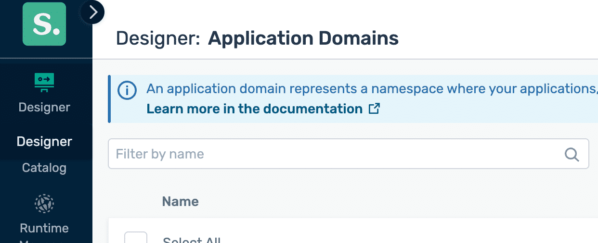
- **Empty domain list:** No application domains have been created; the screen explains that applications, events, and other EDA objects are organized by teams, groups, or business lines, with “Create Application Domain” and “Import Application Domain” actions. 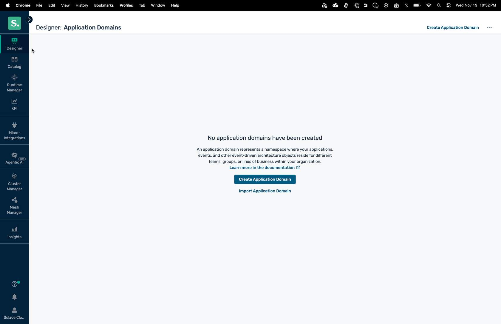
- **Import menu:** The “...” menu next to “Create Application Domain” offers Event Access Requests, Kafka Settings, and “Import Application Domains.” 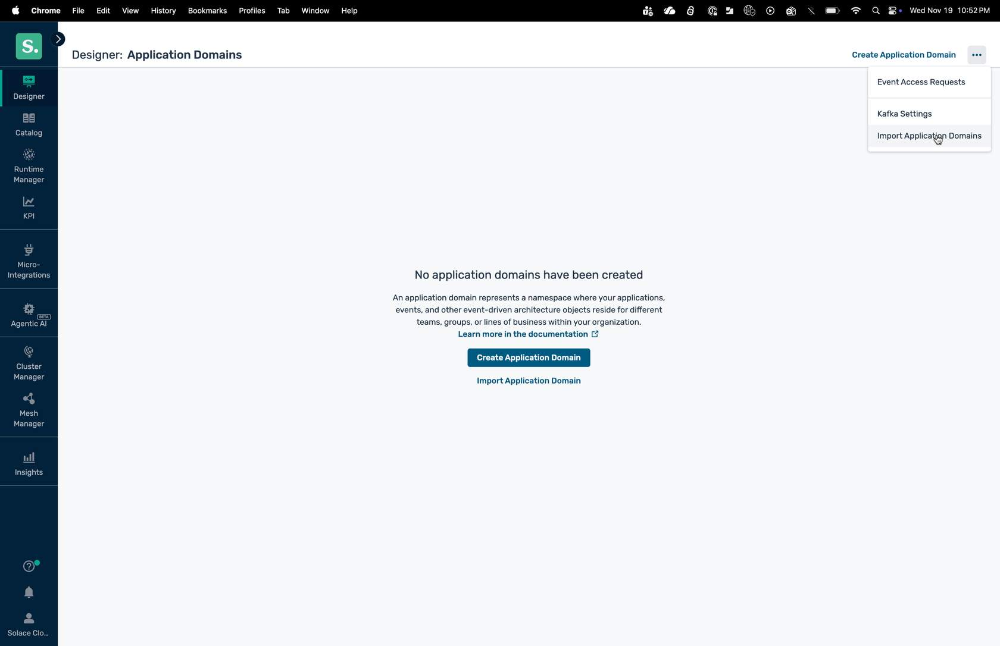
- **Sample file selection:** The file picker highlights `event-portal-samples-main/retail/solace/masterclass-domain/Acme_Retail_Solace_Masterclass_version.json`; adjacent sample-domain, sample-event-stream, hybrid, and kafka folders are visible. 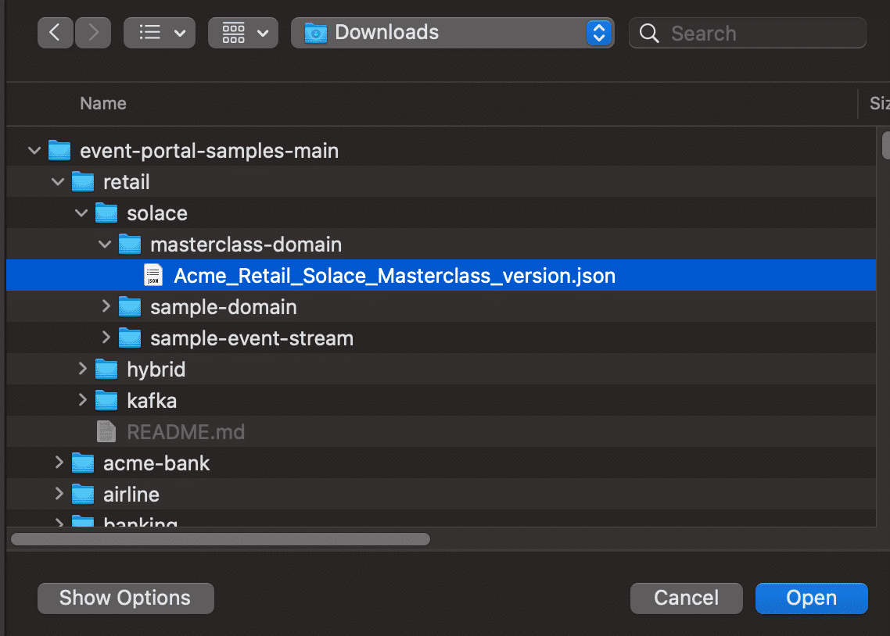
- **Acme Retail Graph View:** The sample graph connects Inventory and FraudCheck, Orders, Payment, and Shipping services to events including Stock reservation, Order Created/Confirmed, Payment Created/Updated, and Shipment Created/Updated. 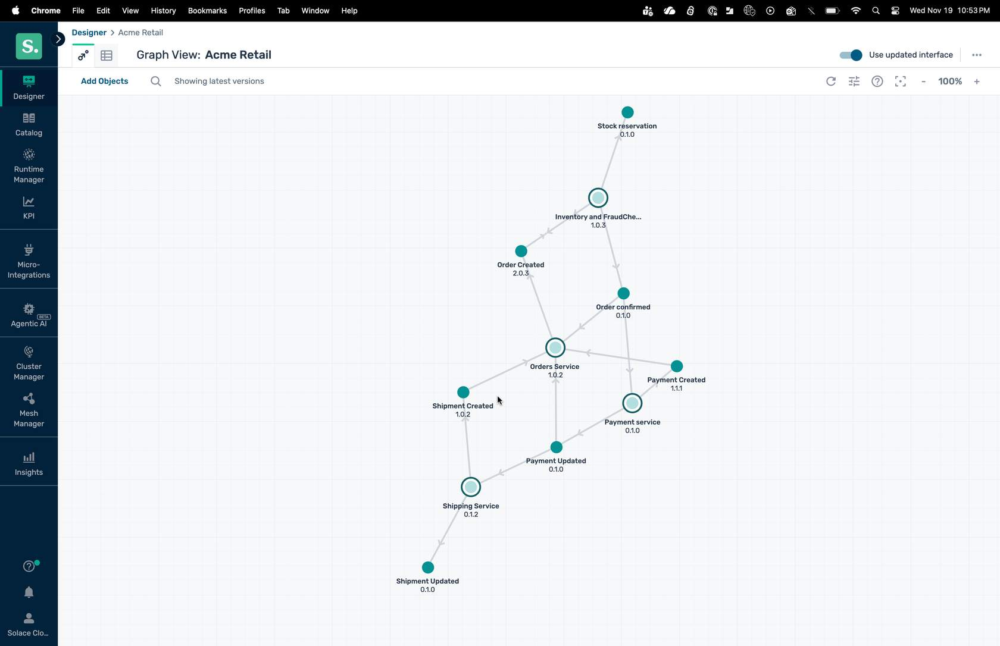
- **Components / Applications list:** The Applications tab lists Inventory and FraudCheck Service, Orders Service, Payment service, and Shipping Service as Standard applications using Solace brokers, each with one version. Other visible tabs include Events, Schemas, Enumerations, Event APIs, and Event API Products. 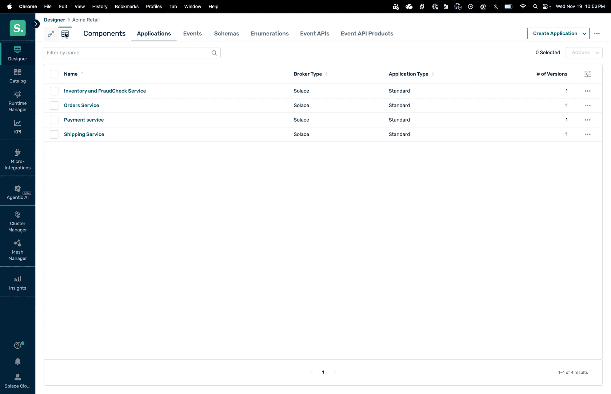

The page ends with the open reflection “What did you find...?” and the course button “TAKEN A LOOK? THEN CONTINUE.” It offers no answer choices, input field, submission, or feedback; it is not a scored knowledge check. The original screenshots were recovered from the SCORM assets, so screenshots from the browser were not used.
### Section banner and reflection artwork

The store banner shows Dave facing empty RealStore shelves decorated with the course’s event-architecture symbols: . Another course screenshot previews the public SolaceLabs `event-portal-samples` repository and sample folders including acme-bank, airline, banking, retail, supply-chain-retail, telco, and natural-resources: 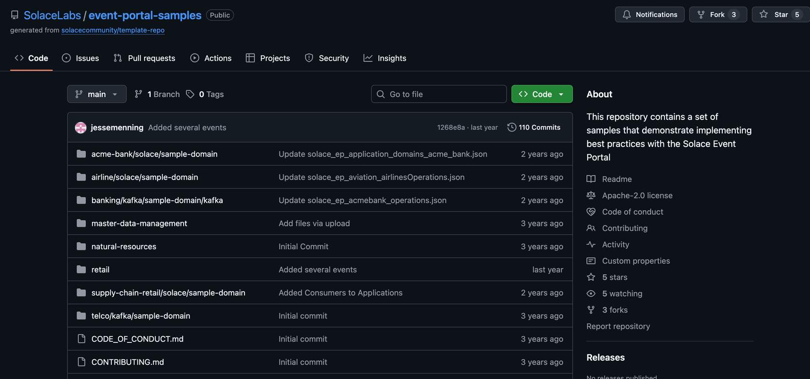. The open reflection prompt uses a Solace-branded mug decorated with connected EDA symbols: 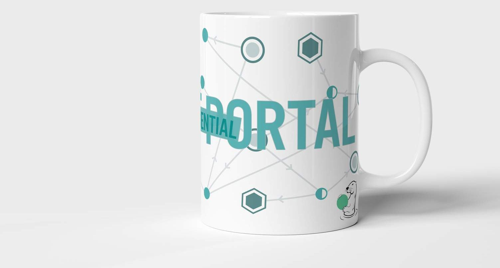
**Section checkpoint:** I downloaded the provided 4.3 MB sample archive to a temporary folder and confirmed it contains the `retail/solace/masterclass-domain/Acme_Retail_Solace_Masterclass_version.json` file shown in the course’s file-picker image. The six carousel visuals were reviewed and linked above. The page shows the unscored reflection “What did you find...?” and “TAKEN A LOOK? THEN CONTINUE.” At this point the Academy showed 89% Completed for Gener-AI-ate your EDA design and 83% Complete for the overall SCORM course. The import-and-explore instructions refer to using Event Portal Designer outside the embedded SCORM; no application domain was imported into a live tenant.
## SCORM section: Course Summary (lesson 12 of 12)

The final screen is by Eric Shantz and opens with the heading “Summary,” followed by an embedded video. The page says, “Congratulations! You made it to the end of the course.” It then says, “Now that you've completed the Foundations of Event Driven Architecture, you're ready to take the exam.” The live Academy navigation shows 100% COMPLETE, and all 12 internal SCORM lessons, including Course Summary, are marked Completed. The certification exam is outside this course-completion task.
### Final summary video

The embedded video runs about 3 minutes 52 seconds, has no text tracks/captions and no transcript link, and played through at 2x to the end before returning to 0:00 paused. Its visible recap lists the Event Driven Methodology (6+1 steps), Distributed Computing Primer, Design Patterns, and Topic Taxonomy. The original course summary slide expands the full topic list to Being Event Driven, Event Driven Methodology, Distributed Computing Primer, Design Patterns, Topic Taxonomy, Event Portal, and the NYC Taxi Co. pilot-selection-to-quick-win example: 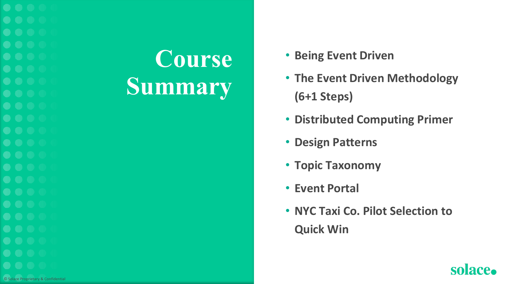.

Another visible frame summarizes PubSub+ as a complete event-streaming and management platform: link brokers into a global dynamically routed Event Mesh; define, manage, and govern events; monitor mesh performance; and do this from one console. Its diagram groups Event Streaming, Event Insights, Event Management, Event Broker and third-party brokers, Event Streaming APIs and Integration, and Security. The original course visual is saved here: 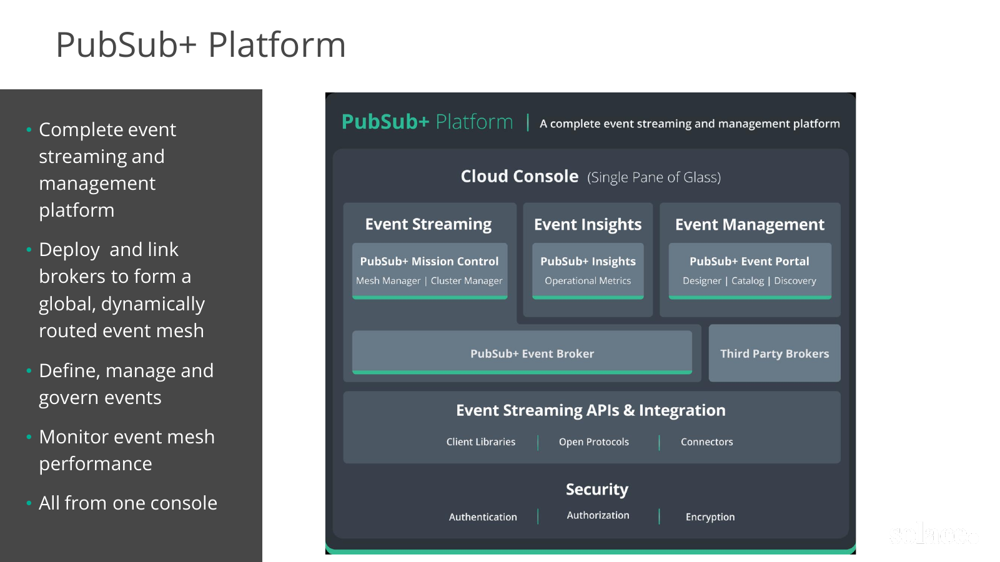.

The video also shows Additional Learning Resources. The original course slide lists Solace Resource Hub, Event-Driven Microservices, Hybrid-Cloud, PubSub+ for Developers, Solace Community Forums, Developer CodeLabs, and the Solace YouTube Channel: 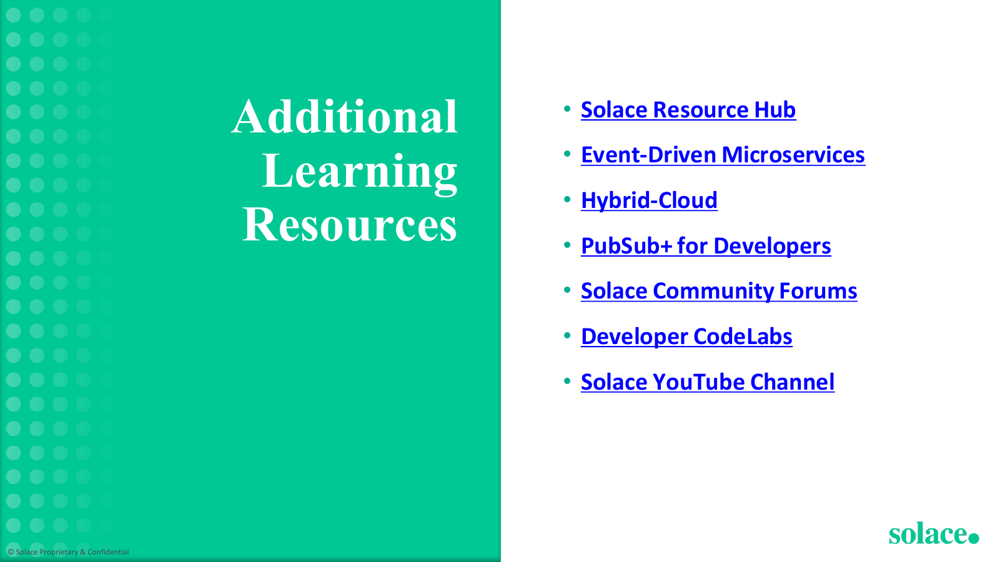. No quiz or extra course-advance control appeared on the final screen. Academy visibly showed 100% COMPLETE and all 12 of 12 internal lessons marked Completed.