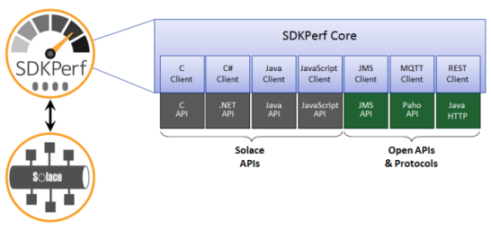
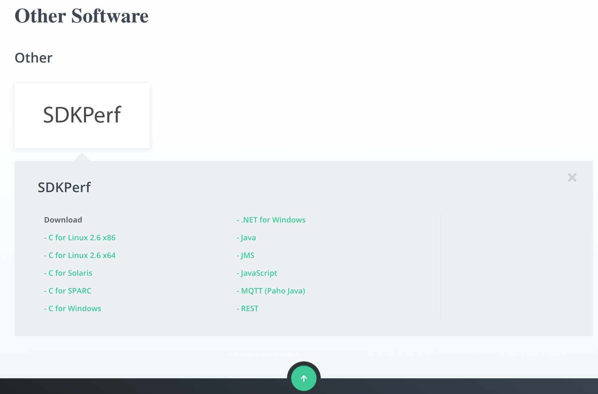
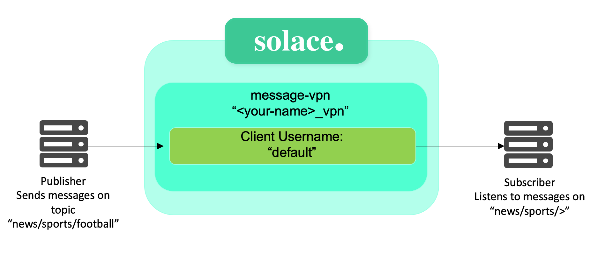

# SDKPerf Messaging Tool

- **Course:** Solace Event Broker Administration
- **Syllabus section:** Welcome
- **Academy content type:** File
- **Course resource:** [SDKPerf Tool Guide.pdf](SDKPerf%20Tool%20Guide.pdf) (547.02 KB; three pages)

## Lesson resource screen

The Academy lesson explains that SDKPerf is used to send messages on a PubSub+ Event Broker. It describes SDKPerf as a tool for validating performance, checking configuration, and exploring broker features. The resource card offers the three-page SDKPerf Tool Guide PDF. Downloading the guide marked the file lesson complete in the Academy.

Academy tags shown for this resource: messaging, tool, performance, java, api, implementation, sdkperf, sdkperf tool, and client interface.

## Overview

The guide repeats the Academy description of SDKPerf and introduces its common architecture across supported APIs and platforms.

## Architecture

SDKPerf is modeled as a common core plus messaging-client implementations. The core exposes a client interface and interacts with API-specific implementations, allowing the tool to work in a consistent, client-agnostic way across supported APIs and protocols. The figure shows adapters for C, C#, Java, JavaScript, JMS, MQTT, and REST, with Solace APIs and open APIs/protocols beneath them.

## Command-line application flow

For each invocation, SDKPerf:

1. Connects clients.
2. Adds required subscriptions and/or binds to endpoints.
3. Starts publishing.
4. Waits until publishing is done.
5. Removes any subscriptions that were added.
6. Disconnects clients.
7. Cleans up and reports statistics.

## Download and setup

The guide directs learners to the Solace downloads page and the SDKPerf Command-Line Options documentation. For this course, it says to download the Java version, then extract the downloaded SDKPerf ZIP file with a tool of choice.

The guide's “Other Software” image lists platform or API variants: C for Linux 2.6 x86/x64, Solaris, SPARC, and Windows; .NET for Windows; Java; JMS; JavaScript; MQTT (Paho Java); and REST.

## Sample commands

The guide says the -stl option starts a subscribing client and the -ptl option starts a publishing client. It instructs learners to run the subscriber and publisher in separate terminal shells. The displayed examples are:

    ./sdkperf_java.sh -h
    ./sdkperf_java.sh -cip={{BrokerIpAddress}} -cu=default@test_vpn -cp=password -stl="news/sports/>" -md -q
    ./sdkperf_java.sh -cip={{BrokerIpAddress}} -cu=default@test_vpn -cp=password -ptl="news/sports/football" -mn=10

The example publisher sends to news/sports/football; the subscriber pattern news/sports/> matches descendants beneath that topic prefix.

## Resume checkpoint

This file resource is complete in the Academy. Its PDF guide has been saved beside this note, and the architecture, download-options, and command-example visuals have been extracted from the guide into this lesson's img folder.
