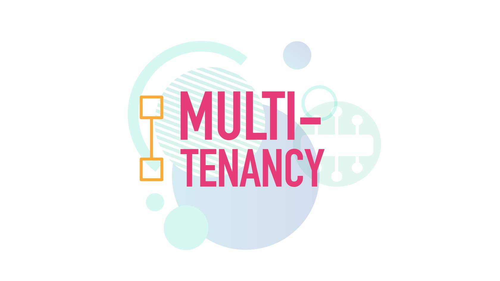
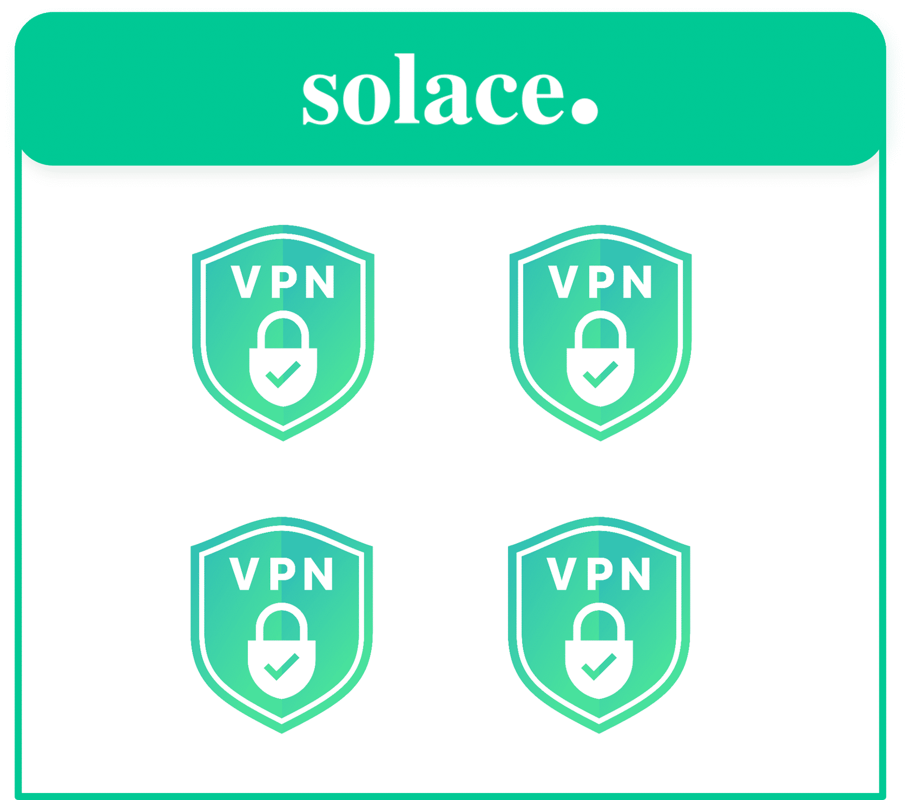

# Solace Multi-Tenancy

- **Course:** Solace Event Broker Administration
- **Syllabus section:** Solace Multi-Tenancy
- **Academy content type:** SCORM

## SCORM course overview

The overview says the course covers message VPNs, resource management, and security through role-based access. It combines theory, practical tips, and a hands-on exercise.

The overview groups its SCORM content into three parts:

- **The Context:** What's the Scenario?
- **The Concept:** What is Solace Multi-Tenancy?; Resource Management; Understanding Role-Based Access.
- **The Click:** Hands-on Activity; Quiz.

The lesson status showed all six items as unstarted when this screen was opened. A Start Course link begins the module.

## Screen 1: What's the Scenario? - Haroldo

Haroldo introduces himself as a middleware manager with ACME Retail. He says frequent online sales require the company to launch promotional campaigns, which generate a high volume of messages. A Continue button reveals the next scenario detail.

The screen shows Haroldo in an office setting.

## Screen 2: Performance concern and response choices

The scenario says sales create many messages for order placements, inventory updates, and customer notifications. Haroldo asks whether this can be managed without affecting the messaging performance of physical stores.

The two responses shown are:

1. “Why don't you completely separate each environment with a new appliance or service?”
2. “Let's learn about multi-tenancy to see if it will work for you!”

The second response follows the lessons stated topic and introduces the concept. After selecting it, the displayed reply is “Sounds good!”

## Screen 3: Scenario conclusion

The conclusion says “It looks like you've won over Haroldo!” and adds, “Now let's learn more about multi-tenancy and help him to implement this solution.” The panel offers Start Over; the module also exposes the next internal section, What is Solace Multi-Tenancy?

No new instructional diagram appears; the scenario reuses Haroldo and the office background already linked above.

## Concept screen: What is Solace Multi-Tenancy?

The Solace Message Router provides equipment sharing through Message Virtual Private Networks (VPNs). Message VPNs are managed objects on Solace PubSub+ event brokers. They provide messaging data separation and resource partitioning.

Each use case or group of applications can use a message VPN so messaging applications share the same equipment and avoid under-utilization. Configuration synchronization makes it easy to deploy a new Message VPN or change an existing one; configuration is automatically replicated across a redundant pair and to the remote data center.

The original illustration shows one Solace broker with four separate, secured Message VPN compartments.

The module first showed this section as 67% complete. Opening the image with Zoom image marked the section complete; the SCORM sidebar then showed 33% overall completion (two of six sections).

## Resource Management

The third SCORM section is titled **Resource Management** and presents a video player. The player metadata exposed the media name `resource limits.mp4`, a duration of 53.19 seconds, and no caption or text tracks. No transcript control was exposed. I played the video to its end; the player reached 99.98% and reset to the paused start frame, while the SCORM table of contents continued to mark this section Completed.

The player exposed a poster asset named `resource limits.jpg`. It could not be saved: the Chrome screenshot API timed out, and the workstation could not resolve the CDN hostname for the original poster URL. Therefore the video's narrated concepts and visual details could not be recovered reliably. This is an explicit content and image gap; no substitute has been invented.

## Understanding Role-Based Access

### Role-Based Access

Solace isolates the management network from the messaging network. Multiple management users may be created to access the management network and display router information, make configuration changes, monitor router statistics, or transfer files to and from the router (for example, certificates or CLI scripts). Permissions and access-level rules limit each user's administrative capabilities according to responsibilities.

### User Responsibilities

The lesson presents three roles in separate tabs:

- **System Administrator:** Responsible for PubSub+ Broker configuration and system-wide settings: administrator access, resource partitioning, authentications, security, and system redundancy features.
- **Application Administrator:** Controls Message VPN configuration such as persistent messaging queues, JMS configuration, real-time event thresholds, client management, and access control lists.
- **Messaging Clients:** Typically do not configure the broker, though they may be permitted to configure endpoints such as temporary queues. They control session characteristics such as access mechanisms and connection properties used with the Message VPN.

The course notes that one team may perform both System and Application Administration depending on the organization, so these roles can be combined.

### Types of Administrative Users

The lesson distinguishes two primary management-user types and two additional Linux-based types. The expanded cards say:

- **CLI User:** Connects to a Solace router using SEMP or the CLI to change configuration or display information for monitoring.
- **File Transfer User:** Remotely transfers files to and from specific router directories using SFTP or SCP, including SSL certificates and CLI scripts.
- **Support User (Linux):** Has access to limited shell commands to view and collect logs and copy files from the router home directory, such as diagnostic files.
- **Sysadmin User (Linux):** Has access to all router-shell commands and root privileges.

### CLI User Access Levels

Each Solace CLI command has a scope and access-level requirement. A CLI user can run a command only when the account's configured access level is sufficient for that command's scope.

| Permission level | Capabilities shown |
|---|---|
| `none` | Cannot execute commands except login-related commands and displaying preferences for the user's own account. |
| `read-only` | Can display operational information about the router; cannot change configuration. |
| `read-write` | Can display router information and make most configuration changes, including restarting the router. |
| `admin` | Can execute all router commands and create other CLI users. |

### Role illustrations and capture gap

Each role tab exposed a course illustration with no alternative text. The displayed asset names map to System Administrator (`AdobeStock_625983340.jpg`), Application Administrator (`AdobeStock_493462092.jpg`), and Messaging Clients (`AdobeStock_712194959.jpg`). The assets appeared loaded in the course page, but the Chrome screenshot call timed out and its Zoom image buttons produced no accessible state change. A browser media-download attempt emitted no download. The workstation also could not resolve the CDN hostname when retrieving the earlier Resource Management poster, so the three illustrations were not copied into this lesson's `img/` folder. Their visual contents remain unavailable; no substitute images have been created.

## Hands-on Activity

The activity introduction says it will create a Message VPN for the ACME online store and create/configure administrative users in PubSub+ Manager. The SCORM then presents two guided video steps:

1. **Create a Message VPN for the ACME Online Store.** The prompt says to follow the video to create a new isolated Message VPN for the online store. The video source is `create msg vpncrop.mp4`, duration 72.47 seconds, with no text tracks. I played it to 99.75%; the player reset to the paused start frame.
2. **Set Up a New Administrative User.** The prompt says the ACME store must be separate from the trading platform. Application Developers should receive read-only access to their respective Message VPNs so they can monitor them but make no configuration changes. The video source is `create admin user for msg vpn.mp4`, duration 204.20 seconds, with no text tracks. I played it to 99.60% at 2× speed; the player reset to the paused start frame.

The activity's concluding message says the isolated Message VPNs let the middleware team manage administrative accounts while application developers monitor their respective environments. These are narrated demonstrations: the module did not open a broker console or request credentials, and I did not change an external broker.

### Activity media gap

Neither video exposed captions or a transcript. Their posters were identified as `create msg vpncrop.jpg` and `create admin user for msg vpn.jpg`, but could not be saved. Chrome screenshot capture timed out and the browser download attempt did not yield a file; the workstation also could not resolve the CDN hostname for an earlier original image. Consequently, the exact UI actions shown in the videos could not be transcribed and their visuals are not in `img/`. This gap is recorded rather than filled with guessed instructions or replacement images.

## Quiz and SCORM completion

### Multiple-choice question

**Question:** What feature of Solace PubSub+ enables multi-tenancy by allowing multiple applications to securely share the same messaging infrastructure without interference?

Choices: exclusive queues; VPN bridging; topic subscriptions; message VPNs.

The page initially retained an earlier incorrect result and offered **TAKE AGAIN**. On retry, I selected **message VPNs**. The system confirmed: “Correct. Correct answer: message VPNs. Your answer: message VPNs.”

### Responsibility sorting activity

The instruction was: “Sort the cards based on whether they show a responsibility of the System Administrator or the Applications Administrator.” The categories and all six cards were:

| System Administrator | Applications Administrator |
|---|---|
| resource partitioning | JMS configuration |
| administrator access | Access Control Lists |
| authentications | client management |

The activity confirmed **6/6 Cards Correct**.

The SCORM table of contents now marks all six internal sections Completed and displays **100% COMPLETE**. This verifies completion of the Solace Multi-Tenancy SCORM lesson; the Academy course-level lesson status still needs checking after closing the SCORM view.

## Resume checkpoint

The Solace Multi-Tenancy SCORM lesson is complete (100%; all six internal sections completed). The Academy course page confirms this lesson is Completed and overall progress is 3/14. Next is Client Authentication Features.