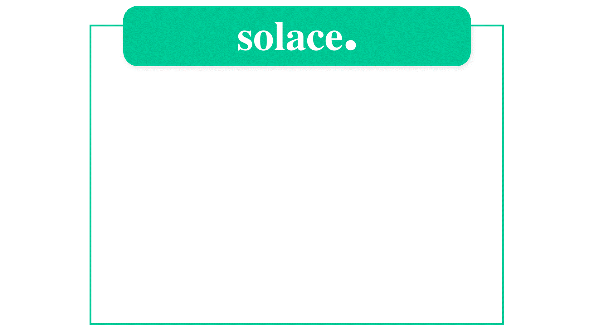
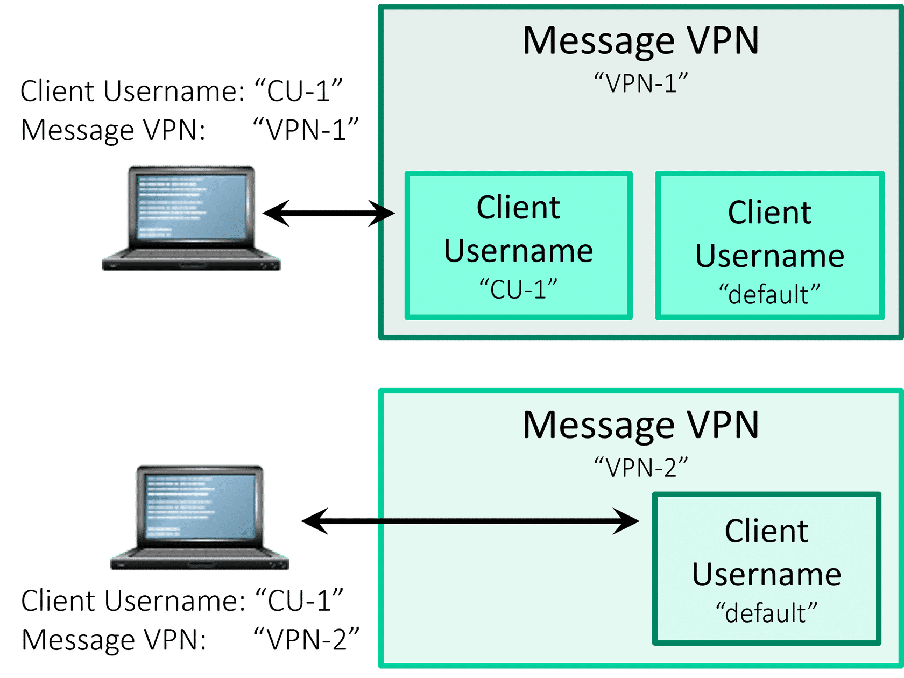
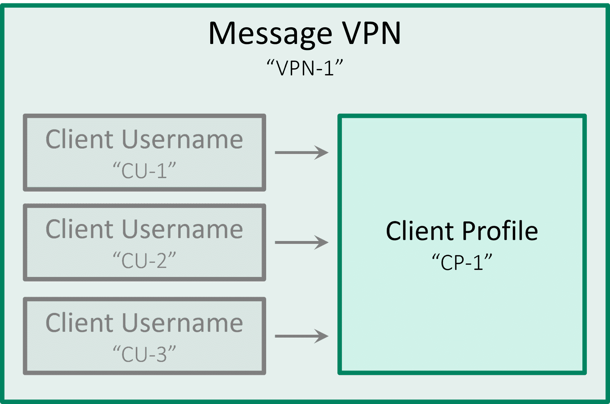
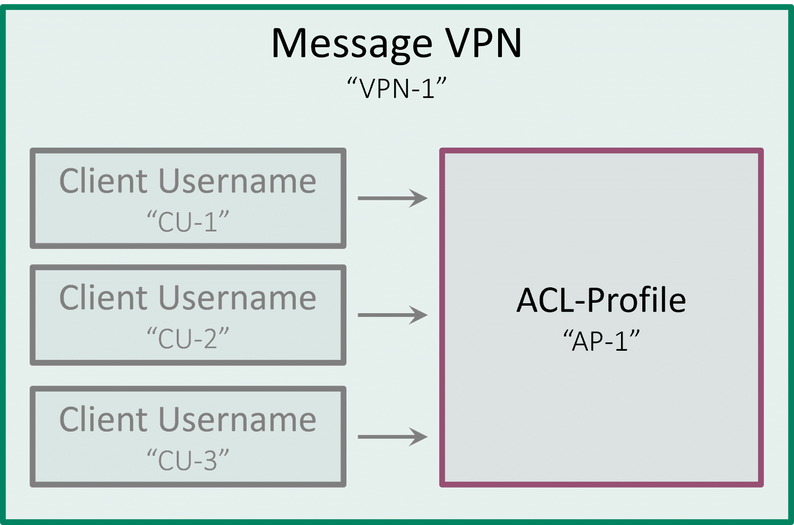
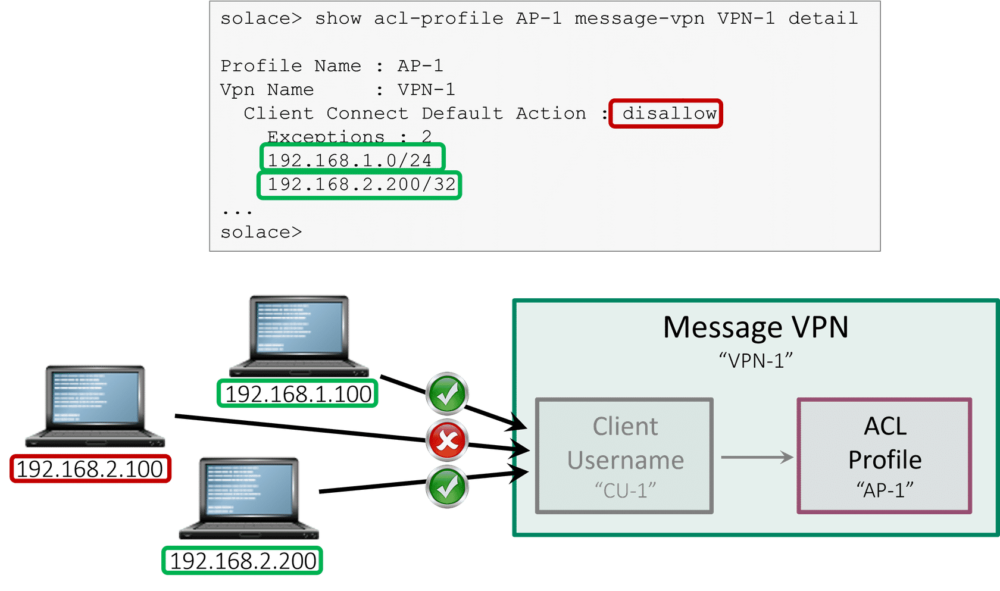
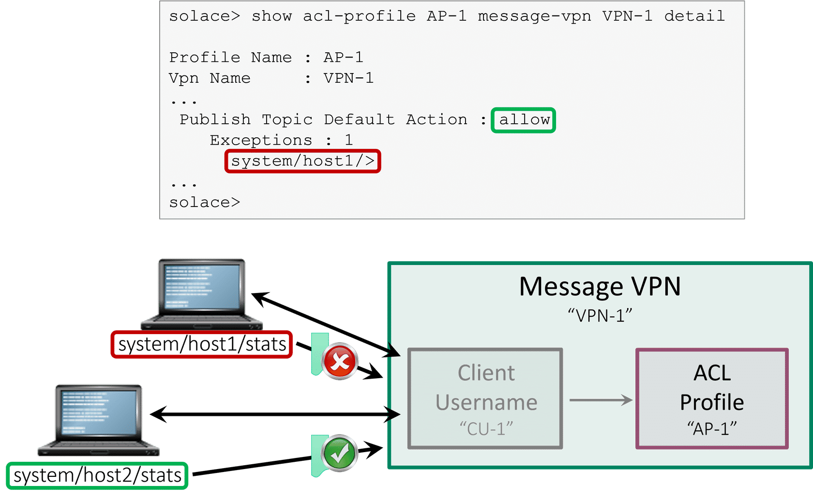
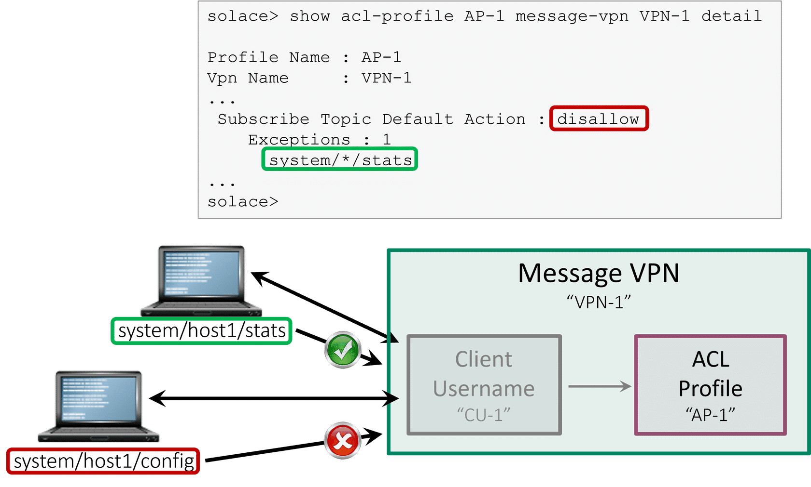
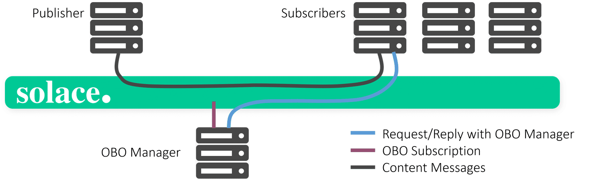
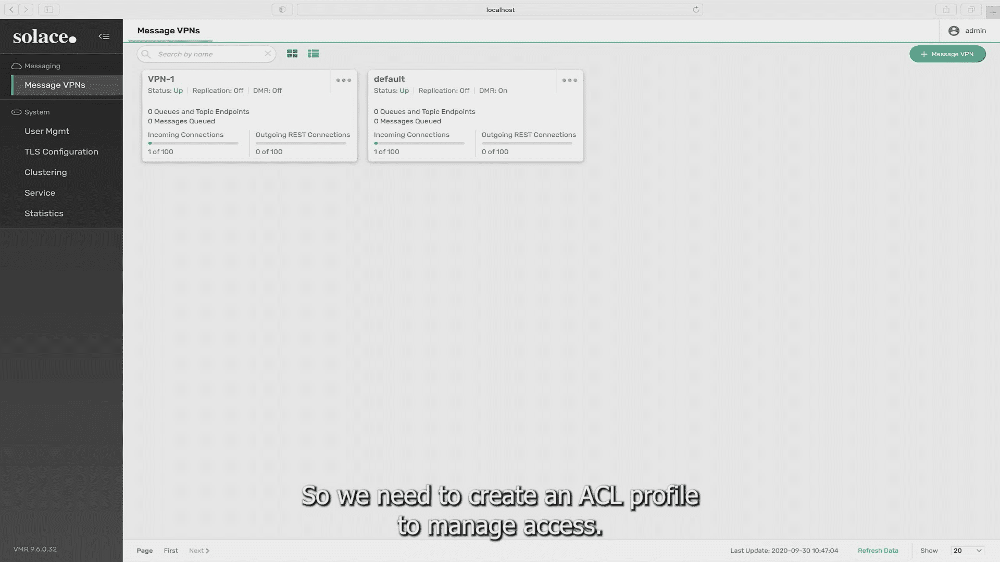

# Client Authorization

- **Course:** Solace Event Broker Administration
- **Syllabus section:** Client Authorization
- **Academy content type:** SCORM

## Screen 1: Course overview

The lesson opens with a **Client Authorization** overview. It says the course will provide a foundation in Solace client authorization and identifies client usernames, client profiles, Access Control List (ACL) profiles, and the OBO (On-Behalf-Of) Subscription Manager as its topics. The description says ACL profiles control the topics a client may publish to and subscribe from, helping prevent unauthorized access to sensitive information. OBO subscriptions let clients subscribe to topics on behalf of other clients.

The SCORM outline is organized into **The Context** - What's the Scenario?; **The Concept** - Understanding Client Authorization, Client Username and Profiles, Access Control List (ACL) Profiles, and OBO (On-Behalf-Of) Subscription Manager; and **The Click** - Quiz and Walkthrough. All six sections showed **Unstarted** at entry. The **START COURSE** link begins What's the Scenario?.

This overview exposed no `` course visuals. Browser screenshot capture is currently failing with a Chrome `Page.captureScreenshot` timeout, so no faithful local screenshot was available. No substitute visual was created.

## Screen 2: What's the Scenario? - Jana's introduction

Jana opens the scenario by introducing herself as a member of the administration team: “Hello, my name is Jana. I work with the admin team.” A **CONTINUE** control reveals the rest of the scenario. The screen uses the original `stock-image.jpg` office background (1680 × 943, empty alt text); I downloaded the image from the lesson's rendered course asset and saved it locally:


## Screen 3: Scenario risk and response choices

Jana says a consumer can read from an order-management topic they should not access and asks, “What should we do??” The two responses are:

1. “Let's learn about how client authorization works to see if we can fix this issue!”
2. “It's not that big a deal.”

The first response is the constructive choice because it addresses the unauthorized topic access. The scenario continues to use the office-background asset saved above. Before selecting a response, the SCORM showed **17% COMPLETE** and What's the Scenario? was still active.

## Screen 4: Scenario response

I selected response 1. The course retains “Let's learn about how client authorization works to see if we can fix this issue!” and removes both response cards; no additional feedback text appears. What's the Scenario? is now marked **Completed**.

## Screen 5: Understanding Client Authorization

The lesson defines client authorization as assigning client access levels **after authentication**. Solace manages this with client profiles and ACL profiles, which define the resources and messaging capabilities available to a client.

Before a client can connect to a Solace router for messaging, the lesson says these managed objects must be configured:

- A **Message VPN**, which provides a virtual messaging environment.
- A **client username**, used to authenticate the client.
- A **client profile**, which allows access to configurable router resources and capabilities.
- An **ACL profile**, which manages client authorization.

The screen includes the course's animated `client object model.gif` asset (empty alt text). I saved the original rendered asset locally:



## Screen 6: Client Username and Profiles

### Client usernames

Client usernames belong to a specific Message VPN. Client applications use them to authenticate to the Solace message router, and a username can support multiple client connections so applications can scale horizontally without additional router configuration.

Client usernames must be **enabled** before clients can authenticate. Disabling one disconnects clients currently connected through it, which administrators can use to forcefully disconnect a particular set of clients. Each client username is associated with a client profile and an ACL profile; those profiles govern connected-client properties and permissions.

### Default client username

Every Message VPN has a built-in `default` client username that always exists and cannot be deleted. A client application can connect using a provisioned username. If the supplied username does not exist on the event broker, the `default` username is used. The lesson notes that this lets administrators configure external authentication such as LDAP or RADIUS without creating broker client usernames for every individual user.

The original diagram contrasts two VPNs: VPN-1 contains named username `CU-1` and `default`, while VPN-2 shows only `default`; the client provides `CU-1` and connects to either VPN. The local course asset is:



### Client profiles

Client profiles belong to a Message VPN and can be applied to client usernames. Sharing a profile lets administrators manage large groups without changing each client individually. The lesson lists these profile controls:

- Resource allocation.
- Limits on client-username connections.
- Per-client transport queues.
- Client characteristics.
- TCP connection tuning.
- Persistent-messaging capabilities.
- Event thresholds.

A default client profile always exists. Every client username has an associated profile; if an assigned profile is deleted, the usernames using it become associated with the default client profile.

The original profile diagram shows client usernames `CU-1`, `CU-2`, and `CU-3` in Message VPN `VPN-1` all pointing to the shared client profile `CP-1`:



## Screen 7: ACL profiles and the client-connect example

ACL profiles, like client profiles, belong to a specific Message VPN and can be assigned to client usernames so administrators can manage entitlements for groups of clients. An ACL profile consists of Access Control Lists that allow or restrict actions. ACL configuration can constrain which IP addresses may connect and which topics a client may publish or subscribe to.

Each Message VPN has a non-removable `default` ACL profile, initially assigned to new client usernames. Its initial configuration allows everything, which can suit deployments that do not use ACLs or development/testing environments. The course recommends restricting the default profile to disallow connecting, publishing, and subscribing so later configuration changes do not create unexpected access. Each ACL definition has a default allow/disallow behavior plus an exception list.

The example control opens three tabs: **ACL PROFILE CLIENT CONNECT**, **ACL PROFILE PUBLISH-TOPIC**, and **ACL PROFILE SUBSCRIBE-TOPIC**. The first tab is selected initially. Its rule disallows all client connections by default but allows connections matching the IP-address exceptions.

The original overview diagram shows three client usernames in `VPN-1` pointing to the VPN's ACL profile `AP-1`:



The **ACL PROFILE CLIENT CONNECT** example selects `AP-1` in `VPN-1`, sets the default action to `disallow`, and contains two IP exceptions: `192.168.1.0/24` and `192.168.2.200/32`. The accompanying example marks `192.168.1.100` and `192.168.2.200` as allowed and `192.168.2.100` as denied. Its CLI detail view is:

```text
solace> show acl-profile AP-1 message-vpn VPN-1 detail
Profile Name : AP-1
Vpn Name     : VPN-1
Client Connect Default Action : disallow
Exceptions : 2
  192.168.1.0/24
  192.168.2.200/32
...
solace>
```



The **ACL PROFILE PUBLISH-TOPIC** tab sets the default action to `allow` for published topics but denies topics matching the exception. In the example, ACL profile `AP-1` in `VPN-1` has one exception, `system/host1/>`; publishing to `system/host1/stats` is denied, while publishing to `system/host2/stats` is allowed.



The **ACL PROFILE SUBSCRIBE-TOPIC** tab sets the default action to `disallow` for all topic subscriptions but allows topics matching its exception. ACL profile `AP-1` in `VPN-1` has the exception `system/*/stats`; the example permits `system/host1/stats` and blocks `system/host1/config`.



## Screen 8: OBO (On-Behalf-Of) Subscription Manager

An **OBO Subscription Manager** is a custom application that adds and removes subscriptions for other client applications. It connects to the router with a client username designated as a subscription manager. The lesson describes it as a backend program that centralizes subscription management: certain clients may subscribe or unsubscribe to topics on behalf of other clients.

### Why use a subscription manager?

- **Existing external permission systems:** Synchronize entitlements from vendor or homegrown systems into the router so subscriptions can be checked against external permissions.
- **Multiple entitlement systems:** Give applications one subscription-management interface instead of requiring each application to integrate with every entitlement system.
- **ACL limits:** Dynamically grant requested subscriptions, including subscriptions a client could not obtain under its own ACL permissions.
- **Auditability:** Centralize and log subscription activity for compliance monitoring and reporting.
- **Topic abstraction and encapsulation:** Let applications ask the manager to update frequently changing topic subscriptions instead of managing those sets themselves.

The course diagram shows publishers and subscribers connected through Solace, with a separate OBO Manager. Its legend distinguishes OBO-manager request/reply, OBO subscriptions, and content messages:



The next heading is **How to manage topic subscriptions on behalf of other clients**, with two collapsed sections: **JCSMP, Java RTO, and .NET APIs** and **C API**.

### JCSMP, Java RTO, and .NET APIs accordion

For these APIs, create a **client name endpoint instance** for each client whose subscriptions the manager will control. The manager can then add or remove topic subscriptions on that endpoint. The course lists:

| API | Create client name endpoint | Add subscription | Remove subscription |
|---|---|---|---|
| Java RTO | `Solclient.Allocator.newClientName(...)` | `SessionHandle.subscribe(...)` | `SessionHandle.unsubscribe(...)` |
| JCSMP | `JCSMPFactory.createClientName(...)` | `JCSMPSession.addSubscription(...)` | `JCSMPsession.removeSubscription(...)` |
| .NET | `ContextFactory.CreateClientName(...)` | `ISession.Subscribe(...)` | `ISession.UnSubscribe(...)` |

### C API accordion

For C API operations, when the subscription-manager client adds or removes a subscription on behalf of another client, pass both the endpoint type `SOLCLIENT_ENDPOINT_PROP_CLIENT_NAME` and the client-name endpoint's name as endpoint properties. The course lists `solClient_session_endpointTopicSubscribe(...)` and `solClient_session_endpointTopicUnsubscribe(...)` for those operations.

## Screen 9: Quiz - restrict unauthorized topic access

The single-select quiz asks: “Her inventory team has notices that a consumer has the ability to receive messages from an order management topic they should not be able to access. What could Jana do?” The three choices are:

1. “Delete the default client profile used by this consumer.”
2. “Use an ACL profile to restrict access for this consumer.”
3. “Use LDAP group authorization.”

The answer was initially unselected. The radio group indicates a single choice. The page includes an `Incorrect` feedback container in the DOM, but it is hidden (`aria-hidden=true`) before submission and does not represent a current result. The screen's `SUBMIT` control was available.

I selected choice 2, “Use an ACL profile to restrict access for this consumer,” and submitted it. The system marked choices 1 and 3 **Correctly unselected**, marked choice 2 **Correctly selected**, and displayed **Correct** with the feedback, “Great! Let's learn how to set that up for Jana.”

### Walkthrough video

The course follows the quiz with a video player. Its source is `ACL profile walkthrough-basic.mp4` and its poster is `ACL profile walkthrough-basic.jpg`. Before playback the duration had not loaded, the player exposed no caption/text tracks, and no transcript was shown. Next, review the walkthrough and capture its duration, caption availability, and instructional content.

The original poster shows a PubSub+ Manager dashboard and the caption “So we need to create an ACL profile to manage access.” I saved the poster from the course-linked asset:



I reviewed the complete original course video through its rendered course asset. Its duration is **1:30.9**. It has no text tracks or separate transcript; English subtitles are burned into the video frames. Selected visible steps:

- The opening subtitle says the goal is to create an ACL profile to manage access.
- In PubSub+ Manager, navigate to **Access Control → ACL Profiles** and create an ACL profile.
- The `ACL-1` example displays `Disallow` as the client-connect, publish-topic, and subscribe-topic default action. The list also shows subscribe-share-name default action `Allow`.
- In **Edit Client Username Settings** for `cu-1`, the displayed Client Profile is `default` and ACL Profile is `ACL-1`; the username is enabled. Guaranteed Endpoint Permission Override and Subscription Manager are off.
- The ending profile list shows `#acl-profile` and `default` with `Allow` for connect, publish, subscribe, and subscribe-share-name, while `ACL-1` uses the restrictions above.

This is a course walkthrough. I did not make or save changes to a real broker. The standalone and embedded players reached their ends; the embedded player showed **Loaded: 100.00%** and returned to its beginning after completion. The quiz's system result says: “Correct. Correct answer: Use an ACL profile to restrict access for this consumer. Your answer: Use an ACL profile to restrict access for this consumer. Great! Let's learn how to set that up for Jana.” All six lesson sections are marked **Completed**, and the SCORM displays **100% COMPLETE**.

## Resume checkpoint

The overview, scenario, client authorization and profile behavior, all three ACL examples, OBO workflows, APIs, quiz feedback, and walkthrough are recorded. Ten original course visuals are saved in this lesson's `img/`. The SCORM shows all six sections Completed and 100% COMPLETE. Next, close the lesson player and reload the Academy course page to verify course-level completion.
