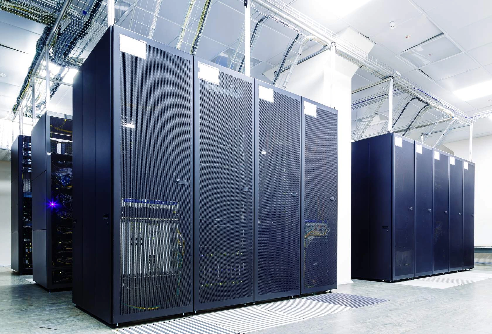
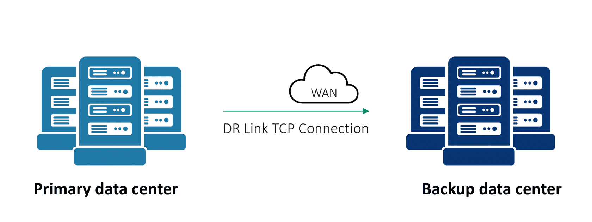
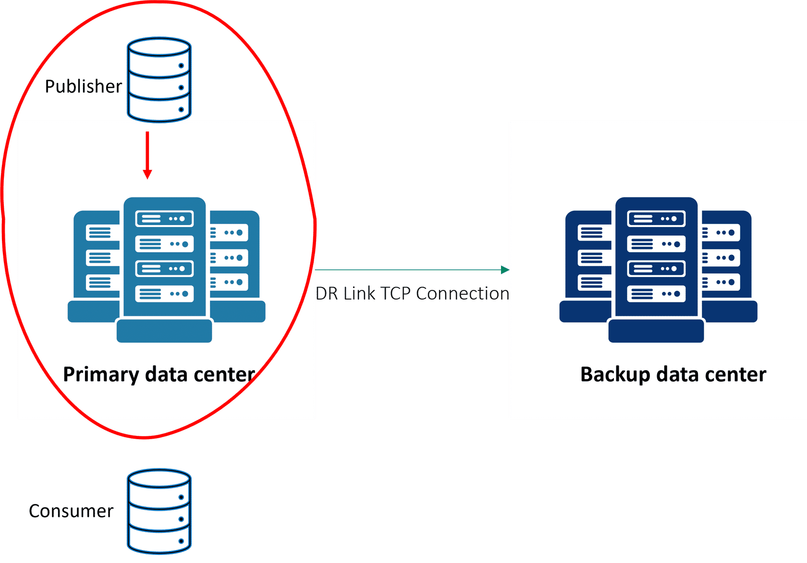
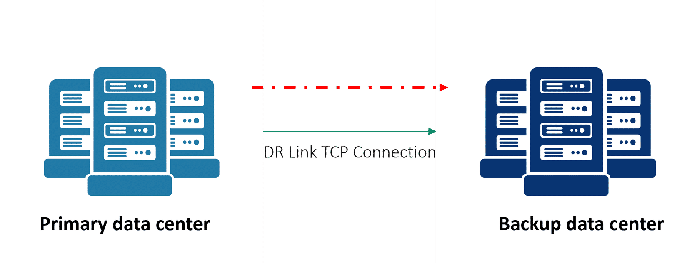
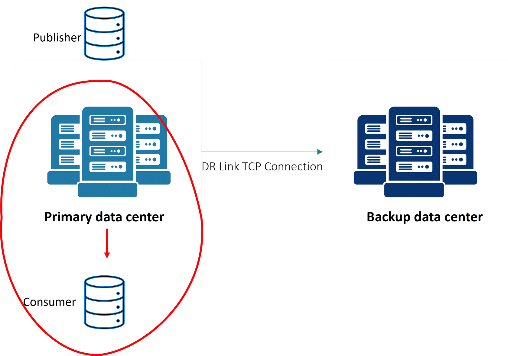
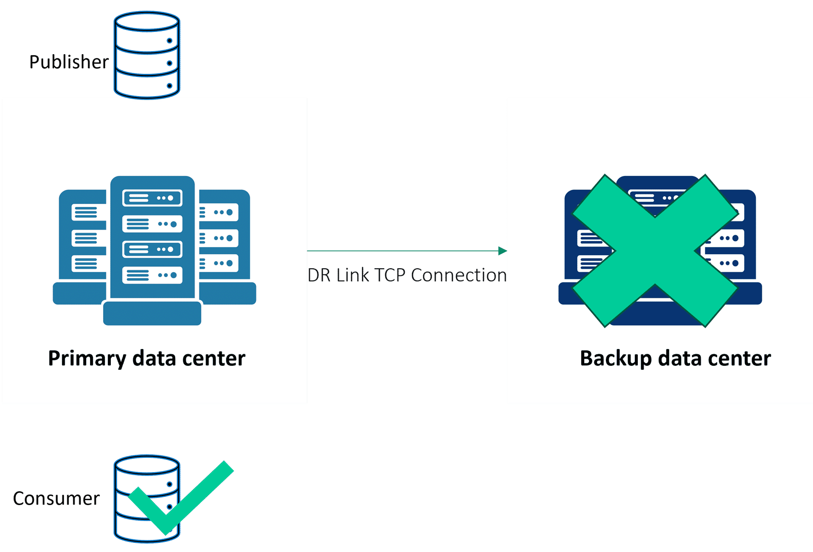
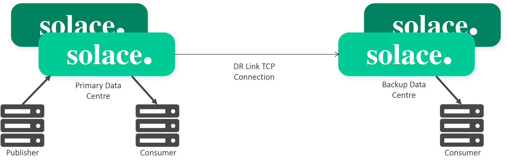

# Data Replication

- **Course:** Solace Event Broker Administration
- **Syllabus section:** Data Replication
- **Academy content type:** SCORM

## Lesson notes

### Screen 1: Academy lesson page

### Screen 2: SCORM course overview

The SCORM title is **Data Replication**. Its overview describes a focused exploration of data replication for resilient, scalable distributed systems, covering foundational replication principles, design choices and their implications, and Config-Sync as a practical application. The table of contents has four unstarted items: **What's the Scenario?** under **The Context**; **What do we mean by data replication?** and **Considering Design Choices** under **The Concept**; and **Quiz** under **The Click**. The overview offers **START COURSE**. No instructional image is exposed on this overview screen.

### Screen 3: What's the Scenario?

**Next:** Continue to reveal the scenario response choices and record them before selecting an answer.

Continuing reveals the follow-up: **“We need to ensure that we don't lose our order processing data. Can data replication help?”** Two responses are offered: **(1)** “Both high availability and data replication protect against data loss. That's probably all you need to know.” **(2)** “Data replication can help to protect order processing data. Let's look at the Solace solution together.” Response 2 directly addresses Haroldo's question and introduces the course content.

**Next:** Select response 2 and record the feedback before continuing.

**Next:** Open **2 of 4 - What do we mean by data replication?** and capture its content before interacting.

### Screen 4: What do we mean by data replication?

This section is **Lesson 2 of 4**. Under **Types of Infrastructure Failures**, the course says there are two types and displays the original wording: **“There are two types of infrastructure failures that can occur. There is are on-site failures, where your appliance or software broker that is deployed in your data centre fails, or you can have a data center failure.”** The selected tab is **ON-SITE SINGLE FAILURE**. It lists **Power failure**, **Hardware component failure**, and **Network infrastructure failure**. It says on-site failures can be resolved with Solace High Availability, which helps with a single point of failure of an appliance or software broker. The panel includes an illustration with a Zoom image control.

The second tab, **DATA CENTRE FAILURE**, is visible but not yet opened. Under **What is Data Replication?**, a diagram shows a primary data center and a backup data center connected across a WAN with a **DR Link TCP Connection**. The accompanying text says Solace replicates an existing HA pair by using a TCP connection over the WAN between the primary and backup data centers. When event brokers are provisioned as a DR pair, the active router in each data center automatically establishes the DR link, which sends messages to the backup data center for all VPNs.

### Screen 5: Data centre failure

The image is the original Academy asset from the selected tab's exposed `assets/AdobeStock_649978181.jpg` source. It was downloaded, verified as JPEG, and visually inspected. The Academy image has no alt text; the note provides a descriptive one.

**Next:** Record any remaining tab content, then continue through the Data Flow interaction in order and save its original step visuals before moving on.

### Screen 6: Data Flow - Step 1

Starting **Data Flow** displays **Step 1 - Message is published to Primary site**. The course text says: **“First, a publisher publishes messages to the active router on the primary site.”** The diagram highlights a publisher sending a message into the primary site's active router, with the DR Link TCP connection leading toward the backup data center.

**Next:** Advance to Step 2 and record the exact text and original diagram before moving again.

### Screen 7: Data Flow - Step 2

**Step 2 - Forward to backup site** says: **“Once the active router on the primary site receives the messages it will automatically be forwarded to the active router on the backup site.”** The diagram highlights the message's path across the DR Link TCP connection from the primary data center to the backup data center.

This original PNG was obtained from the rendered `assets/step 2 data flow.png` source, signature-checked, and visually inspected. The interaction provides Step 1–4 and **Last step** navigation; overall progress remains **50% COMPLETE**.

**Next:** Advance to Step 3 and record its exact text and original diagram before moving on.

### Screen 8: Data Flow - Step 3

**Step 3 - Message is consumed by consumer** says: **“Then, if we have a consumer subscribed to the same topic that the publisher publishes to, it will consume the message.”** The diagram highlights the consumer receiving the message from the primary site's active router; the primary-to-backup DR link remains illustrated.

**Next:** Advance to Step 4 and record the exact text and original diagram before moving on.

### Screen 9: Data Flow - Step 4

**Step 4 - Messages removed from backup** says: **“Once consumed at the primary site messages are automatically removed from the queues at the backup site.”** The diagram shows the message removed from the backup data center after it has been consumed on the primary side.

**Next:** Open **Last step** and record any further explanation or completion controls.

### Screen 10: Data Flow - final state

The final interaction state is labeled **Step 5**. It has no additional explanatory text or separate instructional diagram and offers **START AGAIN** with navigation back to the four numbered steps. The Data Flow process is complete.

**Next:** Open **3 of 4 - Considering Design Choices** and capture its content before interacting.

### Screen 11: Considering Design Choices

This is **Lesson 3 of 4**. The first heading is spelled **“Synchronus Message Replication”** in the course. It defines synchronous replication as withholding the publisher's acknowledgement (ACK) until the remote site acknowledges the message. The listed sequence is: (1) the publisher sends a message to the primary site; (2) the message is forwarded to the backup site; (3) an ACK is sent from the backup site to the primary; and (4) an ACK is sent from the primary to the publisher, confirming the message was saved at both sites.

**Asynchronous Message Replication** is described as fast-asynchronous replication where guaranteed messages are acknowledged to the publisher regardless of whether they have replicated to the remote site. Its listed sequence is: (1) the publisher sends a message to the primary site; (2) the primary sends an ACK to the publisher; (3) messages are forwarded to the backup site; and (4) an ACK is sent from the backup site to the primary.

The **Asynchronous vs Synchronous Replication** comparison table says:

| Dimension | Asynchronous Replication | Synchronous Replication |
| --- | --- | --- |
| Latency | Faster RTT, lower latency | Slower RTT, higher latency |
| Message-Loss | Applications have to tolerate loss of a few messages | Zero message loss |
| Potential Scenario for Message-Loss | Messages may be lost if the bridge is down or messages have not been delivered across the bridge when the primary data center fails | Zero message loss |
| Performance | Higher performance - performance valued over loss of a few messages | Lower performance - performance drop is accepted in favour of zero message loss |

The course says an administrator can downgrade to asynchronous replication when sync-ineligible behavior blocks publishers. This can happen when the primary site cannot reach the backup site because of a network issue or backup-site unavailability. The publisher receives no acknowledgement because the primary has not received one from the backup. Downgrading to asynchronous replication allows publishers to send messages again.

Under **Disabling Consumer ACK Propagation**, the course gives a hot/warm deployment as an example: a consumer application connected to the backup replicated site may need to receive the same messages for state verification. The property can be configured on the client profile at the backup site. The course text has the spelling **“propogation”** in this paragraph.

The original Academy asset is `assets/ACK.png`; it was read from the displayed image element, downloaded, signature-checked as PNG, and visually inspected. The image element had no alt text, so this note supplies a descriptive one.

Under **Design Configurations**, the course lists:

- **Replication queue sizing:** by default, if the replication queue becomes full, publishing messages to topics matching replicated topics is rejected.
- **Replication queue pruning:** replicated messages waiting to be sent to the mate site need not be sent if they have subsequently been consumed on the active site.
- **Topic hierarchies:** not all messages are automatically propagated; data replication uses a VPN bridge.

Under **Config-Sync**, it says configuration should be synchronized between both sites, as with HA. Config-Sync automatically replicates configuration to the routers at the mate site. Changes need only be applied to the DR active router; Config-Sync propagates those changes to the DR backup router.

### Screen 12: Quiz questions

Two multiple-choice checks are visible:

1. **“Which of the following options creates a backup of your data?”** Choices: **High availability**, **Data replication**, **Both**.
2. **“Which of the following best describes the purpose of data replication in distributed systems?”** Choices: **to decrease data availability and system resilience**; **to ensure that data is unique across all nodes in the system**; **to increase data availability and system resilience by maintaining copies of data across multiple node** (this is how the option is rendered in the course).

Both questions initially displayed **Incorrect** feedback and a **TAKE AGAIN** button, with no radio choice selected. These existing incorrect results are recorded before retrying.

For question 1, I selected **Data replication**. The exact feedback was: **“Correct. Correct answer: Data replication. Your answer: Data replication.”** The selection is marked **Correctly selected**, the other two options **Correctly unselected**, and the question **Correct**. Question 2 remains unanswered and is next.

## Visuals

Original Academy images for on-site failure, data-center failure, the WAN replication link, the four Data Flow steps, and consumer ACK propagation are stored in `img/` and referenced above.
