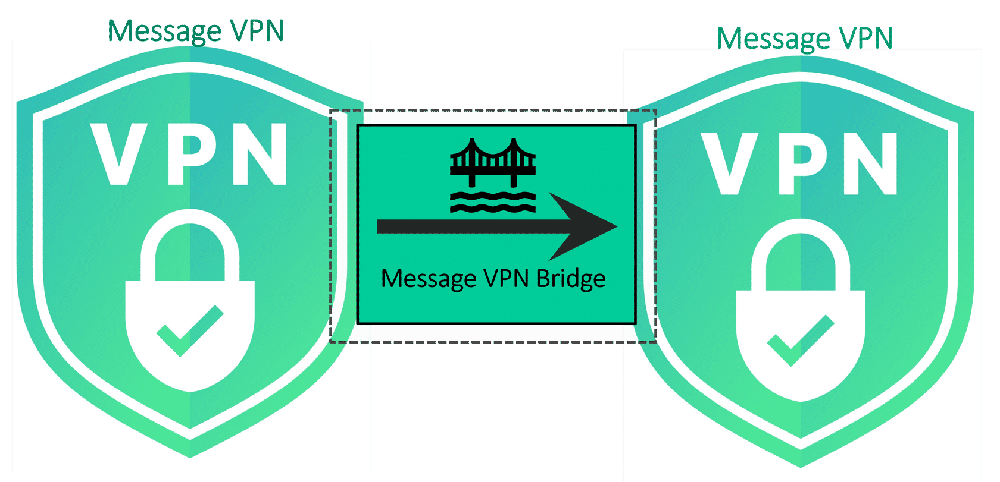
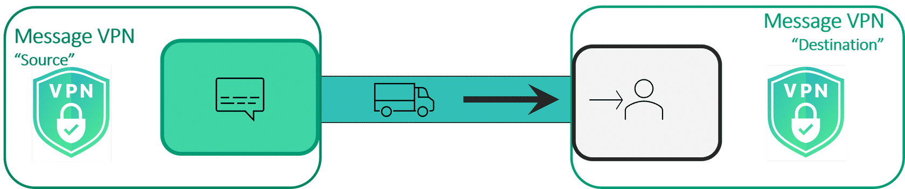
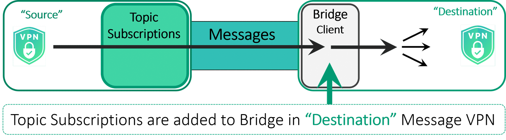
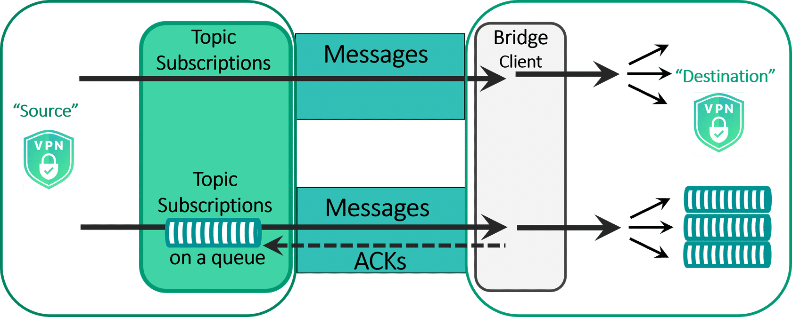

# VPN Bridges

- **Course:** Solace Event Broker Administration
- **Syllabus section:** VPN Bridges
- **Academy content type:** SCORM

## Lesson notes

### Screen 1: Academy lesson page

### Screen 2: SCORM course overview

The SCORM course title is **VPN Bridge**. Its overview describes a comprehensive exploration of the Virtual Private Network (VPN) Bridging Model: its core principles and architecture, how it supports secure and efficient communication between disparate VPNs, and deployment scenarios with scalability, security, and performance requirements. The table of contents lists four items, all **Unstarted**: **What's the Scenario?** under **The Context**; **Understanding VPN Bridges** and **VPN Bridge Topologies and Direction** under **The Concept**; and **Quiz** under **The Click**. The overview offers **START COURSE**. No instructional image is exposed on this screen.

### Screen 3: What's the Scenario?

**Next:** Continue to reveal the scenario question and response choices; record them before selecting an answer.

Continuing shows Haroldo's specific need: **“I need to help our order management group send a subset of messages to to the finance system to let them know to process transactions. There's a separate Message VPN for each of the app teams.”** The course text contains the duplicated **“to to”** as shown. Two responses are offered: **(1)** “Just allow access to all of the transaction information.” **(2)** “Hmm, maybe VPN bridging can help. Let's take a look.” Response 2 proposes investigating VPN bridging to share a selected subset across separately isolated app-team VPNs.

**Next:** Open **2 of 4 - Understanding VPN Bridges** and capture the content before interacting.

## Visuals

### Screen 4: Understanding VPN Bridges

#### What is a Message VPN Bridge?

Message-VPNs are isolated messaging environments in Solace. Messages published to a message-VPN are contained to that message-VPN. Message-VPN bridges provide a solution allowing messages to be shared between message-VPNs in a selective and controlled manner. Using message-VPN bridges, links can be created between message-VPNs on the same or separate appliances to share data. The messages that are allowed to flow from one message-VPN to another can be specified in the form of topic subscriptions. Message-VPN bridges can be configured to move data between message-VPNs using the direct or guaranteed messaging modes.

Global Applications with datacenters across the world may need a way to share data between the regions. If these applications want to share messages selectively between regions, they can use message-VPN bridging.

Bridges can also be configured to share data between different clouds and on-premise.

You can also use VPN bridges to connect Message-VPNs on different routers or the same router. The Message-VPNs can have the same or different names if they are on different routers.

#### Message VPN Bridge Model

The model can be broken down into three areas:

- The network connection between the message VPNs, which acts as the transport.
- Messages are attracted using topic subscriptions, acting as the attractors.
- The bridge client receives the messages from the source.

The labeled graphic exposes three markers: **Attractors**, **Transport**, and **Bridge Client**.

**Attractors marker:** “Topic subscriptions are used to control which messages are sent across message VPN bridges. As with consumers, a well-designed topic structure and the ability to use wildcards gives message VPN bridges the ability to only transmit the messages that need to be shared.”

**Transport marker:** “The network connection between the message VPNs acts as the transport.”

#### Flexibility

One of the key benefits of the Message VPN Bridging Model is the flexibility that it offers:

- Customized **Topic Subscriptions** control the flow of messages.
- **Delivery Mode** options:
  - Direct messaging with at most once delivery.
  - Guaranteed messaging with at least once delivery.
- **Message Direction** choices:
  - Unidirectional bridging.
  - Bidirectional bridging.
- Alternative **Transport Modes**:
  - Compressed connections.
  - Encrypted connections.

#### VPN Bridge Delivery Mode

Message-VPN bridges for direct and guaranteed messaging both follow the same principles. For a pair of message-VPNs, bridges are always created on the message-VPN that is the destination for messaging traffic. The bridge, when created on the local (destination) message-VPN, connects to the remote (source) message-VPN and attracts messaging traffic towards it.

**Direct Messaging:** To use direct messaging, topic subscriptions are added to the bridge configuration in the “local” message VPN. Using its connection to the “remote” message VPN, these topic subscriptions are applied by the bridge client to attract messages across the bridge. The messages are then distributed in the “local” message VPN.

**Guaranteed Messaging:** Bridges using guaranteed messaging use a queue endpoint on the remote message VPN. Topic subscriptions are added to the queue in the “remote” message VPN. The bridge client binds to the queue to attract messages across the bridge. The messages are then distributed in the “local” message VPN.

#### Mixed Delivery Modes

Message VPN bridges may be configured to use both delivery modes. The message delivery mode used depends on the matching topic subscription. You can map critical messages to topic subscriptions on the queue and bridge them to the destination messages VPN and map less critical messages like state messages with delivery mode of direct messaging.

If we have a two of the same topic subscription configured on the bridge but one has a guaranteed delivery mode and the other has a direct delivery mode, then the destination message vpn will get the same message twice. In order to avoid this, we would ensure that we have a separate topic name subscription on the bridge. If the topic space doesn’t naturally divide into guaranteed and direct delivery modes, consider including the `<DeliveryMode>` in the topic structure. This can simplify the configuration needed to ensure the desired delivery mode is used end to end when using both delivery modes.

**Next:** Open **3 of 4 - VPN Bridge Topologies and Direction**; all displayed text, visuals, and marker content from this section are saved above.

### Screen 5: VPN Bridge Topologies and Direction - Pipeline Topology selected

In the pipeline topology, also known as pipe and filter, messages can be published on the message VPN and bridged across another message VPN where the messages are filtered and published to the other message VPN. This allows the pipeline topology to provide controlled message flow.

**Visual gap:** The selected pipeline tab displays the original `pipe.png` diagram from course media key `rise/courses/T9kp5gYvYOK9lp21kq8yzi36D3XQAOGH/mdtP7BxMVBxITRCd-pipe.png`. The visible lesson page does not expose an accessible image description. The exact media key was recovered from the loaded lesson package, but direct retrieval from its media CDN returned HTTP 403; Chrome screenshot capture timed out. Therefore, no local screenshot or image file is available for this diagram.

The same page includes the following **VPN Bridge Direction** content:

**Unidirectional Bridging:** “In the simplest case, a message VPN bridge is unidirectional, in that messages only move in one direction.” Unidirectional bridges can be useful in such cases as data centralization data from distributed locations or one-way data replication.

**Bi-directional Bridging:** “Extending the configuration of a unidirectional bridge by adding a bridge in the opposite direction results in a bidirectional bridge where message moves in both directions.” For bidirectional bridges, the topic subscriptions are configured separately, allowing for asymmetric sharing of messages. Also, bidirectional bridges share a connection and have automatic loop prevention, so even with overlapping Topic subscriptions, messages are prevented from being sent back over the link on which they were received. Bidirectional bridges can be useful in scenarios such as connecting regions for global applications or integrating interdependent applications within a region.

**Visual gaps:** The lesson shows original diagrams for unidirectional (`rise/courses/T9kp5gYvYOK9lp21kq8yzi36D3XQAOGH/IgGvpzE8JMwaf_VJ-uni.png`) and bidirectional bridging (`rise/courses/T9kp5gYvYOK9lp21kq8yzi36D3XQAOGH/uowFBXn8rAKg4tDc-vpn-bridge-bi.png`). These media keys were recovered from the loaded lesson package, but direct retrieval from the media CDN returned HTTP 403 and Chrome screenshot capture timed out, so no local copies are available.

**Next:** Open the Fan-out tab and record its displayed content before opening Network.

### Screen 6: Fan-out Topology tab

The **FAN-OUT TOPOLOGY** tab is selected. The lesson says: “The fan-out topology is useful when you have messages that are being published to one VPN and you would like that data to be published to multiple VPNs. The Fan-out topology provides controlled message distribution.”

**Visual gap:** The tab displays its original fan-out diagram (`fanout.png`; media key `rise/courses/T9kp5gYvYOK9lp21kq8yzi36D3XQAOGH/CqRIfLtzcsm8yzMu-fanout.png`). Direct retrieval from the lesson media CDN returned HTTP 403, and Chrome screenshot capture timed out, so the original could not be saved locally.

**Next:** Open the Network tab and record its displayed content.

### Screen 7: Network Topology tab

The **NETWORK TOPOLOGY** tab is selected. The lesson says: “In Network topology, typically you connect VPNs with one other in a loop fashion and this is usually done when you want to share between regions.” It adds: “Care must be taken to avoid Topic routing loops. The recommended avoidance technique is to use topic hierarchy design.”

**Visual gap:** The original Network topology diagram is associated with the course media key `rise/courses/T9kp5gYvYOK9lp21kq8yzi36D3XQAOGH/Lew2lTR1prUMJOZY-network%2520top.png`. It could not be saved locally; the other diagram assets from this same course package returned HTTP 403 when retrieved, and Chrome screenshot capture timed out.

### Screen 8: VPN Bridge Direction - lower page reviewed

### Screen 9: VPN Bridges quiz - initial matching question

The activity presents these matching terms and definitions:

- **Customized topic subscriptions** - controls the flow of messages.
- **Options for delivery mode** - direct messaging and guaranteed messaging.
- **Choice of message direction** - unidirectional or bidirectional.
- **Many alternative transport modes** - compressed and encrypted connections.

The last pair is flagged as an incorrect pair in the loaded course answer data, even though the earlier Flexibility lesson text listed compressed and encrypted connections under transport modes. Treat it as a possible distractor and resolve its correct match through the quiz interaction and feedback. No answer has been submitted yet.

### Screen 10: Matching cards exposed by keyboard focus

Moving keyboard focus through the quiz exposes four draggable source cards, in this order: **Choice of message direction**, **Many alternative transport modes**, **Customized topic subscriptions**, and **Options for delivery mode**. Each is exposed as an image labeled “Draggable item” with help text “Rectangular shape with an arrow on the right side.” The accessibility tree does not expose the drop-zone labels or a keyboard drag instruction. No card has been matched and the quiz is still unsubmitted.

### Screen 12: Submit validation
