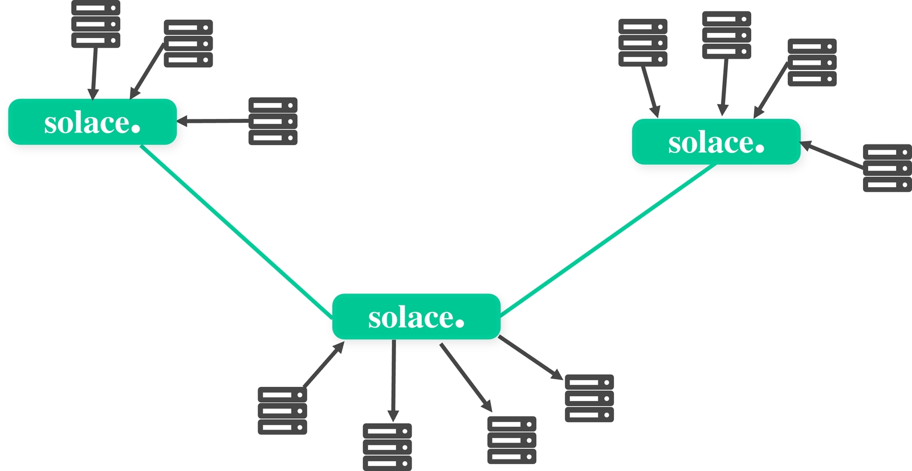
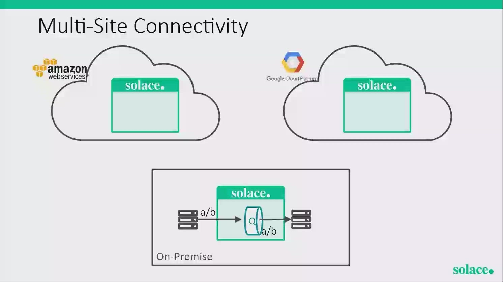
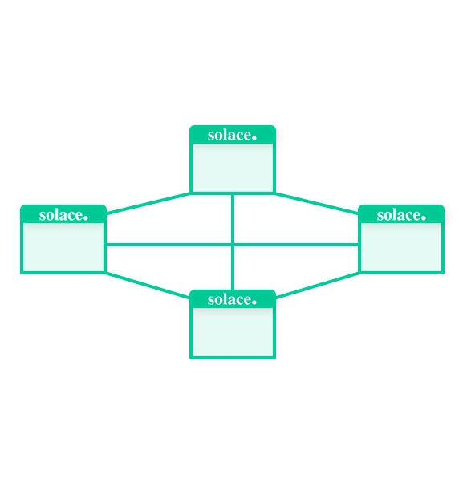
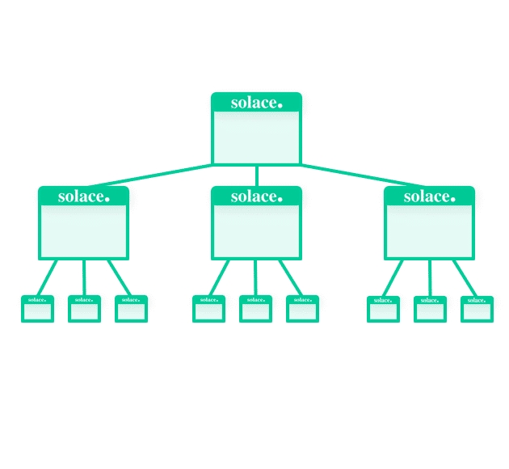
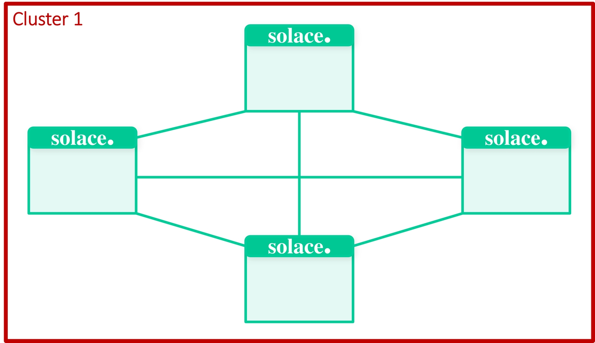
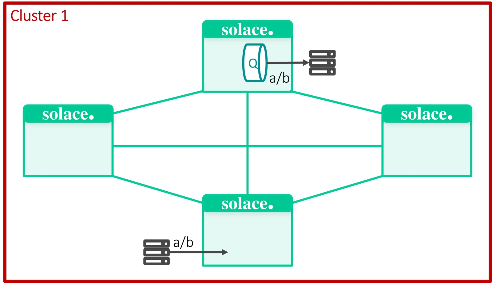
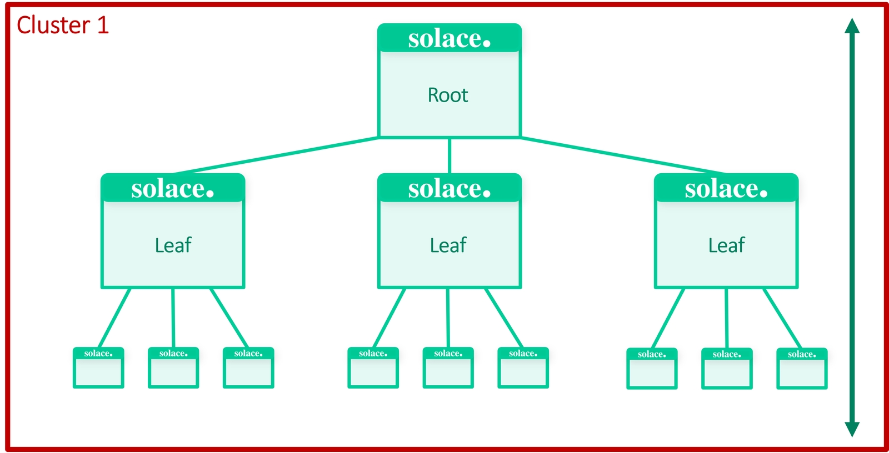
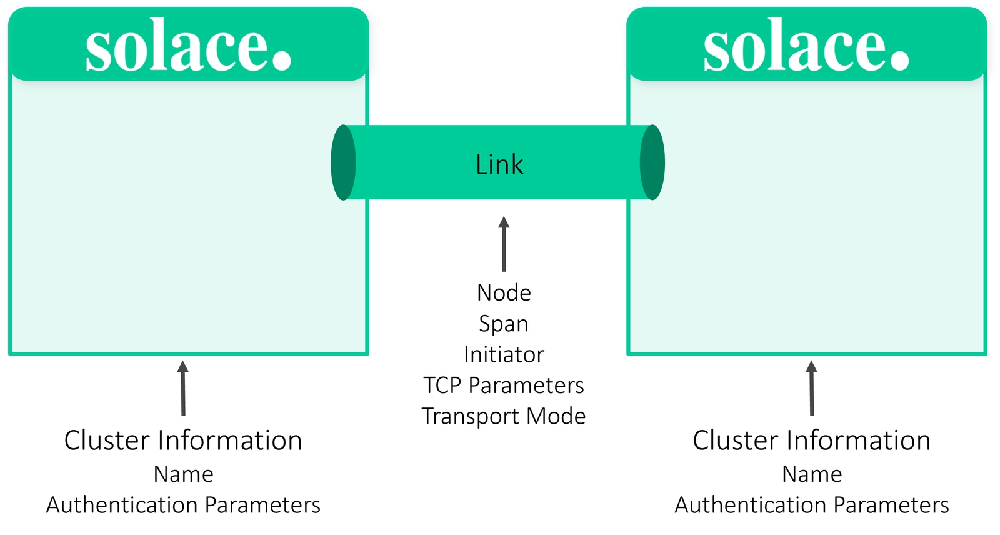
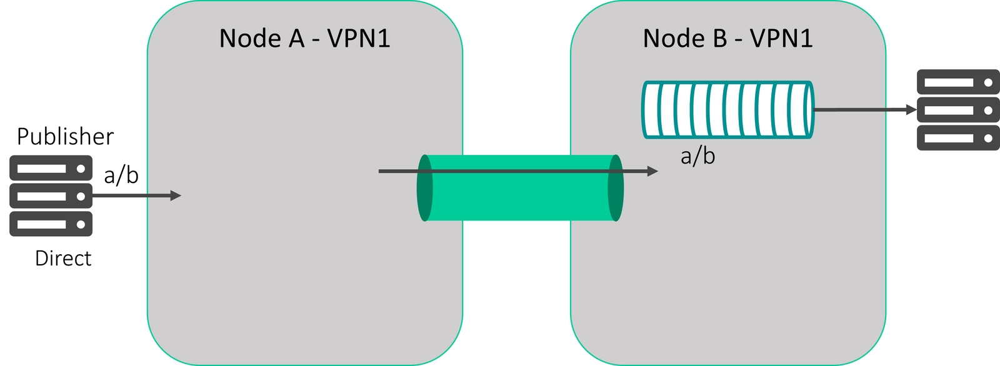
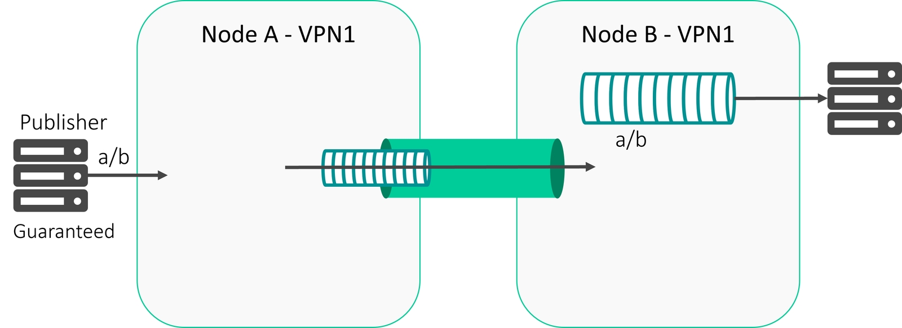

# Dynamic Message Routing

- **Course:** Solace Event Broker Administration
- **Syllabus section:** Dynamic Message Routing (DMR)
- **Academy content type:** SCORM

## Lesson notes

### Screen 1: Academy lesson page

### Screen 2: SCORM course overview

The module is titled **Dynamic Message Routing (DMR)**. Its overview says the course covers DMR basics, key configuration terms, and feature comparisons; explains how DMR enables efficient message distribution across distributed systems; and explores DMR's advantages over traditional messaging models. The table of contents has three sections: **The Context - What's the Scenario?**, **The Concept - Understanding DMR; A Deeper Dive**, and **The Click - Quiz**. All four activities are marked **Unstarted**. The page offers **START COURSE**. The large title-cover artwork is decorative course branding; no instructional diagram is exposed on this screen.

### Screen 3: What's the Scenario? - opening

**Next:** Continue to reveal the scenario and its response choices; record the question before selecting.

### Screen 4: What's the Scenario? - collaboration question

Haroldo asks: **“We have multiple message centers globally that process the same information and use the same apps. How can I make collaboration easier for them?”** The two responses are **(1)** “They can share information in lots of ways, I'm sure they can figure this out.” and **(2)** “Dynamic Message Routing can help! Let's discuss how.” The rendered scene shows Haroldo speaking in an office; the screenshot was inspected, but this browser capture interface does not provide a local file path for saving it. It is a scenario illustration rather than a technical topology diagram.

**Next:** Select response 2 and record the displayed response and section status.

**Next:** Open **2 of 4 - Understanding DMR** and record the content before interacting.

### Screen 5: Understanding DMR - lesson content

#### What is Dynamic Message Routing (DMR)?

DMR routes events or messages from one Message VPN to another, similarly to static bridges. Compared with static bridges, DMR distributes events more intelligently and dynamically across the network and configured links. It works with both persistent and non-persistent messages. DMR removes the need to use topic namespaces to predefine what data flows across each Message VPN bridge; this becomes automatic while retaining the same persistent features.

The first diagram depicts three Solace brokers interconnected in a multi-site arrangement, with local endpoint/server groups at the sites.

Under **Clustering: Full Mesh**, all event brokers in the network connect together to form one cluster. The diagram labeled **Cluster 1** shows four event brokers connected in a mesh.

In the illustrated message-propagation example, a publisher at the bottom sends toward a queue at the top with a matching subscription; the left and right nodes do not see the messages because neither has a matching subscription.

Under **Clustering: Tree**, event brokers connect as one cluster and messages move in a north/south pattern, enabling high fan-out to millions of connections for data-distribution and IoT use cases. The diagram shows a root broker connected to three leaf brokers, each with three downstream brokers.

The screen also presents five DMR bridge prerequisites as unchecked checklist items:

- DMR mode must be configured; SolOS 8.13+ has it enabled by default.
- The message backbone service must be enabled.
- SMF (Solace Message Format) service must be enabled.
- PubSub+ instances must have unique physical router names.
- With PubSub+ Software, the connection tier must support at least 1,000 connections.

The original course images have been saved from the exact media keys in the loaded SCORM package through Articulate's image rendition service. Direct file URLs on the course asset host returned HTTP 403. Each local image is a rendition of the original course asset, not a generated replacement.

**Next:** Work through the prerequisite checklist, then move to A Deeper Dive.

### Screen 6: Multi-Site Connectivity video - player before playback

Under the **Multi-Site Connectivity** heading, an embedded video player is visible with a **Play Video** control. No transcript, caption text, duration, or player feedback is exposed before playback. The associated slide image is saved above.

**Next:** Play the video and inspect the available captions or transcript; record any remaining concepts if none is available.

### Screen 7: Multi-Site Connectivity video - playback review

Selecting **Play Video** changed the player controls to **Pause**. The duration initially appeared as 0:00 while loading; once loaded, the progress bar advanced and the control later returned to **Play**. The player and accessibility controls expose no captions or transcript. A screenshot during playback timed out, but the course's associated Multi-Site Connectivity diagram is available locally above. No spoken transcript is claimed; audio-only details remain unavailable in this capture.

### Screen 8: DMR prerequisites - checklist completed

**Next:** Open **3 of 4 - A Deeper Dive** and record its content before interacting.

### Screen 9: A Deeper Dive - configuration, flexibility, and delivery modes

#### Configurations

The course says configurations occur at the broker level. Cluster information is specified on each broker, along with link configurations between event brokers. If the brokers belong to the same cluster, their link is identified as an **internal link**. If the link connects brokers in different clusters, it is an **external link**. Only one external link is allowed between different clusters.

#### Link Flexibility

- **Span:** Internal implies a clustering architecture; External implies a hybrid cloud architecture.
- **Delivery mode:** Direct messaging provides at-most-once delivery; guaranteed messaging provides at-least-once delivery.
- **Initiator:** Determines which side of the link establishes the TCP connection.
- **Transport modes:** Compressed or encrypted connections.

#### Data Channels - Delivery Modes selected

The selected tab says: **“For the clustered link, you can either use direct messaging or guaranteed messaging with topic subscriptions on a queue.”** The other tabs are **Direct Messages** and **Guaranteed Messages**.

#### Feature Comparison

| Feature | Message VPN Bridging | Dynamic Message Routing |
|---|---|---|
| Delivery Methods | Direct and Guaranteed Messaging | Direct and Guaranteed Messaging |
| Routing | Static | Dynamic |
| Optimize Bandwidth | No - Static Subscriptions | Yes - Dynamic Subscriptions |
| Loop Prevention | Manual | Automatic |
| Transport Modes | Compressed & Encrypted | Compressed & Encrypted |
| Message-VPN Connection | Same or Different Routers | Different Routers |
| Click-to-Connect | PubSub+ Manager | PubSub+ Manager |
| Configuration | CLI, SolAdmin, PubSub+ Manager | CLI, PubSub+ Manager |

**Next:** Open **Direct Messages** and record the complete tab text and image before moving to Guaranteed Messages.

### Screen 10: Data Channels - Direct Messages selected

The **Direct Messages** tab says: **“How the messages are consumed does not affect how the messages are propagated across the data channel. The publisher defines messages as being direct or guaranteed.”** The direct-message diagram shows an `a/b` publisher on **Node A - VPN1** publishing across the link to a matching subscription/queue on **Node B - VPN1**, which delivers to its local endpoint group.

The sidebar shows **A Deeper Dive - 88% Completed**. **Guaranteed Messages** is the remaining tab.

**Next:** Open **Guaranteed Messages** and record its complete text and image.

### Screen 11: Data Channels - Guaranteed Messages selected

The **Guaranteed Messages** tab says: **“The consumer defines if they would like the messages to wait for them when they are not connected, or if they only want to receive messages real-time.”** The diagram contrasts a publisher sending `a/b` messages through queues on Node A and Node B to an endpoint, with the queue path preserving messages for a consumer that is disconnected.

### Screen 12: DMR quiz - questions and choices before submission

#### Question 1 - Multiple choice

**What option would help multiple message centers globally to process the same information using the same applications?**

1. intelligently interconnecting event brokers in a mesh
2. using only encrypted transport modes
3. connecting to on-premises sites only

#### Question 2 - Fill in the blank

**To enable DMR, administrators must configure the _______ to establish communication connections between Solace PubSub+ event brokers.**

#### Question 3 - Multiple response

**Which of the following are prerequisites to setting up a DMR Bridge?**

- DMR mode must be configured.
- Message backbone service must be disabled.
- SMF (Solace Message Format) service must be enabled.
- When using PubSub+ Software the connection tier must be at least 100 connections.

The last choice conflicts with the earlier checklist, which stated **at least 1,000 connections**. Preserve this discrepancy and use the quiz feedback to determine which option the question accepts.

**Next:** Answer Question 1 using the scenario and clustering content, submit it, and record the exact result before proceeding to Question 2.

Question 2's fill-in field is now populated with **link** and is still awaiting submission. The exact prompt is “To enable DMR, administrators must configure the _______ to establish communication connections between Solace PubSub+ event brokers.” No correctness result has been submitted yet.

Submitting **link** displays **“Correct. Acceptable responses: link, links. Your answer: link.”** The feedback reads **Correct**, and the accepted variants are `link` and `links`.

**Next:** Answer Question 3, submit, and record the exact feedback before advancing.

**Next:** Retry Question 3 with only DMR mode configured and SMF enabled, then record the result.

On the retry, **DMR mode must be configured** and **SMF (Solace Message Format) service must be enabled** are selected; **Message backbone service must be disabled** and **the 100-connection tier** are unselected. The retry **SUBMIT** control is available, and no retry feedback is shown yet.

Submitting the retry displays **“Correct. Correct answer: DMR mode must be configured., SMF (Solace Message Format) service must be enabled.. Your answer: DMR mode must be configured., SMF (Solace Message Format) service must be enabled..”** The feedback reads **Correct**; DMR mode and SMF are marked **Correctly checked**, while the disabled-backbone and 100-connection options are **Correctly unchecked**. This confirms the earlier 100-connection choice is not a DMR bridge prerequisite according to this quiz.

### Screen 13: Academy page after closing DMR SCORM

**Next:** Open Operational Maintenance and capture its first screen before interacting.

## Visuals

The original course visuals available in the DMR SCORM package have been saved under this lesson's `img\` folder and linked beside their explanations above. The embedded scenario/video playback did not expose a transcript or downloadable captions; that limitation is documented in Screen 7.
