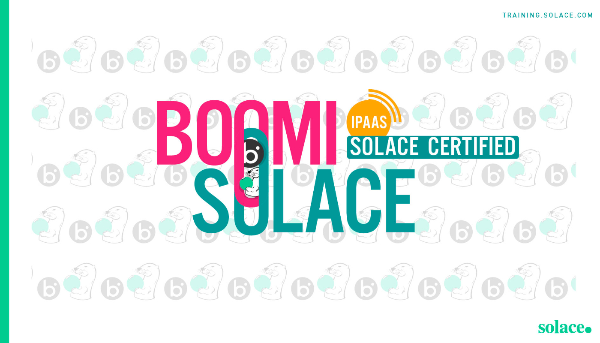

# Being Event Driven Integration - with Boomi

## Academy wrapper checkpoint before resuming

Observed on 2026-09-30 in the live Academy page before clicking the resume control. The course page displayed the breadcrumb path “Solace Certified Event-Driven Integration - Boomi” → “Event-Driven Integration Course - Boomi”; course type “E-learning”; language “English”; “Course in progress, 0 of 1 lessons completed”; and a syllabus with one item, this SCORM lesson. The lesson card displayed “Content status: In progress” and “Content type: SCORM”. The lesson content area displayed the heading “Being Event Driven Integration - with Boomi” and the control “Resume where you left off”. No SCORM instructional screen was visible yet, so no instructional content was inferred from this wrapper state.

The Academy wrapper state was recorded before using “Resume where you left off”.

## SCORM cover screen

After resuming, the SCORM module first rendered a cover screen attributed to Phil FitzGerald. It displayed the title “Being Event Driven Integration - with Boomi” over Boomi/Solace artwork and a “BEGIN LEARNING” control. The introduction asked whether the learner knows how Boomi and Solace work together to deliver an event-driven architecture and workflow enhancements in a changing integration world, and whether the learner can name the big ideas, key components, and sketch the workflow. It stated that by the end of the class the learner would be able to do exactly that. The module recommended prior EDA essentials, working knowledge of Solace Event Portal and Boomi’s relevant integration capabilities, and noted that there is no hands-on component but the instructions and demos are universally applicable.

The visible table of contents grouped the SCORM sections as follows: “THE CONTEXT” → “The Architectural & Dev challenge”; “THE CONCEPTS” → “Evolving Integration architecture”, “Boomi and Solace explained”, “Essential Concepts”, and “Design Principles”; and “THE CLICK” → “The Solace - Boomi workflow” and “Conclusion”. All displayed section markers were “Unstarted” at this point. The visible SCORM screen was recorded before using “BEGIN LEARNING”.

## SCORM content

### 1. The Architectural & Dev challenge

The SCORM navigation identified this as **Lesson 1 of 7**, under “THE CONTEXT”, with the module at 0% complete. The lesson asked: “What are they meant to do?” Its answer was: “Not much, just everything that everyone else relies upon.”

The architect’s responsibilities were presented as four objectives: develop a vision for Event-Driven architecture; document, implement, and maintain EDA cost-effectively; create procedures for developers to realize event-driven integrations that conform to the big vision; and maximize developer efficiency.

The desired typical day for an architect was described as: maintaining and updating the business vision with relative ease; providing discoverability and a consistent mechanism to define and document the EDA across teams; rapidly deploying consistently generated Boomi automation flows that serve the vision; and using built-in mechanisms to manage object deployment to the Advanced Event Mesh through Event Portal.

The resulting architecture deliverables were listed as:

- **Documented Event Catalog:** a clear, shared repository of all events, including topics, payload schemas, metadata, and documentation, created and maintained in Solace Event Portal for discoverability and governance.
- **Event Mesh Configuration:** a deployed and operational Solace Event Mesh connecting brokers across required on-premises, cloud, or hybrid environments, including queue, security, and redundancy configurations.
- **Boomi Integration Processes:** producer and consumer processes configured in Boomi, tested, and validated, with documentation for each process covering trigger criteria, transformations, and downstream actions.
- **Monitoring and Alerting Setup:** Solace broker, Boomi Atom, and event-mesh monitoring tools tracking throughput, latency, and delivery rates, with alerts for failures, anomalies, or resource constraints.
- **End-to-End Test Cases and Results:** comprehensive tests covering publication, subscription, retries, error handling, and other scenarios, with detailed results confirming functional and performance requirements.
- **Security and Compliance Artifacts:** documentation of topic access control, data encryption, role-based permissions, and evidence of compliance with relevant regulations such as GDPR and HIPAA.
- **Operational Playbook:** guidance for maintaining and scaling the solution, including troubleshooting, escalation paths, and best practices.

The desired typical day for a developer was then described through five activities. First, the developer imports event definitions directly into Boomi: instead of manually defining event structures, Boomi’s Solace Connector can import event names, schemas, and topics from Solace Event Portal, improving consistency, reducing errors, and speeding setup. Second, the developer designs event-driven micro-integrations: modular Boomi processes subscribe to or publish events and handle mapping, enrichment, and business logic for focused use cases such as publishing SAP order data, inserting that data into Salesforce, or transforming and routing data to NetSuite. Third, the developer reuses and shares components through a clear event catalog and reusable mappings, cloning or extending processes for new integrations to promote consistency and minimize duplication. Fourth, the developer leverages built-in scalability and monitoring by configuring asynchronous event flows with Solace durable subscriptions and retries for reliable delivery, then using Boomi monitoring to track process performance. Fifth, the developer iterates and enhances with confidence because the loosely coupled, schema-driven framework allows updates and new integrations with minimal disruption. The stated result was less repetitive configuration and troubleshooting, faster integration delivery, better data quality, and stronger alignment with business goals—“now that’s worth having.”

The screen’s key instructional visual showed an abstract Boomi/Solace-themed background with four highlighted statements: “Tasked to develop a vision for Event-Driven architecture”; “Document, implement, and maintain EDA cost-effectively”; “Create procedures for developers to realize Event-driven integrations — that conform to the big vision”; and “Maximize developer efficiency.” The source image was visibly rendered inside the nested SCORM frame, but the Academy asset exporter exposed no nested SCORM image URL for local export; the visual is therefore preserved by this exact description, while the course cover artwork above is saved locally as the recoverable original asset. No video or audio was present on this screen.

The first lesson screen was fully recorded before selecting the lesson’s “2 of 7 — Evolving Integration architecture” advance control.

### 2. Evolving Integration architecture

The SCORM sidebar marked the previous lesson **Completed**, displayed this lesson as **Lesson 2 of 7**, and showed 14% module completion when the lesson opened. The lesson introduced an “Evolving view of architecture”. It said that IT systems are increasingly viewed not simply as “data custodians” but as the enterprise’s “nervous system”. This mindset prioritizes data in motion over data at rest and enables more dynamic decision-making.

The lesson described the target architecture in practical terms: it should not bog down when demand increases or some components are unavailable; it should grow as more components are added; it should ensure late consumers do not miss important information; and it should allow new capabilities to be added without turning the whole system upside down. The question posed was how to get there, with the suggested answer to “flip the script on integration”: keep the core simple while handling complex processing at the outskirts.

The lesson’s streamlined approach was said to provide these advantages:

- It clears the data path by using an Event Mesh for routing, speeding integration paths by decoupling them from performance-impacting systems.
- It simplifies setup by eliminating complex routing rules through the Event Mesh’s native capabilities.
- It decentralizes processing and deployment to the edges, enabling regional resource optimization.
- It allows new consumers in different regions to be added without downtime or changes to the existing setup.
- It supports individual scaling of each node for better resource management.
- It handles increased data volumes without affecting performance.
- It ensures that faults or delays in one system do not impact other integration flows.

The “Integration Reimagined” visual contrasted two models. “Integration of the last 20 years” was shown as centralized, monolithic, point-to-point, and tightly coupled, with services connected through many one-to-one routes. “Integration for the next 20 years” was shown as decentralized, distributed, and event-driven, with applications connected through a centralized event mesh.

The accompanying iPaaS explanation said that the Solace platform remains focused on rapid data movement while Boomi performs complex functions at the edge. The diagram positioned the Event Mesh at the core and the integration components at the edge, showing how a traditional integration can be repositioned.

The lesson concluded that using Solace and Boomi together creates real-time, composable integrations that unify asynchronous and synchronous communication. This simplifies complex integration challenges, maximizes reuse, and gives developers a toolset for scalable, agile solutions.

#### Video

The lesson included a 3:01 video. It was played through to 100% completion. The player exposed Play/Pause, progress, playback rate, Picture-in-Picture, Fullscreen, Mute, and volume controls, but no captions, transcript, or subtitle control was available. The visible video frame used Solace/otter artwork with teal and orange circular accents; no additional audio claims are made here because no transcript or captions were available. The surrounding lesson text above records the concepts and conclusions presented on the screen.

#### Visual recovery note

The Integration Reimagined diagram and the adjacent iPaaS diagram were visible in the nested SCORM frame and their accessible descriptions and labels were recorded above. The course JSON exposed their original asset names, but the nested SCORM asset URLs returned 403 when accessed outside the rendered lesson and the page asset exporter did not expose those nested images for local bundling. They are therefore documented by their displayed labels, structure, and accessible descriptions rather than replaced with generated artwork.

The second lesson screen, including the full text, video state, and visual descriptions, was recorded before selecting the lesson’s “3 of 7 — Boomi and Solace explained” advance control.

### 3. Boomi and Solace explained

The SCORM sidebar marked “Evolving Integration architecture” **Completed**, showed this as **Lesson 3 of 7**, and displayed 29% module completion on entry. The lesson used an analogy: Boomi is the “master architect of bridges (APIs) and highways (integration platforms)” that keeps everything connected smoothly, while Solace ensures messages and events move at high speed where every millisecond counts.

It described Solace as the platform for Event-Driven Architectures that must handle massive amounts of data in real time, acting as the backbone for applications that react to events as they happen, such as monitoring stock trades or updating live sports scores. It described Boomi as strong at connecting different systems and messaging languages, largely in a RESTful style. The lesson then said that as the world moves faster, the need for real-time event-driven interactions is increasing. One sentence on the live screen referred to “MuleSoft’s integration prowess with Solace’s event-handling muscle” even though this is the Boomi course; that wording was preserved as displayed.

#### What does each platform contribute?

The lesson provided a three-tab interaction. All tabs were opened and recorded before advancing.

**SOLACE tab:** The Solace platform contributes linear scalability, dynamic event routing, performance, event governance, multi-protocol capabilities, support for all event exchange patterns, full support for AsyncAPI standards, and a well-defined EDA and microservices architecture methodology.

**BOOMI tab:** Boomi contributes comprehensive integration capabilities; orchestration and choreography capabilities; a large connectivity set and comprehensive UX experience; REST API Management/Governance through the Integration Suite; Citizen Integration support and RPA; support for both RESTful and event-driven patterns; and well-defined integration methodologies, including API-led connectivity and an application network.

**SOLACE+BOOMI tab:** Together, Solace and Boomi address use cases requiring high performance, such as IoT or capital markets; global reach and scaling, such as global manufacturers and retailers; agility and flexibility, such as adding new omnichannel experiences or digital services and products; heterogeneous and polyglot environments, such as multi-cloud real-time synchronization; predictive behavior, such as predictive maintenance, fraud detection, and cross-sell/upsell; automation and process scaling; and artificial-intelligence readiness, including RAG and Agentic AI.

#### Big ideas and key terms

The lesson defined three big ideas. **Loose coupling** means systems do not need direct knowledge of each other; they communicate through events, allowing systems to be added or changed without disrupting the whole ecosystem. **Asynchronous communication** means events are processed independently of the sender, so systems do not wait for a response, supporting real-time responsiveness and better efficiency. **Event-centric design** makes events the core unit of communication; each event represents a meaningful state change, such as “Order Placed”, and triggers downstream processes or actions.

The key words were defined as follows: an **event** is a signal or message representing a state change or occurrence of interest; a **producer** publishes events to the event broker; a **consumer** subscribes to events and acts when one is received; an **event broker** routes events from producers to consumers, with PubSub+ given as an example; **asynchronous messaging** is communication where sender and receiver need not interact simultaneously; an **event stream** is a continuous flow of events that consumers can subscribe to for real-time processing; a **topic** is an event description attached by the publisher that the broker uses to make routing decisions for subscribers; a **Boomi Atom** is a lightweight runtime engine executing Boomi integration processes on-premises or in the cloud; a **Boomi Process** defines data flow between systems, including connectors, transformations, and business logic; and a **Boomi Shape** is a functional building block in a Boomi process for tasks such as mapping, flow control, or API calls. The lesson explicitly stated that the Solace Connector for Boomi is a Boomi Shape.

#### Visual recovery note

The opening visual showed the Boomi/Solace bridge-and-highway analogy: Boomi represented as the integration architect and Solace as the high-speed event and message movement layer. The SCORM source exposed the visual’s accessible text and the tab content, but its nested original image could not be locally bundled because the asset exporter did not expose it and direct asset retrieval returned 403. The visual is preserved by this description and by the exact accessible text above; no substitute artwork was generated.

The third lesson screen, including all three tabs and the key-term definitions, was recorded before selecting the lesson’s “4 of 7 — Essential Concepts” advance control.

### 4. Essential Concepts

The SCORM sidebar marked “Boomi and Solace explained” **Completed**, showed this as **Lesson 4 of 7**, and displayed 43% module completion on entry. The section opened with the theme “Reasons to be cheerful about your iPaaS + Solace architecture.”

#### Scaling

The Solace platform was presented as scalable in three ways: **vertical consumer scaling**, using Partitioned Queues to dynamically add any number of consumers to a channel without impacting performance; **broker scaling**, clustering brokers and load-balancing across clusters for high availability; and **event-mesh scaling**, connecting brokers in a globally scalable mesh that provides a seamless event-distribution path.

The example compared clients in New York and Tokyo. Traditionally, each region would need an event platform and client code to relay information between regions, adding performance tuning, coding, and management work. An Event Mesh removes that complexity: a Tokyo client registers as a consumer, and when a New York client publishes an event, the Event Mesh routes it automatically to Tokyo without special setup, forwarding code, or extra management.

#### Data Distribution

For one-to-many distribution, Boomi and Solace complement each other by using event-driven routing while Boomi handles the logic. The example was ACME Retail changing the price of last season’s mountain bikes. The main office changes the price, but locations worldwide must receive the update with local currency and tax differences applied.

In a REST-only setup, global synchronization would require APIs in every region and complex orchestration, with exposure to latency and outages. An event-driven Pub/Sub approach simplifies distribution, although it requires suitable global messaging infrastructure. With a globally configured Event Mesh, a corporate price-change event immediately informs relevant parties worldwide, while Boomi consumers in each region perform local adjustments such as currency conversion and tax handling. The live text included the wording “BoomiBoom consumers”; this apparent typo was preserved as displayed.

#### Data Aggregation

In distributed architectures, datasets may live in different systems, environments, and geographies. Connecting to disparate systems, extracting the required data, aggregating it, and presenting it uniformly becomes difficult as the number of systems grows, especially when they are globally distributed. The example of a banking customer’s complete profile required demographics from Salesforce, account data from a mainframe, and loan data from a loan system; a traditional orchestration may time out as this aggregation grows.

#### Stateful Choreography

Stateful choreography was defined as a distributed-systems pattern where multiple services collaborate on a process, each knowing the current process state and its own role. Unlike orchestration, where a central coordinator directs each step, choreography has services communicate directly and pass process state as needed.

The Order Fulfillment example broke the process into five event-connected stages: (1) placing the order through a website or app and sending it through a RESTful API to the Order Management System; (2) starting fulfillment, which involves several stages and checks; (3) checking inventory and emitting a signal to order the item if it is not in stock; (4) preparing shipment by packaging, arranging pickup, and shipping; and (5) keeping the customer updated throughout. Each step is triggered by events and the timing can vary.

The lesson acknowledged that other event platforms can implement this pattern, then identified three areas making a Solace implementation attractive: state representation, scalability, and heterogeneity. It compared orchestration to an orchestra conductor who coordinates the initial order and multiple tasks as one business transaction, and choreography to a flash mob where participants know their parts without a central guide. Typical choreography does not track overall state; Solace adds a way to observe it throughout the choreography.

Solace’s stateful approach provides **awareness**, letting participants know progress in real time, and **notification**, making it easier to update customers or stakeholders smoothly and in detail. It uses variables in the topic structure like a community bulletin board: each participant picks up cues and signals progress. A special “monitoring subscriber” watches state changes. This separates notifications and error handling from the main action, keeping the process organized and focused.

#### Error Handling

The lesson said exception handling in distributed environments is complex. Boomi has strong built-in exception handling, but it is mainly designed for in-process errors. In a large distributed environment, an error in one geography can affect services and systems elsewhere, requiring complex rollback strategies.

Two error-handling types were distinguished: **in-process**, handled directly inside the workflow, which can slow the workflow and overlook broader effects, and whose failure may halt the entire process; and **out-of-process**, handled outside the main workflow so the service’s speed and continuity are not directly affected.

The “Event Mesh Distributed Error Handling” section recommended three steps: minimize in-process handling by keeping error handling out of the main workflow and resolving errors quickly; understand failure impact across the wider environment to choose the right recovery strategy; and ensure the capability to implement recovery strategies under critical conditions.

The lesson proposed a “Resolution Center” outside the main service area to process exceptions efficiently without disrupting service flow, then raised the risks of cross-region errors and a single Resolution Center becoming a single point of failure. A hybrid solution was suggested: localized, domain-specific Resolution Centers handle errors in their domains while communicating with a central Resolution Center. This improves resilience and supports strategic recovery by using the Event Mesh for rapid error offloading and coordination between Resolution Centers and administrative services. Separating error handling from the main data path and using a network of Resolution Centers preserves service integrity while enabling comprehensive recovery and adaptation.

#### Visual recovery note

This lesson displayed a title visual for the iPaaS + Solace architecture, a New York/Tokyo Event Mesh routing illustration, a global price-change distribution illustration, a distributed data-aggregation illustration, an Order Fulfillment choreography illustration, and an Event Mesh Distributed Error Handling still. Their visible purpose and labels are captured in the surrounding explanations. The nested SCORM originals were not exposed by the page asset exporter and direct retrieval of the course-package asset paths returned 403, so no generated replacements were made. The recoverable local course artwork remains linked above.

The fourth lesson screen and its complete instructional content were recorded before selecting the lesson’s “5 of 7 — Design Principles” advance control.

### 5. Design Principles

The SCORM sidebar marked “Essential Concepts” **Completed**, showed this as **Lesson 5 of 7**, and displayed 57% module completion on entry. The section theme was “Getting the flow right.”

#### Routing and Filtering

The lesson identified two typical routing types: **destination-based routing** and **content-based routing**. It said destination routing is usually more prevalent, while the live text referred to both types being included in the integration process “in MuleSoft”; the wording was preserved as displayed. The more integration components placed on the data path, the more tightly coupled the components become and the more performance may be affected.

Both routing tabs were opened. **Destination-based routing** forwards data according to a specific destination in the data packet. An event may arrive on one channel and need to be placed on another channel. The lesson compared this with a post office forwarding mail according to the address on the envelope and selecting the most optimal path to a predefined destination.

The Solace Event Mesh can perform destination routing implicitly. It was compared with IP networking at a higher level: IP routers exchange routing tables using protocols such as BGP, while event brokers in the mesh exchange subscription information to create a “mesh view” of event paths. Events can then be routed to their required destinations.

Because the Solace Event Mesh cannot see the event payload, it cannot perform content-based routing. The suggested division of responsibility was for the Event Mesh to handle destination routing and Boomi to handle content-based routing, reducing coupling and improving performance. Filtering follows the same pattern: destination-based filtering can be done on the Event Mesh, while content-based filtering can be done in Boomi.

**Content-based routing** forwards packets according to their content or metadata rather than only a destination address. The process receives information from a channel, applies conditions to the payload, and pushes the event to a different destination channel. The lesson compared this with a librarian filing books by topic: when titles do not explicitly identify a shelf, the librarian uses context such as genre or intended audience. The enlarged visual showed a person pulling a red book from a library shelf.

#### Protocol Bridging

The Event Mesh naturally supports multiple messaging protocols, including JMS, MQTT, AMQP, and SMF (Solace Message Format), for communication with the Event Broker. Two benefits were stated: developers can use the protocol they already know, and separate systems do not need to be created for every protocol. The Event Mesh can also connect messaging systems such as Kafka, IBM MQ, and TIBCO EMS, simplifying event movement across platforms.

#### Multiplexing and Demultiplexing

Both interactive explanations were expanded. **Multiplexing (Mux)** gathers events from multiple sources and funnels them into one main channel, which is useful for live statistics and analysis of combined data. **Demultiplexing (Demux)** takes a stream of events and divides it into smaller, manageable sub-streams, making it possible to sort data in real time with greater processing flexibility and agility.

The lesson said Solace supports these patterns with simple configuration and two Event Mesh features: multiple topics can be mapped to one queue, providing one form of multiplexing; and hierarchical topic structures can contain wildcards and variables, supporting both multiplexing and demultiplexing.

The example topic was `order/process/{city}/{storeid}`, where `city` and `storeid` are variables. Publishers can send to paths such as `order/process/Chicago/123` or `order/process/NewYork/456`, using a destination to gather data from different sources. Consumers can filter with wildcards: `order/process/NewYork/*` receives New York store orders, while `order/process/>` receives all orders across the US. This enables demultiplexing based on consumer interests without additional effort.

The approach fully decouples subscribers and publishers, adding flexibility and agility, and removes unnecessary logic from the integration path to make it lighter weight. The lesson noted that multiplexing and demultiplexing can also be combined for a more streamlined processing environment.

#### Visual recovery note

The key recovered visual was the library-shelf photograph used for the content-based-routing analogy; its enlarged state was inspected. The original nested SCORM image could not be exported locally because it was not exposed by the page asset exporter and the course-package asset path returned 403. The visual is preserved by the description above rather than replaced with generated imagery.

The fifth lesson screen, both routing tabs, both expanded Mux/Demux explanations, the topic examples, and the visual description were recorded before selecting the lesson’s “6 of 7 — The Solace - Boomi workflow” advance control.

### 6. The Solace - Boomi workflow

The SCORM sidebar marked “Design Principles” **Completed**, showed this as **Lesson 6 of 7**, and displayed 71% module completion when the lesson opened. The lesson heading was “describe the workflow”.

The complete workflow was presented in six steps:

1. **Define Business Use Cases and Events.** Collaborate with stakeholders to identify integration scenarios such as synchronizing customer data or triggering notifications on a payment event. Map the business process to events such as “Order Created” and “Payment Processed”. Use Solace Event Portal to design and catalog the events, including metadata such as payload schemas and descriptions.
2. **Configure Solace Event Mesh.** Deploy Solace PubSub+ brokers in cloud, on-premises, or hybrid environments. Connect the brokers into an Event Mesh for seamless routing across geographic or system boundaries. Define topics with a structured hierarchy such as `order/created/{geo}/{orderID}`.
3. **Set Up Event Producers in Boomi.** Create Boomi integration processes that generate events from database updates, API calls, ERP events, or user actions. Use the Solace PubSub+ connector in Boomi to publish events to the appropriate topic, then validate publication and topic structure.
4. **Configure Event Consumers in Boomi.** Use the Solace connector to subscribe to topics such as `order/created/EMEA/*`. Build consumer processes that transform data, call downstream APIs, or write to databases. Add idempotency safeguards to handle duplicate events from retries or replays.
5. **Use Solace Event Portal for Governance.** Catalog events, publishers, and subscribers to provide team transparency. Visualize event flows to validate that producers and consumers match the business process. Share the event catalog with other teams or external partners for reuse and consistency.
6. **Test, Monitor, and Optimize.** Simulate real-world end-to-end scenarios to verify event triggering, routing, and consumption. Use Solace and Boomi monitoring tools to track throughput, latency, and solution health. Adjust the Event Mesh or Boomi processes for increased load or new use cases.

#### “demo the show” timeline

The lesson included a two-point timeline. **Starting in Event Portal** was subtitled “Getting your Applications in line.” **Moving** was subtitled “Making Event Driven a real experience.” The first video was 4:05 and the second was 5:12; both were played through to the player’s end state. Neither player exposed captions, a transcript, or a subtitle control, so no transcript is claimed. The only additional concepts presented in accessible text were the timeline titles and subtitles; the six-step workflow above records the instructional content available around the videos.

The sixth lesson screen, the full six-step workflow, timeline labels, and both video completion states were recorded before selecting the lesson’s “7 of 7 — Conclusion” advance control.

### 7. Conclusion and knowledge check

The SCORM opened **Lesson 7 of 7**, titled “Conclusion”, by Phil FitzGerald. The conclusion congratulated the learner for reaching this point and stated that the lesson had shown how Boomi and Solace work together to deliver an Event-Driven architecture and workflow enhancements. It revisited the changing face of integration and said that, after the demo, the learner should be able to name the big ideas, identify the key components, and sketch the workflow. It then invited the learner to double-check their knowledge and explain it to others.

The visible control was “START QUIZZING YOUR SKILLS”. The conclusion screen was recorded before selecting that control.

#### Knowledge check Question 1 of 4

The first quiz screen displayed the prompt **“What does this mean?”** and an infographic headed “We live in a world of more…” with these callouts: **More Applications** — “>1,000 per enterprise”; **More Distributed** — “90% of orgs are multi-cloud”; **Sharing More Data** — “Up 25% every year”; **More Quickly** — “Latency expectation down from seconds to real-time”; and **More Intelligent** — “Real Time RAG Agentic AI”. The visual concluded, “…making it more difficult to connect and integrate everything.”

The two available radio choices were:

- “The growth in application variety, need and density will only grow.”
- “We’ve reached peak complexity”

The radio-button control indicated single selection. The full question, infographic text, both choices, and selection instruction implied by the radio controls were recorded before submitting an answer. The original infographic was visible inside the nested SCORM frame but was not exposed for local export; its complete visible wording is preserved above.

**Submitted answer:** “The growth in application variety, need and density will only grow.” **System feedback:** “Correct. Correct answer: The growth in application variety, need and density will only grow.. Your answer: The growth in application variety, need and density will only grow.. How could it not eh?” The answer was marked correctly selected, the alternative was marked correctly unselected, and the feedback panel displayed “Correct” and “How could it not eh?”. The quiz then exposed a “NEXT” control. This confirmed result was recorded before advancing.

#### Knowledge check Question 2 of 4

The second quiz screen displayed **“You currently live in this kind of complexity”** above an integration-spaghetti infographic. The visual showed many one-to-one connections among AI-powered and IoT/connected things and places, API management and iPaaS platforms (including Apigee, MuleSoft, gravitee.io, Boomi, SAP, and AWS), cloud services, analytics/data lakes (including Snowflake, SAS, Spark, and Databricks), business applications (including Salesforce, SAP, and Workday), systems of record/databases (including SAP ECC, MongoDB, and Oracle Database), and ESB/messaging/streaming systems (including IBM MQ, Kafka, TIBCO, and IBM). The center labels were “Point to Point”, “Synchronous”, “Batch/Polling”, “Siloed”, and “Non-Real-time”.

The available checkbox choices were:

- “Yes”
- “No”
- “I dare not think about it”

Checkboxes indicated a multiple-response interaction; the full question, visual labels, all choices, and the multiple-selection control type were recorded before submitting.

**Submitted answer:** “Yes.” **System feedback:** “Correct. Correct answer: Yes. Your answer: Yes. Even if you claim not to, you will do soon or are part of other system spaghetti”. The answer was marked correctly checked; “No” and “I dare not think about it” were marked correctly unchecked. The feedback panel displayed “Correct” and “Even if you claim not to, you will do soon or are part of other system spaghetti”. The quiz then exposed a “NEXT” control. This confirmed result was recorded before advancing.

#### Knowledge check Question 3 of 4

The third quiz screen displayed **“Integration turned inside ___?”** with a fill-in text field labelled “Type your answer here”. The accompanying visual contrasted a left-side architecture labelled **“Centralized, Monolithic, Point-to-Point, Tightly-Coupled”** with a right-side architecture labelled **“Decentralized, Distributed, Decoupled, Event-driven”**. The right side centered “Events & Real-time Data Streams”. The input field required the learner to fill the blank; the full prompt, visual labels, and entry instruction were recorded before typing.

**Submitted answer:** `out`. **System feedback:** “Correct. Acceptable responses: out. Your answer: out.” The feedback panel displayed “Correct”, and the accepted response was recorded as `out`. The quiz then exposed a “NEXT” control. This confirmed result was recorded before advancing.

#### Knowledge check Question 4 of 4

The fourth quiz screen displayed **“Good for business?”** with a diagram showing Salesforce on the left feeding a central event-mesh field labelled “Liberate”, “Stream & Filter”, and “Democratize”. The right side was labelled “Integrate” and routed to SAP, ServiceNow, and Workday. The bottom identified the beneficiaries as **Architects**, **Developers**, and **Stakeholders**.

The available radio choices were:

- “Competitively smart”
- “Absolutely (but with effort)”

The radio controls indicated single selection. The full question, diagram labels, both choices, and selection instruction implied by the radio controls were recorded before submitting.

**Submitted answer:** “Absolutely (but with effort)”. **System feedback:** “Correct. Correct answer: Absolutely (but with effort). Your answer: Absolutely (but with effort).” The answer was marked correctly selected, “Competitively smart” was marked correctly unselected, and the feedback panel displayed “Correct”. The SCORM sidebar showed **Conclusion Completed**, the module progress reached **100% COMPLETE**, and the quiz exposed a “NEXT” control. This confirmed result and completion state were recorded before advancing.

#### SCORM quiz result

After the fourth question, the SCORM displayed **Quiz Results**, **Your score 100%**, **Passed**, and **PASSING 80%**. The final result screen exposed a “TAKE AGAIN” button, which was not selected because the knowledge check had already passed. This result screen was recorded before closing the SCORM lesson.

## Academy completion confirmation

After the SCORM was closed and the Academy page refreshed, the live wrapper visibly showed **Course completed**, **Content status: Completed** for this SCORM lesson, and “Well done! The course is completed.” The Academy recorded completion of Event-Driven Integration Course - Boomi on **09/30/2026 at 05:33 pm**. The learning-plan panel showed **2 of 3 courses completed** and identified the separate mandatory Boomi Exam as the next course, **Not started**.
