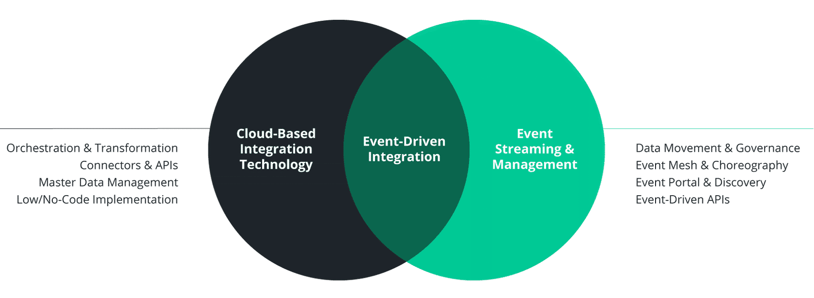
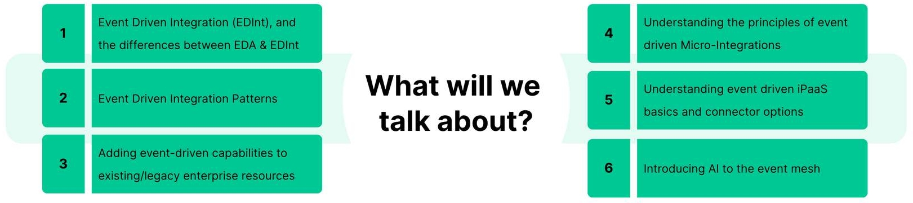
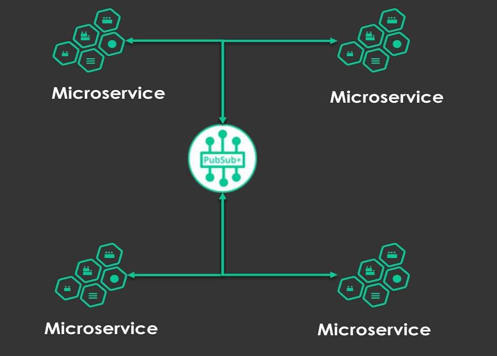
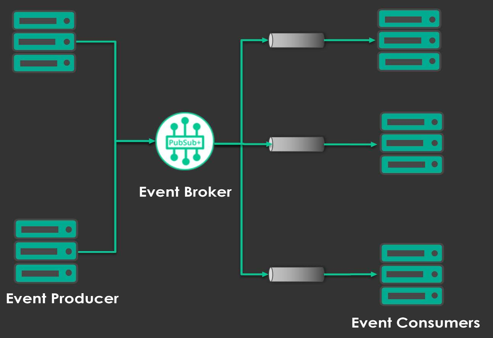
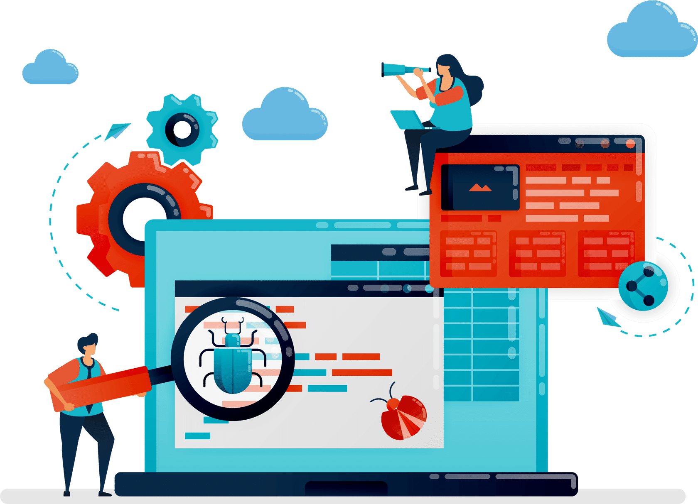
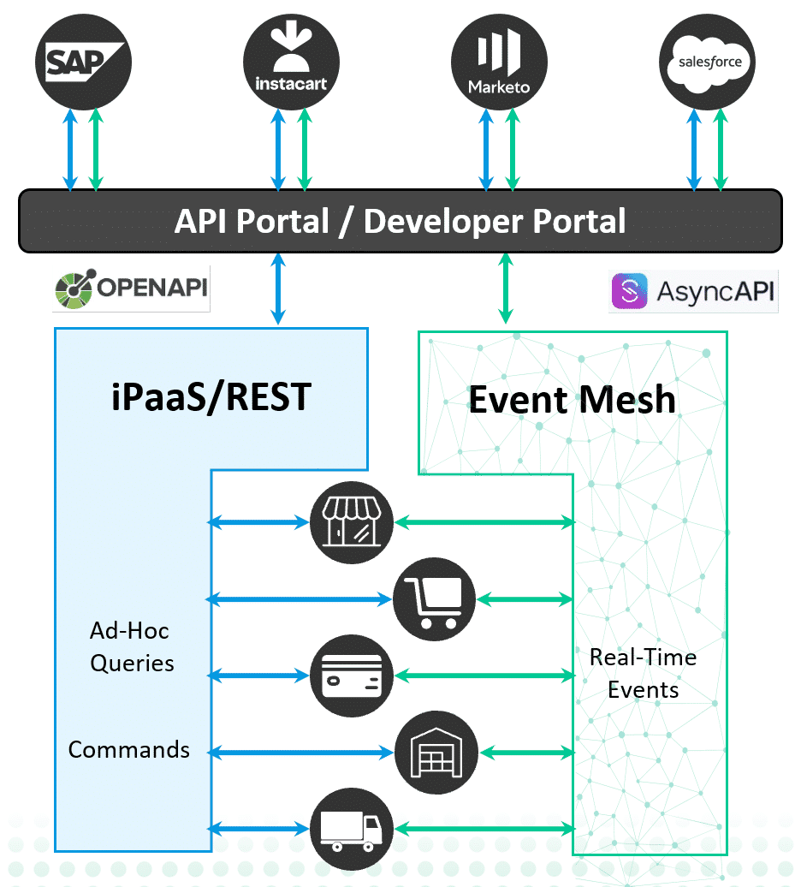
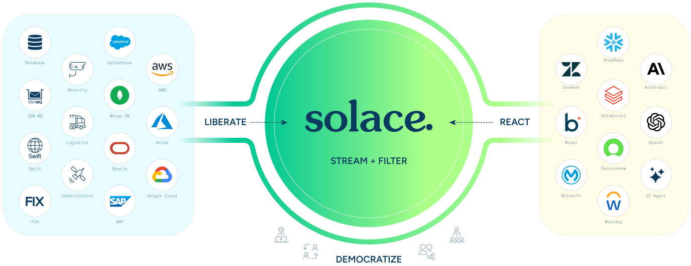
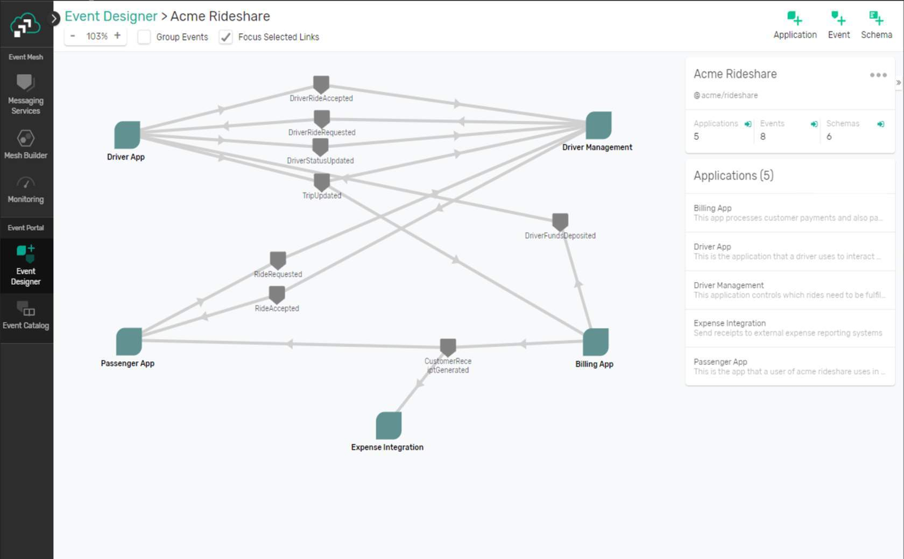
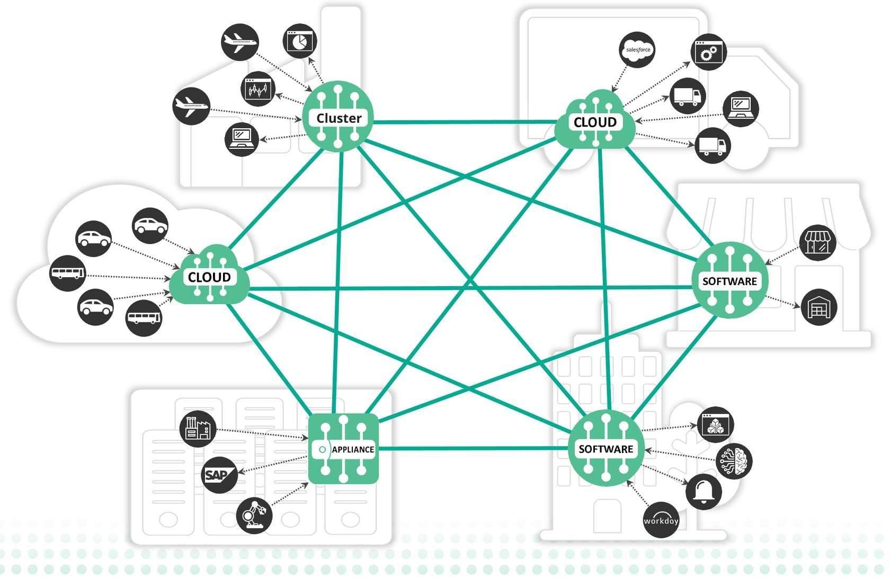

# Welcome

- **Syllabus order:** 01
- **Course section:** The Context
- **Academy status:** Completed.
- **SCORM status:** 100% complete; its internal sections are Welcome and Event Driven Definitions.

## Course player screens

The course player showed 3 sections, 9 lessons, and 4 hours. The Context showed 1 of 2 lessons completed; Welcome was Completed and How Solace Does Integration was In progress. The Concepts showed 0 of 5 completed, and The Click showed 0 of 1 completed. Feedback Survey - 2025 appeared as a separate Survey item.

The course header showed 1 of 9 lessons completed. The learning-plan panel showed 0 of 2 courses completed and listed Solace Certified Integration Associate Exam as the next course, Not started, 2 hours, English. The Welcome completion screen displayed “You have completed this lesson!” with a checkmark illustration and controls for Next lesson How Solace Does Integration and Retake the lesson.

## SCORM section: Welcome

The first internal section opens with a banner, “Welcome - Event Driven Integration with Solace Platform.” It asks whether the learner is an Integration Specialist, Solutions Architect, or Developer who works with integrated systems.

The screen asks four questions: Are systems loosely coupled and resilient or held together by fragile point-to-point connections? Do applications communicate in real time or poll for updates, causing delays and wasted resources? If one system goes down, do the others keep running or does failure ripple across the architecture? As the business grows and adds cloud services, can integrations scale and adapt easily or do they need constant rework?

It says organizations with integration challenges are not alone. Growing point-to-point connections become harder to manage, more fragile, and less scalable, draining resources that could be used for new features and innovation. Modern organizations combine modern applications, legacy platforms, in-house systems, and third-party services. The screen asks how to connect them without a brittle web of links and cascading failures; make agile decisions when systems and data are siloed or inconsistent; and reconcile systems across business units or during mergers and acquisitions.

The “What to Expect” section says enterprise integration does not have to be complicated. Learners should think of integration as a flexible Event Driven ecosystem rather than a series of individual connections. The accompanying Venn diagram places Event-Driven Integration at the overlap of Cloud-Based Integration Technology and Event Streaming & Management. The left side lists Orchestration & Transformation, Connectors & APIs, Master Data Management, and Low/No-Code Implementation; the right side lists Data Movement & Governance, Event Mesh & Choreography, Event Portal & Discovery, and Event-Driven APIs. 

### WHY GO EVENT DRIVEN? tab

The selected tab defines Event Driven Integration as the seamless, real-time coordination of systems that enables them to share data and respond to changes independently and collaboratively, creating a unified, flexible platform. It lists three benefits: connect systems while keeping them loosely coupled; adapt to new integration requirements without system-wide impacts; and scale as the architecture grows.

### SKILLS YOU'LL PICK UP ALONG THE WAY tab

This tab says learners will learn and apply Solace's four-step methodology to Event Driven Integration: Liberate, Stream & Filter, React, and Democratize. It also lists building resilient integrations with event-driven patterns; managing the complete lifecycle of all API types; implementing micro-integrations for rapid system connectivity; leveraging iPaaS solutions for simplified integration management; and using the Event Mesh to harness enterprise context, AI, and real-time data.

At the bottom of the Welcome internal section, a green bar links to “2 of 2 - Event Driven Definitions.” The skills tab also contains a zoomable image headed “What will we talk about?” Its six numbered topics are: Event Driven Integration and the differences between EDA and EDInt; Event Driven Integration Patterns; adding event-driven capabilities to existing or legacy enterprise resources; principles of event-driven Micro-Integrations; event-driven iPaaS basics and connector options; and introducing AI to the event mesh. The original image is saved locally. 

## SCORM section: Event Driven Definitions

The second internal section asks “What is Event Driven Integration?” and introduces the difference between Event Driven Architecture (EDA) and Event Driven Integration (EDInt). It states that EDA is the foundation and EDInt applies EDA principles specifically to integration challenges: “You can have EDA without EDInt. You can't have EDInt without EDA.”

### Event Driven Architecture

The selected CORE CONCEPTS tab describes EDA as a software design pattern for decoupled, asynchronous communication. Applications publish and subscribe to events via an Event Broker. Event Brokers and an Event Mesh are central to the architecture. EDA enables real-time communication between services, supports local, cloud, or hybrid deployments, and is built around loose coupling and scalability. 

The ARCHITECTURE COMPONENTS tab identifies Event Brokers as the central communication hub, publishers as event generators, subscribers as event consumers, and an Event Mesh for distributed event routing. It also lists asynchronous messaging patterns and support for multiple deployment models. 

The IMPLEMENTATION REQUIREMENTS tab says teams building EDA services are responsible for data transformation, schema validation, and advanced payload filtering. Teams must communicate with the event broker over a supported protocol, usually either a vendor-specific protocol (the page gives SMF for Solace and Kafka wireline for Confluent) or an industry standard such as JMS or MQTT. The panel includes a supporting illustration without additional labels. 

The IMPLEMENTATION CONTEXT table says EDA is best suited for greenfield scenarios with few or no legacy applications or services, modern microservices, and mature development teams. It requires understanding of event-driven patterns, asynchronous-programming experience, and the ability to work without integration tooling.

### Event Driven Integration

The selected CORE CONCEPTS tab describes EDInt as focusing on integrating diverse applications within an event-driven ecosystem. It is designed to handle a mix of new and legacy systems, manages data sharing between applications, accommodates various data formats and access methods, is built for enterprise integration scenarios, and emphasizes data transformation and connectivity.

The WHAT CHALLENGE DOES IT SOLVE? tab says EDInt enables one application to share a subset of its functionality with others. Data formats may vary; applications may use different access methods such as REST, vendor-specific APIs, or batch files; and unrelated data may need aggregation for another application's tasks. The resulting integration needs include data transformation, connectivity, data enrichment, and schema validation. EDInt leverages iPaaS, microservice frameworks, and management tools to enhance EDA and deliver enterprise-grade integration solutions.

The IMPLEMENTATION CONTEXT table says EDInt is best suited for enterprise integration scenarios, mixed technology environments, legacy-system modernization, and cross-application data sharing. 

### EDA and EDInt comparison

The page says EDA and EDInt are related but not the same: EDInt is a specific implementation of EDA, applied to solve integration problems. EDA provides the foundation and core principles and patterns for event-driven communication; EDInt applies those principles to integration challenges and adds tools and capabilities for connecting diverse systems.

| Aspect | EDA | EDInt |
|---|---|---|
| Focus | Architecture for event-driven systems | Integrating data between different applications |
| Scope | Broader architectural pattern | Specific implementation of EDA for integration |
| Dependency | Can exist without EDInt | Requires EDA as a foundation |
| Tools | Event Brokers, Event Mesh, etc. | iPaaS, Micro-Integrations, Unified APIM, etc. |

### Why Solace Platform for Event Driven Integration?

The page says Solace Platform can build an Event Driven Integration infrastructure that works with all systems, from legacy monoliths to cloud-native SaaS. It combines data transformation and connectivity from existing approaches such as iPaaS, protocol/API integration, and platform integrations with the real-time dynamic choreography of an event broker and event mesh. This is presented as a way for enterprises to keep integrations reliable and secure while remaining agile.

The Simple, Flexible Implementation card says Solace works with existing technology, supports multiple messaging protocols, and uses an event mesh to integrate on-premises, private-cloud, and public-cloud deployments. Its diagram places a Solace “STREAM + FILTER” circle between source and application groups; LIBERATE points inward from the left, REACT points inward from the right, and DEMOCRATIZE appears below. The left labels are Database, Salesforce, Security, AWS, IBM MQ, Mongo DB, Logistics, Azure, Swift, Oracle, Google Cloud, Communication, SAP, and FIX. The right labels are Snowflake, Zendesk, Anthropic, Databricks, OpenAI, Boomi, ServiceNow, MuleSoft, AI Agent, and Workday. 

The Unique and Powerful Event Portal card says Event Portal offers a graphical interface to define, model, catalog, and visualize events, event-driven applications, and event flow. The course describes it as the first and only product of its kind and says it can save time, money, and mistakes and accelerate EDA adoption. Its image shows Event Designer for Acme Rideshare with 5 applications, 8 events, and 6 schemas. The five applications are Driver App, Driver Management, Passenger App, Billing App, and Expense Integration. Visible events include DriverRideAccepted, DriverRideRequested, DriverStatusUpdated, TripUpdated, DriverFundsDeposited, RideRequested, RideAccepted, and CustomerReceiptGenerated. 

The Scalable performance across your distributed enterprise and event mesh card says Solace Event Brokers provide enterprise-grade performance, guaranteed in-order message delivery, and reliably low latency so systems can distribute events to subscribers in real time. Its image shows six named hubs-Cluster, two Cloud nodes, two Software nodes, and Appliance-connected by teal mesh lines, with dotted arrows connecting surrounding services and devices. 

## Visual recovery

The Welcome section uses a dark-blue and teal title banner with overlapping circles and a pale hexagonal background. The Event Driven Definitions section uses similar banners, a comparison table, and three timeline cards. Its EDA/EDInt illustration depicts a person behind a brick wall, an arrow, and an X; the course text does not explain those symbols.

The original course assets for the Event Driven Integration Venn diagram and topic infographic, EDA concept and producer/broker flow, implementation context and requirements, Solace Platform, Acme Rideshare Event Designer, and event mesh were saved in this lesson's img folder and linked beside their explanations. The separate zoomable EDA/EDInt illustration is described above; the Academy page did not expose a standalone download for that visual.

No graded quiz or answer choices appeared in this internal page; the Welcome page's four checkboxes are reflective prompts rather than a scored knowledge check.

## Resume checkpoint

Both internal SCORM sections, Welcome and Event Driven Definitions, are marked complete in the player; the module shows 100% complete. Their screens, interactive tabs, and available visuals have been recorded. The Academy still shows Welcome as Completed and course progress as 1 of 9. The next step is How Solace Does Integration, which the Academy marks In progress.