# How Solace Does Integration

- **Syllabus order:** 02
- **Course section:** The Context

## SCORM section: Integration is Broken

The opening screen frames four enterprise integration problems: siloed data locked in isolated systems is difficult to access in real time; constant polling that returns little or no new data wastes resources and creates unnecessary load; tightly coupled systems limit flexibility and innovation; and integration sprawl adds complexity without agility. The lesson says traditional methods are too slow, rigid, and manually intensive for current demands. The screen also contains a 3:10 video; it was played through to 100% at 2× speed. It has no visible captions or transcript control. Visible frames use animated computer and data icons, then show Solace Platform in the center of a mesh: Salesforce, MongoDB, Oracle, and SAP appear as source systems on the left; Snowflake, Databricks, ServiceNow, and Workday appear as destinations on the right; the diagram labels the two flows “Liberate” and “Integrate,” includes cloud and on-premises environments, and shows “Orchestrate” and “Govern” above the mesh. No downloadable frame or transcript was exposed, so the video’s instructional diagram is described here.

The lesson then asks what can be done and identifies an Event Mesh as central to modern integration. It defines an Event Mesh as a dynamic, distributed network of interconnected Event Brokers that enables seamless event distribution among applications, services, devices, and agents, and calls it foundational to Event-Driven Integration. It describes the mesh as an enterprise’s real-time backbone, streaming across clouds, data centers, and edge environments. AWS, Google Cloud, Azure, Alibaba, and Kubernetes are named as examples it can connect without custom replication or constant reconfiguration. The lesson claims 90% of enterprises operate across multiple platforms and says an Event Mesh moves data where needed in real time without duplication, delays, or added complexity. Its conclusion says the mesh gives enterprises flexible, resilient, governed data-distribution infrastructure to modernize integration.

## Visuals

The opening screen uses a teal and navy circular motif beside the title “Integration is Broken.” A zoomable timeline visual depicts a green, interconnected event-mesh ribbon connecting cloud and edge icons, business systems, and applications; visible logos include Salesforce, Oracle, AWS, SAP, Workday, Databricks, and Zendesk. A second zoomable infographic says the increasingly distributed, multi-cloud world involves 90% of organizations, 1K+ applications per enterprise, 25% more data shared year over year, latency expectations dropping from seconds to real time, and 40% more digital projects delivered; the accompanying message calls for faster application response and speed to market. The second SCORM section’s zoomable four-principles diagram says: Liberate unlocks siloed data by exposing it in an event-driven manner; Stream & Filter makes it available in real time across environments and geographies; React lets apps, AI agents, and people analyze and act on real-time data; Democratize gives everyone self-service access to events and information. It shows an event mesh connecting Salesforce, AWS, Azure, Alibaba Cloud, Google Cloud, Kubernetes, SAP, ServiceNow, Workday, agentic AI, and human consumers. The course title card is saved as 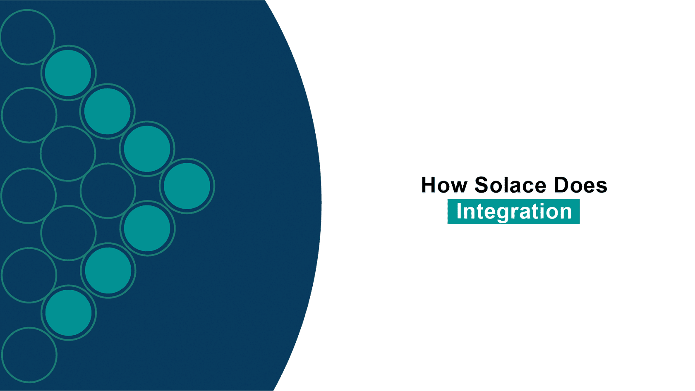. The overview diagram is saved as ; the four highlighted tab captures are linked below.

## SCORM section: How Solace Does Integration

The opening screen says Solace is rethinking integration to make it event-driven and introduces four principles as selectable tabs: Liberate, Stream & Filter, React, and Democratize.

### 1. Liberate

Data trapped in silos is captured at the moment it changes and published to the event mesh as a real-time event, freeing it from the silo. This replaces slower approaches such as polling, extract-transform-load, and batch transfers with a responsive event-driven model. 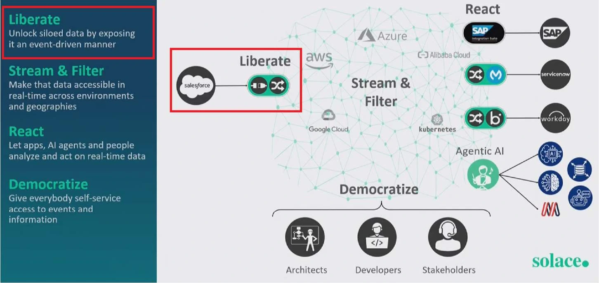

### 2. Stream & Filter

The lesson says liberated data is streamed and filtered intelligently across systems and environments. Events are published to the event mesh with Smart Topics; consumers subscribe to specific events and receive relevant data; filtering on the broker reduces bandwidth, processing overhead, and noise. 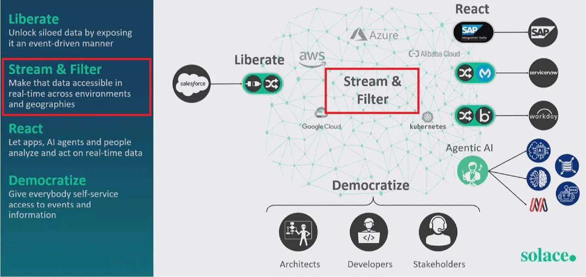

### 3. React

The tab says events lose value the longer they sit idle, so systems should act as soon as events occur. The event mesh makes events immediately available to applications, micro-integrations, AI agents, and other consumers so they can react instantly and drive automation, insights, and business outcomes as they happen. 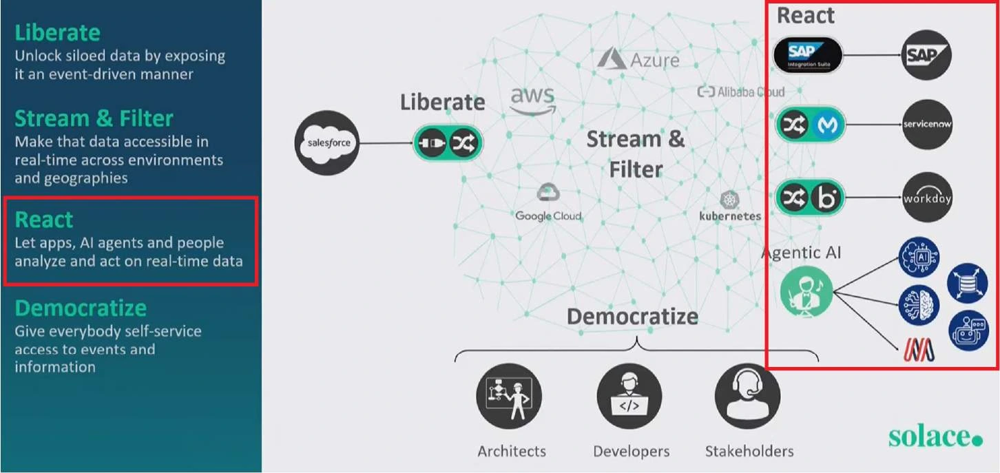

### 4. Democratize

The lesson says data should be safely and effectively usable by anyone who needs it. Producer systems such as applications, sensors, and services are decoupled from consumers. A single event can be reused by many consumers without overloading the source system or adding complexity. 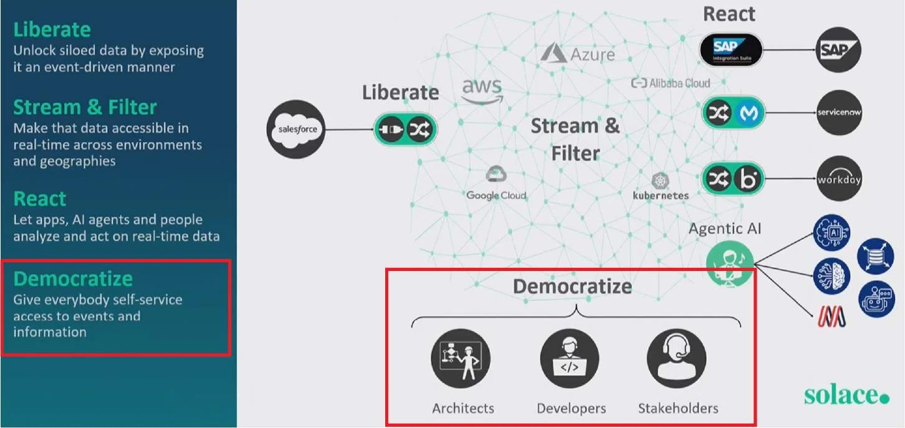

## Screen: 1. Liberate Your Data

The purpose text says liberation overcomes slow, fragile, outdated integration. Data often sits stale in silos; Solace captures key business events as they happen and makes them immediately available to other applications. Micro-Integrations (MI) are described as lightweight, event-driven modules linking enterprise systems to the real-time distribution layer, the Event Mesh. Solace liberates data at its source through event broker infrastructure that integrates with change data capture (CDC) tools and API polling solutions. Once liberated, data flows across the Event Mesh for secure, real-time delivery.

The screen includes a 1:37 video titled “Solace’s Event-Driven Approach to Integration.” Its poster shows the event-mesh diagram and four principles. The video was played through to 100% at 2× speed. A frame at 57% shows a dense integration map spanning APIM, iPaaS, cloud, analytics, and business-application groupings, overlaid with the red terms “Point to Point,” “Synchronous,” “Batch/Polling,” “Siloed,” and “Non-Real-time.” This visually contrasts a tangled legacy integration landscape with the event-mesh approach; no transcript or caption track was available. 

### Sorting activity

The exact question is “Which of the following types of data would benefit most from being liberated?” The target categories are “Needs Liberation” and “Can Do Without Liberation.” Eight draggable cards appeared in sequence: “Monthly backups,” “Quarterly financial reports,” “IoT sensor readings,” “Static marketing content,” “Payment confirmations,” “Archived tax records,” “Customer order status,” and “New user registrations.” Monthly backups, quarterly financial reports, static marketing content, and archived tax records were placed in “Can Do Without Liberation.” IoT sensor readings, payment confirmations, customer order status, and new user registrations were placed in “Needs Liberation,” based on whether they are time-sensitive events that benefit from real-time distribution. Each drop advanced to the next card; the activity displayed no textual correctness feedback. The final visible card has been sorted; the activity confirmed "8/8 Cards Correct" and offered REPLAY. Continue is the next action.

## Screen: 2. Stream & Filter

The purpose text says streaming creates a continuous enterprise-wide information flow, unlike polling, which sends repeated requests even when nothing changed. Streaming delivers updates only when events occur, avoiding wasted traffic, redundant queries, and unnecessary CPU load. Decoupled producers let multiple applications respond to the same event independently without straining the source system or creating performance bottlenecks. Streaming makes real-time updates efficiently available across the organization; filtering gives each system only relevant information, reducing noise and processing costs.

The lesson says Liberate emits events into the Event Mesh; streaming and filtering with Smart Topics lets events travel anywhere in the enterprise without custom connections or replication logic. Smart Topics are metadata-rich producer-added tags that describe and structure events for efficient routing and filtering. Their standardized, hierarchical structure is human-readable and machine-processable: `<domain>/<noun>/<verb>/<version>/<properties>`. The example is `retail/order/created/v1/region=northeast/priority=high`.

The radio-station analogy says a station publishes a program once whether one person or a million listen; each consumer tunes into the channels wanted. In EDA, data flows continuously from the producer and consumers receive it in real time without adding load to the source. The lesson links to an optional Topic Tester tool for visualizing topic hierarchies: `https://solaceservices.github.io/Solace_Topic_Tester/`.

### Smart Topic benefits and distinction

- **Efficient filtering:** Subscribers use precise wildcard patterns, such as `retail/order/*/v1/>`, to receive relevant events.
- **Content-based routing:** The broker routes using topic structure without inspecting message payloads.
- **Self-describing:** A topic provides context about an event’s purpose and content.
- **Discoverability:** The hierarchy gives developers an intuitive topic space to navigate.
- **Scalability:** Fine-grained network-level filtering reduces unnecessary message processing.

The lesson distinguishes an event (data about something that occurred) from Smart Topics (the address or classification the Event Mesh uses to distribute that event). It says the result is a real-time data fabric spanning the organization, with data flowing where and when needed.

The Stream & Filter visuals include a cross-industry event-taxonomy graphic: Event = (noun) + (verb) + [properties], with examples from Airtel (device recharging in real time), Roche (diagnostics from more than 100,000 connected devices), Barclays (front-, middle-, and back-office integration), and Airbus (accelerated operations and productivity). 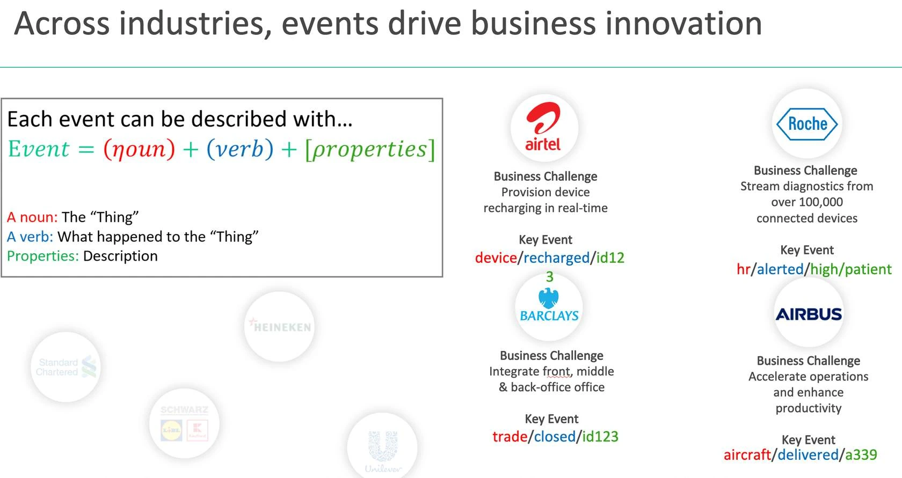

The Topic Tester visual shows producer and consumer topic fields plus a dataset table with Domain, Noun, Verb, Version, Region, Priority, and Tracking Number. 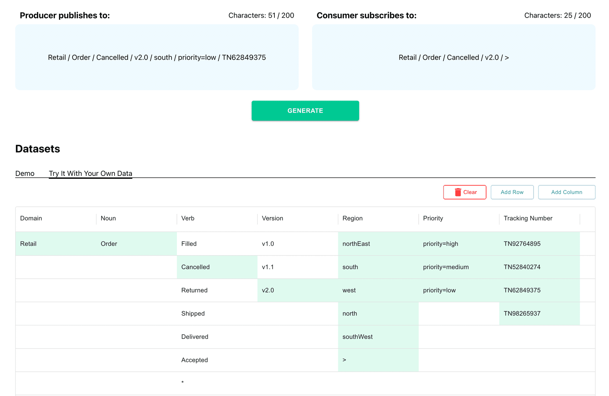

A routing diagram shows SAP publishing `inventory/stocked/store123/sku123` and `salesorder/created/smith/sku123/apac` into an Event Mesh, where subscribers match hierarchical topic patterns. 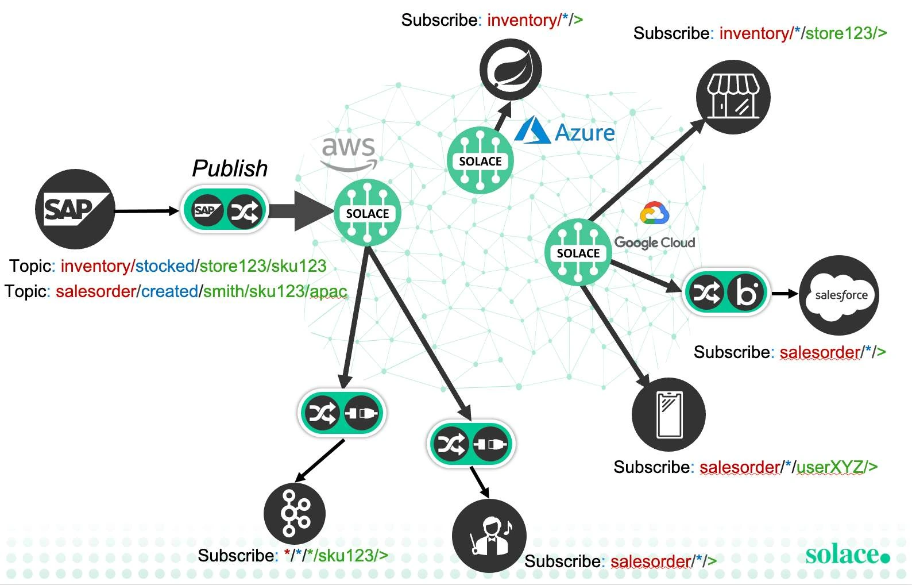

The message-structure visual separates the header topic (`retail/order/created/v1/online/us/premium`), message properties (`applicationId: order-service`, timestamp `2025-06-17T19:33:42Z`), and payload (`orderId: 12345`, `customer: ABC Corp`, `items: [...]`, `total: 299.99`). It says the topic is in the header and routes the message without examining the payload. 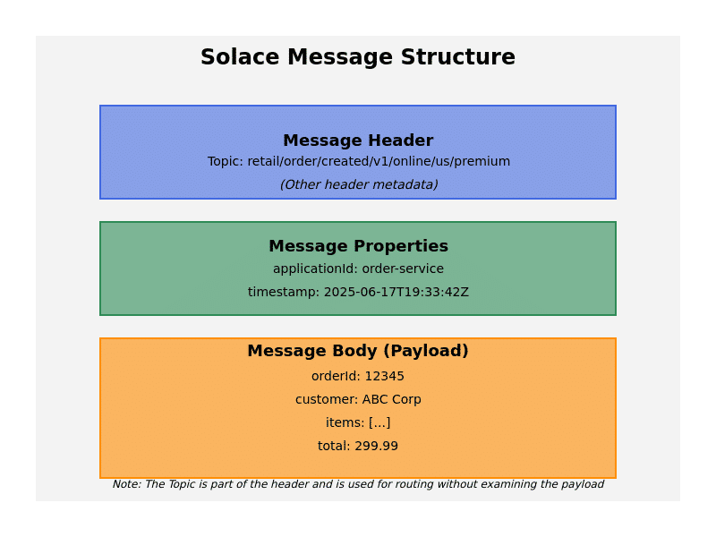

The radio analogy illustrates one broadcast that listeners tune into, whether one person or one million. The saved visual shows an old-fashioned radio with its antenna and controls. 

All original course assets observed in this section are saved in `img/` and linked above.

The screen also includes a 1:26 video titled “Solace’s Event-Driven Approach to Integration.” It played through to 100% at 2× speed; no captions or transcript controls were exposed. A visible slide titled “Event Mesh: Stream and Filter your Data” says publishers describe and tag events before publishing them as a stream, and consumers receive only the events they need through automatic filtering. It presents an Event Mesh as streaming events across locations and environments with ubiquitous access and no configuration changes or point-to-point replication; it calls the mesh key to micro-integration resilience and keeping routing and filtering logic out of those integrations. The example topics include `inventory/stocked/store123/sku123` and `salesorder/created/smith/sku123/apac`. Another video slide contrasts centralized, monolithic architecture with decentralized, modular architecture and tightly coupled synchronous point-to-point systems with event-based decoupling. The final visible frame returns to the four-principles diagram described above.

### Sorting activity

The exact question is “Which of the following scenarios would benefit most from being streamed?” The two categories are “Stream & Filter” and “Batch or Bulk Processing.” Eight cards were sorted: “Price change for high-demand item,” “Login from a new device,” “IoT sensor data from refrigeration units,” and “Social media mentions of your brand” were placed in “Stream & Filter”; “Annual compliance archive generation,” “Monthly newsletter subscriber exports,” “Quarterly financial reconciliation,” and “Weekly payroll reports” were placed in “Batch or Bulk Processing.” The activity displayed “8/8 Cards Correct,” confirming all placements.

## Screen: 3. React

The purpose text describes React as the phase that lets systems respond to real-time data before its business value fades. It lists three tools: targeted Micro-Integrations deliver events from the Event Mesh to destination systems such as databases, SaaS applications, and AI services; standard API protocols provide simplified, decoupled access to real-time event streams; and Solace Agent Mesh embeds AI agents in the event mesh so they can respond to real-time data with context and coordinated actions. The screen says this is where integration stops moving data around and starts using it to create outcomes.

The screen includes a video titled “Solace’s Event-Driven Approach to Integration,” showing the four-principles event-mesh diagram with React highlighted and destination examples including SAP, ServiceNow, Workday, and Agentic AI. Playback reached the end and reset to the beginning; no captions or transcript control was exposed. 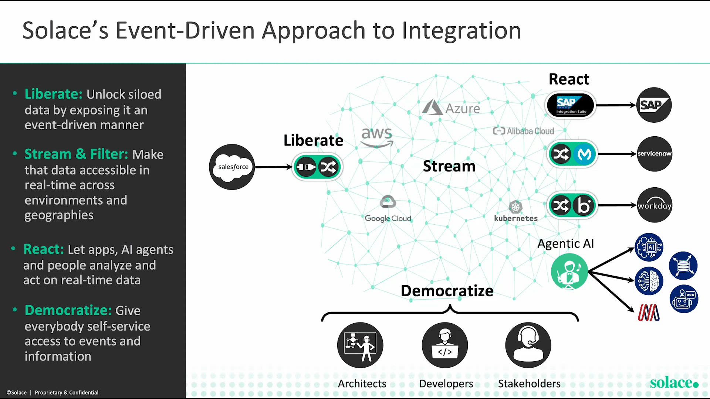

The screen also shows “When it comes to Real-Time Responsiveness,” a time-versus-data-value chart. It labels short decision windows as predictive/preventative and actionable, then reactive over minutes, and historical business intelligence over hours to months. The slide states that decision-making slower than seconds is reactive and decreases value exponentially, and cites Gartner’s 2019 Stream Processing report. 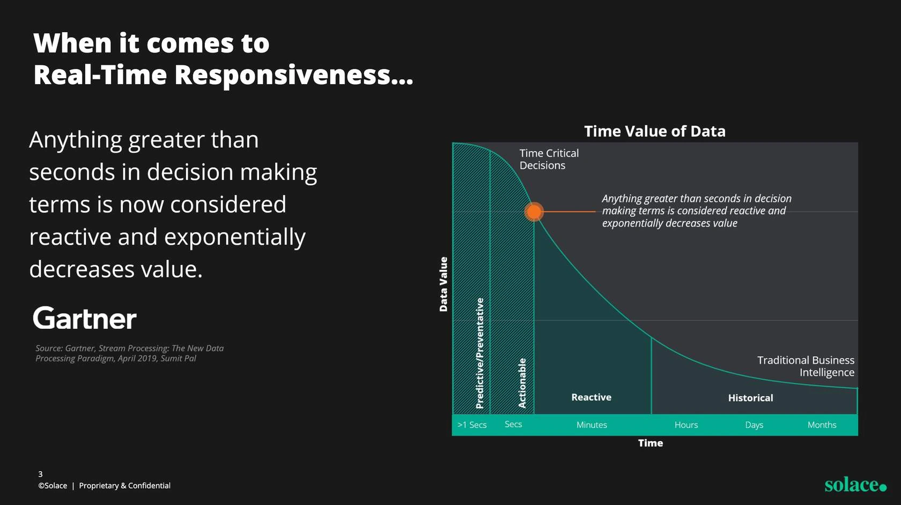

The knowledge check asks “Which events should trigger real-time reactions, and which can be handled later?” The categories are “React” and “Relax.” “Batch upload of old CRM data,” “Monthly marketing performance report generated,” and “Daily sales summaries emailed to execs” were sorted into “Relax”; “Package marked ‘Delivered’ in shipment tracking,” “Machine sensor detects overheating,” and “Customer abandons cart” were sorted into “React.” The activity advanced after each drop without item-specific feedback and ended with “6/6 Cards Correct.”

## Screen: 4. Democratize

The purpose screen defines democratization as giving more people the ability to discover, access, and use enterprise data. It aims to make data understandable, trustworthy, and reusable so teams can unlock business value without deep data expertise. Event Management tools are described as event-focused counterparts to API management: they help people find and understand data, reuse it without harming performance, and access it under well-defined policies. Event catalogs, access controls, and self-service portals help deliver the right data safely. The purpose also includes observability, making analysis and automation results accessible alongside raw events, such as dashboards, dynamic pricing updates, and audit trails. Event Portal curates and organizes events for use in workflows.

The screen includes a 2:49 video titled “Solace’s Event-Driven Approach to Integration.” Its poster repeats the four-principles event-mesh diagram; no caption tracks or transcript were available. Playback at 2× reached the end and reset. Visible frames include “Event Management: Democratize your Data,” which places discoverability, access, deployment environments (development, staging, and production), and KPIs around a Runtime Event Mesh. It says Event Management should curate events for discoverability, eliminate data and organizational silos, express meaning in non-technical terms, make integration easy and self-service, and govern use by protecting sensitive events, enforcing best practices, supporting code generation, and treating data and events as products. An Event Catalog frame shows Applications, Events, Schemas, and Enumerations tabs, keyword search and filtering, event-version details, and callouts about cataloguing integration assets and understanding how they interact. A “Single Pane of Glass Event Management” frame presents Mission Control for managed brokers and enterprise-wide event streaming, Event Portal for designing, cataloguing, visualizing, discovering, sharing, securing, and managing events, and Insights for proactive monitoring, dashboards, and OpenTelemetry-enabled tracing into observability backends. A later benefits frame lists more innovation, faster development, and fewer silos beside an event-mesh diagram connecting business systems and cloud services. These are visible-screen observations rather than a video transcript.  

The exact knowledge check asks “Which of these teams or departments would benefit from other departments Democratizing their data?” The categories are “Would Benefit” and “Wouldn’t Benefit As Much.” Marketing, Finance, and Operations / Supply Chain belong under “Would Benefit”; Batch-Based Procurement, Archival / Records Management, and Facilities Management belong under “Wouldn’t Benefit As Much.” The final replay displayed “6/6 Cards Correct” after Facilities Management was placed in “Wouldn’t Benefit As Much.” Earlier placements of Facilities Management in “Would Benefit” scored below full credit; the activity did not provide item-level explanations.

## Screen: What’s Next?
