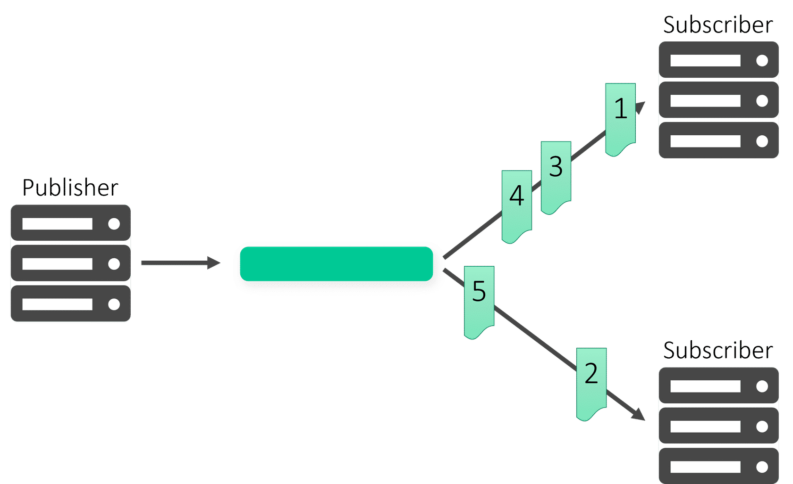
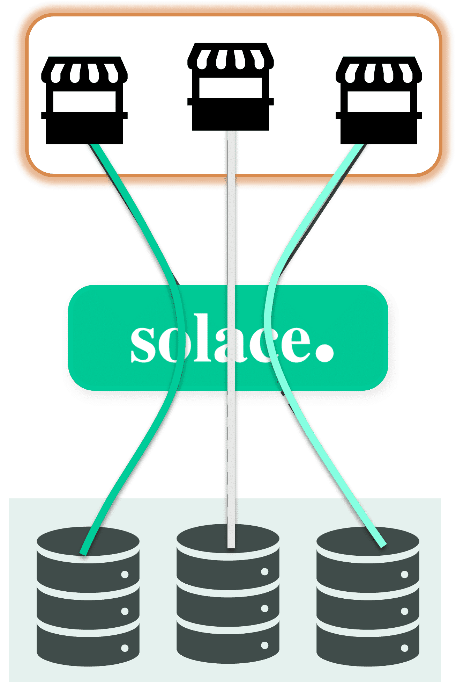
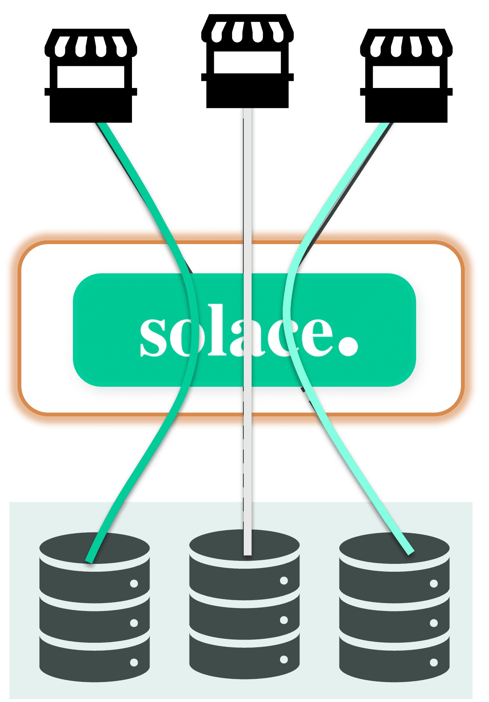
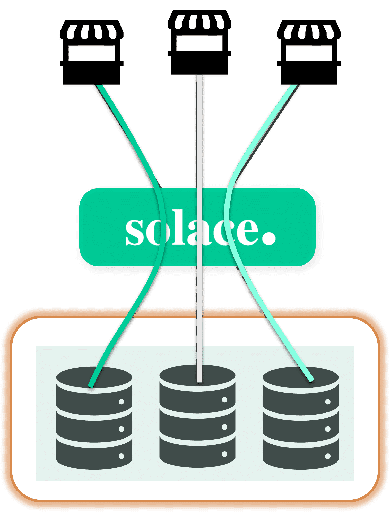
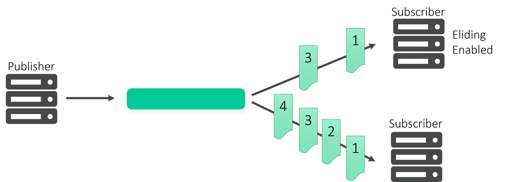
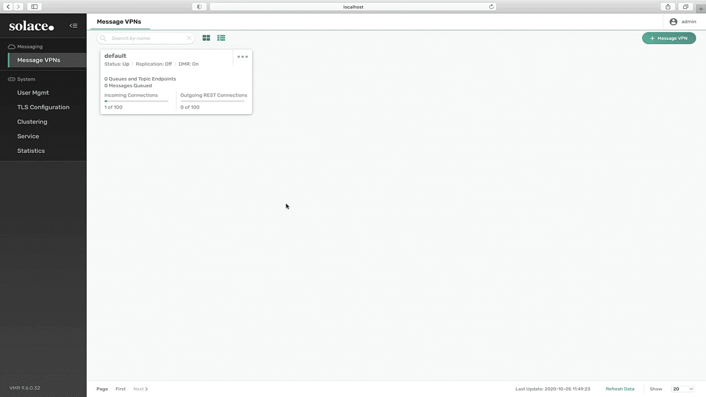

# Direct Messaging Features

- **Course:** Solace Event Broker Administration
- **Syllabus section:** Direct Messaging
- **Academy content type:** SCORM

## Screen 1: Course overview

The overview introduces **Direct Messaging** in Solace PubSub+ and focuses on optimizing communication through **message eliding** and **shared subscriptions**. It says the course combines theory, quizzes, and walkthroughs to improve messaging solutions for high-throughput, low-latency scenarios.

The SCORM outline contains five sections: **What's the scenario?**; **Understanding Direct Messaging**; **What is Message Eliding?**; **Quiz**; and **Shared Subscription Walkthrough**. All were **Unstarted** at entry. **START COURSE** opens What's the scenario?. No course images were exposed on this overview screen.

## Screen 2: What's the scenario? — Haroldo's introduction

Haroldo introduces himself: “Hi! I'm Haroldo. I manage a middleware team at ACME Retail.” A **CONTINUE** control reveals the scenario. The active character artwork is the original `YlGNlyEUF20yE2Uv_564_full.png` asset (698 × 2048, empty alt text); it is saved locally:

## Screen 3: In-store inventory messaging question

Haroldo asks: “What type of messaging should I use for our in-store inventory during the day? We only care about the most current data and losing a message or two isn't a big deal.” The two responses are:

1. “There's no real difference between the message types”
2. “Let's learn about direct messaging to see if that will work for your situation.”

Response 2 is the suitable choice because the scenario needs current inventory data and explicitly tolerates occasional message loss. The screen is at **20% COMPLETE** before selection. Haroldo's active illustration shows him gesturing; that original course image is also saved locally:

## Screen 4: Scenario response

I selected response 2, “Let's learn about direct messaging to see if that will work for your situation.” The course retains that response and removes the other choice. What's the scenario? is marked **Completed**. Haroldo appears in a smiling standing pose on this screen; the corresponding original image is saved locally:

## Screen 5: Direct Messaging and Shared Subscriptions

Direct Messaging lets a client publish to a topic destination; the broker routes each message to receiving clients with matching topic subscriptions. Unlike guaranteed messages, direct messages are not retained for clients that are disconnected, are not acknowledged on delivery, and may be discarded during congestion or system failures.

### Characteristics

- Delivered to subscribing clients in the order publishers send them.
- Do not require acknowledgement from subscribing clients.
- Are not spooled on the message bus for consuming clients.
- Are not retained for a client while it is disconnected from an event broker.
- May be discarded during congestion or system failures.

### Typical applications

- Extremely high message rates and very low latency are required.
- Consumers can tolerate message loss during network congestion.
- Messages do not need to be persisted for slow or offline consumers.

### Shared subscriptions

Shared subscriptions can load balance large volumes of client data across multiple backend-application instances. When a message is published, one client in the shared subscription group is selected at random to receive it.

The example uses an ACME Retail point-of-sale (POS) system. When a customer checks out, an event from the cash register updates item inventory. The course's store illustration and shared-subscription flow diagram are saved locally:

The three-step POS interaction is ready to start. Its visible labels say: Step 1, the checkout event updates inventory; Step 2, the broker routes the message to the backend; Step 3, the message is randomly assigned to one backend application in the subscription group. The course says several backend applications in one group can prevent a single instance from being overloaded. Multiple shared subscription groups may also subscribe to the same topic; one member of each group receives each message, for example a ticketing group and an analytics group.

### Shared-subscription interaction — Step 1

The first step says: “First, when the customer checks out, an event is sent from the cash updating item inventory.” Its original diagram shows three POS registers and three backend servers connected through Solace. The course asset is saved locally:

### Shared-subscription interaction — Step 2

The second step says: “The application broker would then route the message to the backend system.” Its original diagram highlights Solace between the POS registers and the backend servers:

### Shared-subscription interaction — Step 3

The third step says: “The message is then randomly assigned to one of the backend applications in the subscription group.” Its original diagram highlights the backend application group receiving messages through Solace:

### Shared-subscription interaction — final screen

The final screen explains that one backend application could be overloaded by a high checkout volume. Running multiple applications in the same subscription group distributes messages across instances and load-balances that traffic. It offers **START AGAIN** and the three step controls, with no additional image.

## Screen 6: What is Message Eliding?

The course defines message eliding as a way for client applications to receive only the most current direct messages at a rate they can manage. It presents two uses:

- **Congestion management:** if a client needs all messages only while it can keep up with the flow, queued messages can be elided so that only the most recent message for each topic is provided.
- **Message-rate control:** a client application can be limited to a configured number of messages per second per topic.

The original diagram shows publisher traffic passing through a broker and branching to two subscribers: the upper subscriber has eliding enabled and receives a reduced set of messages, while the lower subscriber has eliding disabled and receives the full illustrated sequence.

### Market-data example

Market data may be published at a very high rate, although people can process only a few updates per second. The client still wants the latest information, but at a slower rate than the full feed. Message eliding can limit output to a few updates per topic per second. The course illustrates this with operators viewing market-data screens.

### Message Eliding Walkthrough video

The lesson provides a 2:36 walkthrough video. Its original poster shows the PubSub+ Manager **Message VPNs** page and is saved locally. The video player exposed no captions or transcript control; narration details beyond the surrounding written lesson content could not be captured.

### Considerations

- An eliding consumer receives a message on a given topic every **N milliseconds**; the interval is configurable in the client profile.
- The broker discards messages that arrive before the **N**-millisecond interval has elapsed.
- If the eliding delay is set to **0**, messages are discarded only when the client is congested.
- The publisher must flag messages as eligible for eliding.
- The receiving consumer must be assigned a client profile that permits message eliding.
- The Solace Router tracks and applies eliding to new incoming messages for the eliding consumer.

## Screen 7: Quiz

The quiz begins with: “Let's see if you can help Haroldo make a decision.” The first multiple-choice question is:

> Remember, Haroldo has lots of data traffic coming in and he needs needs the current data. He can afford to lose messages on occasion. Which direct messaging feature could help for his in-store inventory data?

Choices:

- shared subscriptions
- message eliding

I initially selected **message eliding**. The system marked it incorrect and stated: “Incorrect. Correct answer: shared subscriptions. Your answer: message eliding.” I used **TAKE AGAIN**, selected **shared subscriptions**, and the system confirmed: “Correct. Correct answer: shared subscriptions. Your answer: shared subscriptions.”

### Question 2 — Multiple choice

> Which of the following statements about direct messaging in Solace PubSub+ is true?

Choices:

- direct messaging guarantees message delivery.
- direct messaging is best suited for scenarios where message loss can be tolerated.
- direct messaging is the same as persistent messaging.
- direct messaging requires message acknowledgements from the consumer.

I selected **direct messaging is best suited for scenarios where message loss can be tolerated**. The system confirmed: “Correct. Correct answer: direct messaging is best suited for scenarios where message loss can be tolerated.. Your answer: direct messaging is best suited for scenarios where message loss can be tolerated..”

### Question 3 — Fill in the blank

> __________ in Solace PubSub+ ensures that subscribers receive only the latest update when multiple messages are queued, optimizing bandwidth and processing.

I filled in **Message eliding**. The system marked it correct and stated: “Correct. Acceptable responses: eliding, message eliding. Your answer: Message eliding.”

## Screen 8: Shared Subscription Walkthrough

The final SCORM section is titled **Shared Subscription Walkthrough** (**Lesson 5 of 5**). The screen contains an embedded video player and no additional explanatory text. On entry, the SCORM outline showed **100% COMPLETE** and listed all five sections as completed. I played the approximately 10:41 walkthrough to the end at 2× with audio muted; the player returned to **Play** at the beginning after reaching the end. No captions or transcript control, poster URL, or accessible video-frame description was exposed, so the video's individual UI steps could not be transcribed or saved as images. The separate shared-subscription explanation and three original step diagrams are preserved in Screen 5. No live broker configuration was changed.

## Resume checkpoint

The overview, scenario, direct-messaging characteristics/use cases, POS example, all three interaction steps and final summary, Message Eliding screen text and illustrations, all quiz prompts, choices, and feedback, and completion of the final walkthrough are recorded. Original instructional course images are saved in `img/` with relative references. Both videos were played through at 2× with audio muted; neither player exposed captions or a transcript control. The final walkthrough also exposed no poster URL or accessible frame description, so its individual UI steps and frames are documented as unavailable. The SCORM outline showed **100% COMPLETE** with all five sections completed. After closing and refreshing the Academy lesson page, LMS progress advanced to **6/14** and Direct Messaging Features was marked **Completed**. The next course lesson is Guaranteed Messaging.
