# High Availability

- **Course:** Solace Event Broker Administration
- **Syllabus section:** High Availability
- **Academy content type:** SCORM

## Lesson notes

### Screen 1: Course overview

The SCORM launch opens to the **High Availability** course overview. The description says: “In this course, you will delve into the realm of high availability, understanding its goals, drivers, and the unique approach adopted by Solace. The course is designed to offer a comprehensive overview from an Administrator's perspective, providing insights into the challenges and solutions in achieving high availability in software systems.” The visible contents are **What's the Scenario?**, **What is High Availability with Solace?**, **Understanding the Administrator Perspective**, **Config-Sync**, and **Quiz**; each is marked **Unstarted**. The overview displays **START COURSE**. The course-level syllabus shows this lesson as the current item, while Academy still reports 6/14 overall and Guaranteed Messaging remains in progress.

**Next:** Start the SCORM course and record the scenario screen before advancing.

### Screen 2: What's the Scenario?

The first lesson is **What's the Scenario?** Haroldo introduces himself as a middleware manager for ACME Retail and asks: **“It's really important that we don't lose customer data or have a disruption to order processing. How can we ensure we don't lose our data?”** The screen presents a **CONTINUE** button; this frames the course's high-availability scenario around preserving customer data and uninterrupted order processing.

**Next:** Continue to the next screen and record its content before advancing again.

### Screen 3: Respond to the scenario

The scenario continues: **“We need to ensure that we don't lose our order processing data. Is there any way to make sure that no data is lost if there is a broker failure?”** It offers two responses: **(1)** “You already have about 98% availability, is that not enough?” and **(2)** “Let's consider high availability so we can protect those mission critical systems and aim to keep downtime as low as possible.” The second response best addresses the risk by protecting mission-critical systems and reducing downtime.

**Next:** Select response 2 and record the course feedback before continuing.

Selecting response 2 replaces the answer choices with the selected response and the course reply **“Thank you! I definitely need to know more.”** A **CONTINUE** button appears, followed by the next lesson link **2 of 5 — What is High Availability with Solace?** No explicit correct/incorrect label is shown. After continuing, the scenario displays **“It looks like you've won over Haroldo!”** and **“Now let's learn more about high availability.”** with a **START OVER** control. The scenario is marked **Completed** in the sidebar; the SCORM course indicator is **20% COMPLETE**.

**Next:** Open **2 of 5 — What is High Availability with Solace?** and record its first screen.

### Screen 4: What is High Availability with Solace?

The section is **Lesson 2 of 5** and defines high availability for mission-critical systems as minimizing downtime. Availability is measured as a percentage of uptime; the stated goal for many mission-critical systems is **“5 nines” or better**, meaning less than five and a half minutes of downtime per year. The precise figure shown is **99.999% Availability = five nines = 5.26 minutes of downtime a year**.

**High Availability Options** has two collapsed sections: **High Availability Appliance** and **High Availability Software**. These remain to be opened and recorded.

Expanding **High Availability Appliance** reveals that two Solace PubSub+ appliances are required for high availability. A network administrator defines them as a **redundant pair** so that if one appliance fails, the other automatically takes over.

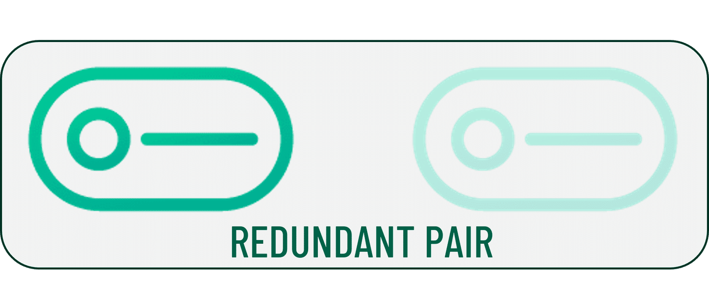

Expanding **High Availability Software** reveals that a PubSub+ software HA redundancy group contains **three event broker instances**: two act as active/standby messaging nodes and the third acts as a monitoring node. The group can be deployed in almost any cloud or on-premises environment.

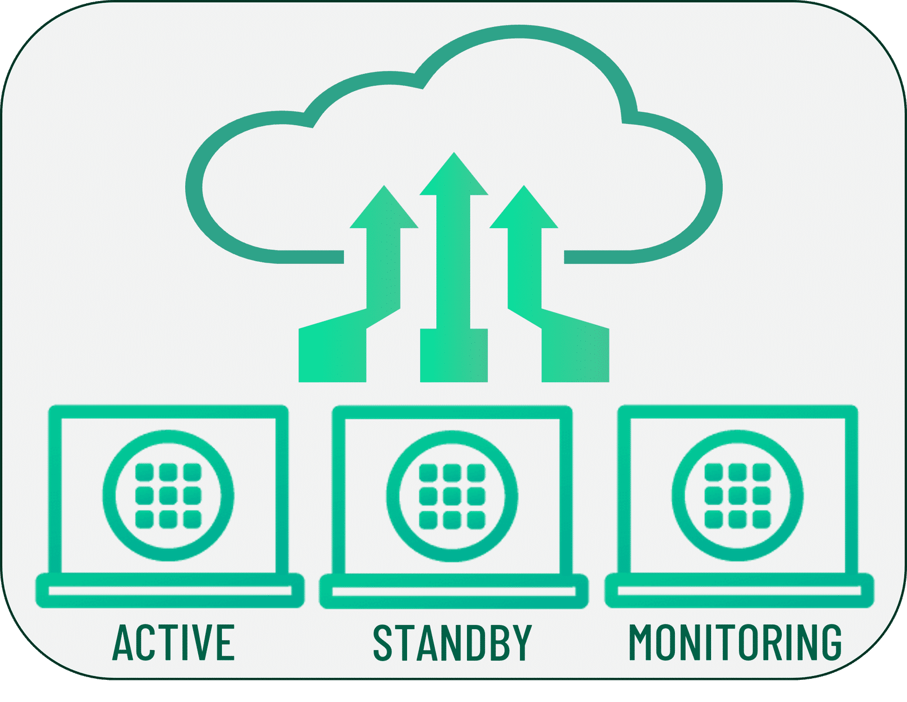

Under **High Availability Redundancy Model**, Solace PubSub+ software event brokers use an **active/standby** model. The primary broker provides messaging services to clients; a backup broker waits in standby and provides service only if the primary fails. Fault detection triggers standby activation and service restoration.

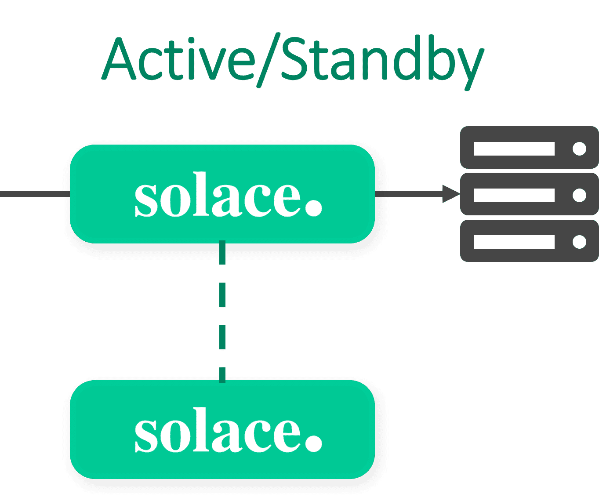

The **PubSub+ Redundancy Group** diagram and accompanying list identify three roles: the primary node provides messaging services to clients; the backup node is prepared to take activity if the primary is unreachable; and the monitoring node acts as a tie-breaker to prevent split-brain scenarios.

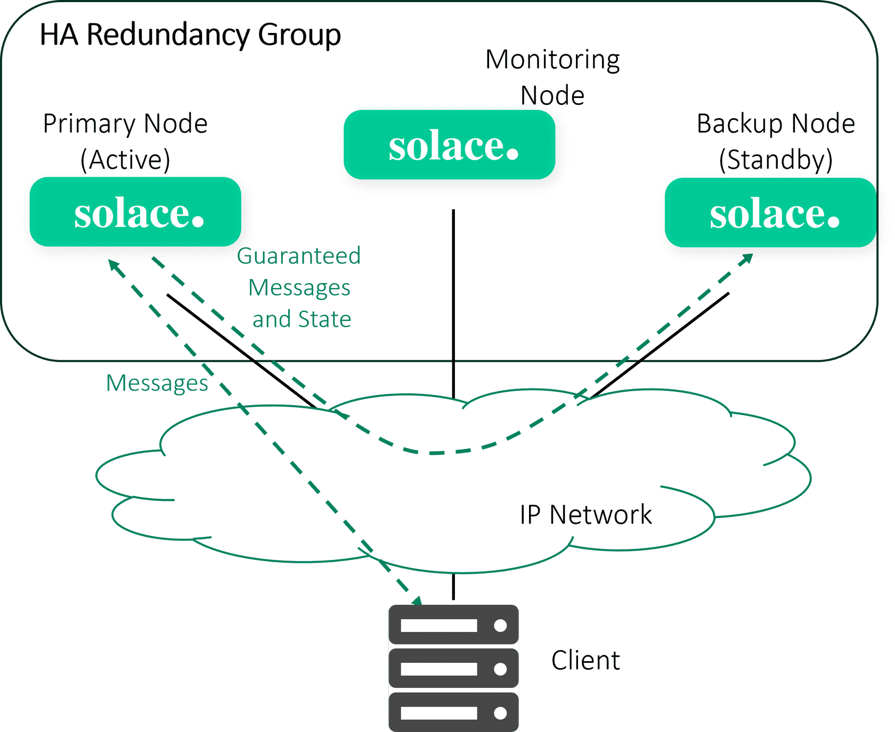

The **Failover Mechanism** description says the software broker supports host-list failover, transferring client connections from one message-routing node to another after a node failure. The list contains IP addresses or DNS names for both primary and backup brokers. Their IP addresses remain different, but only one broker is active and accepts connections at a time. Connecting clients know both addresses and handle reconnecting from one address to the other; brokers in the HA group do not perform that client reconnect on the clients' behalf.

Two interactive step processes are shown: **Failover Detection** and **Failback**, each with a **START** control. Starting **Failover Detection** reveals a numbered sequence of five steps plus **Last step**. **Step 1** says clients connect to the primary node while the backup remains in standby, prepared to take over if the primary node goes down.


**Step 2** says that when the primary node goes down, the client's TCP connection is broken. The course image marks the primary node as failed while the backup remains in standby and the monitoring node remains present.

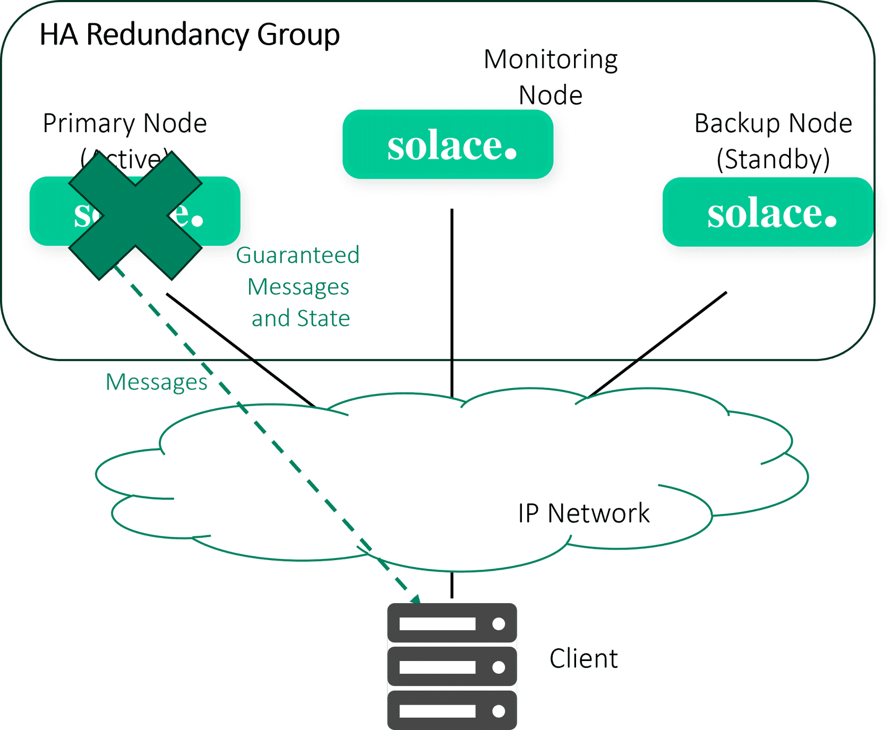

**Step 3** says: **“When the primary node goes down, the lient TCP connection is broken. The monitoring and backup nodes cannot see the primary, but they can see each other.”** The displayed text has the apparent typo **“lient”**; it is preserved here as shown. The diagram depicts the failed primary and the backup and monitoring nodes retaining communication.

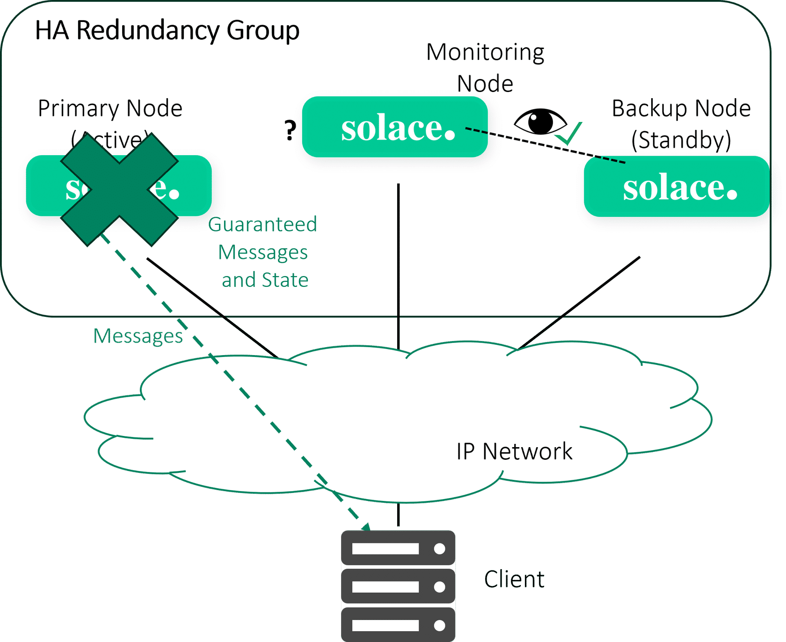

**Step 4** says **“Then the backup node goes into an active state.”** The diagram labels the backup node **Active** after takeover, while the primary remains failed and the monitoring node stays in place.

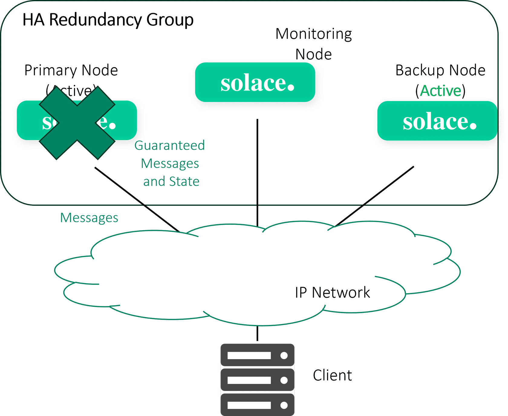

**Step 5** says **“Then the client reconnects to the second IP, the backup node.”** The diagram shows the backup node active and the client connection routed to it; the primary remains failed.

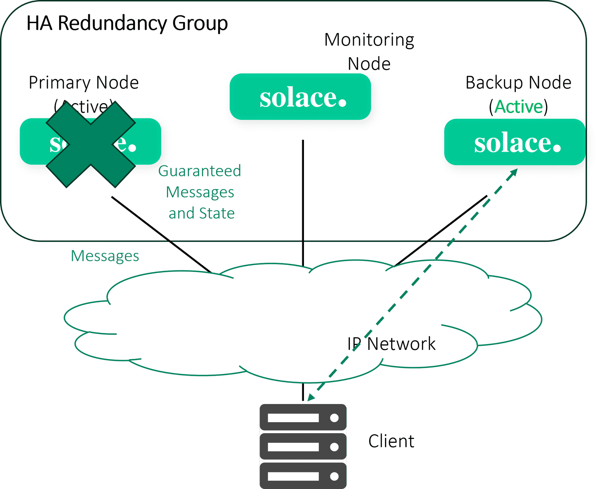

The **Last step** control reveals an additional final statement, labeled **Step 6** in the player: **“When the backup event broker takes activity, it will start accepting connections on the Management VRF static IP address. The connecting clients will traverse their host lists and connect to the backup event broker using the backup event broker’s static IP address.”** The final state offers **START AGAIN**. This step has text but no separate image control.

Starting the **Failback** process reveals a three-step sequence. **Step 1** says that when the failed broker returns online, it uses the mate-link VRF to resynchronize its message-spool contents to match the active broker. Resynchronization may take a few seconds if the spool differences are small, or several hours if the failed broker was offline for a long time and large quantities of data accumulated on the active broker. Resynchronization does not affect service; the backup continues serving connected clients.

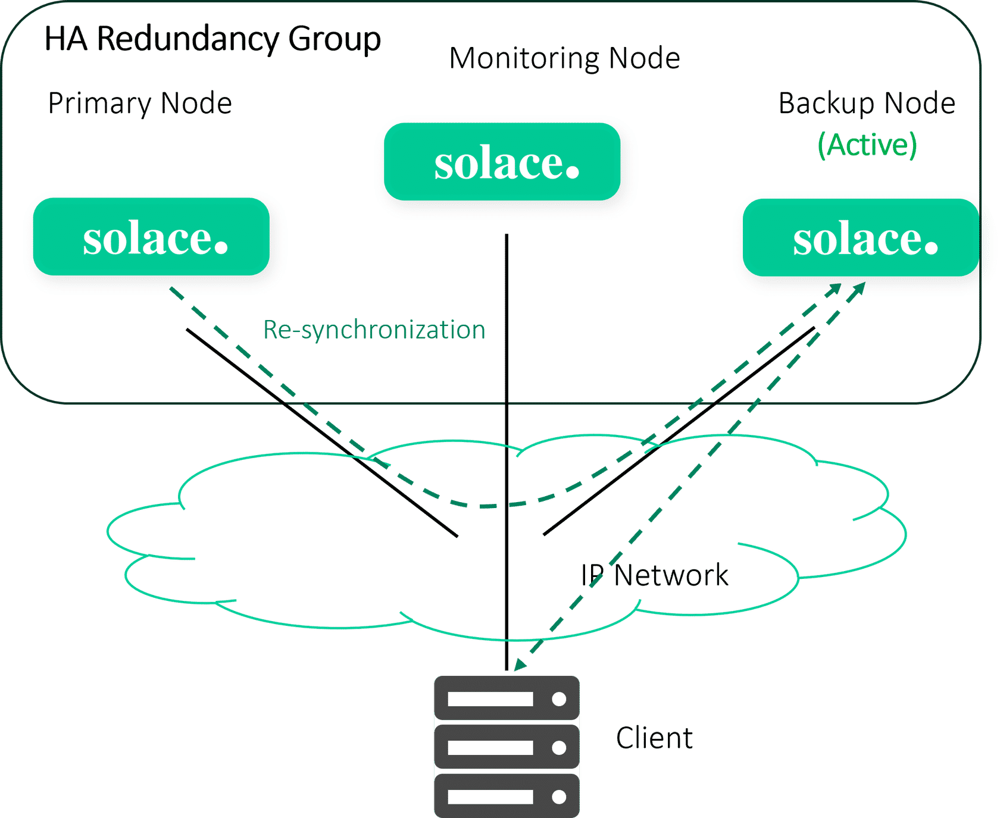

**Step 2** says **“Once re-synchronized, the primary node goes into a standby state.”** The original image shows the primary in **Standby** and the backup still **Active**.

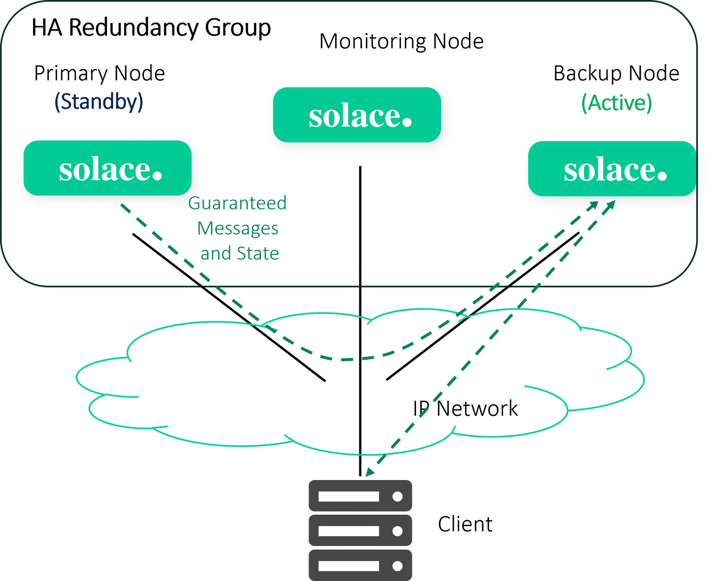

**Step 3** says the administrator runs the **`revert-activity`** command to return activity from the backup node to the primary node. The diagram shows the primary active, the backup in standby, and the **Revert Activity** action.

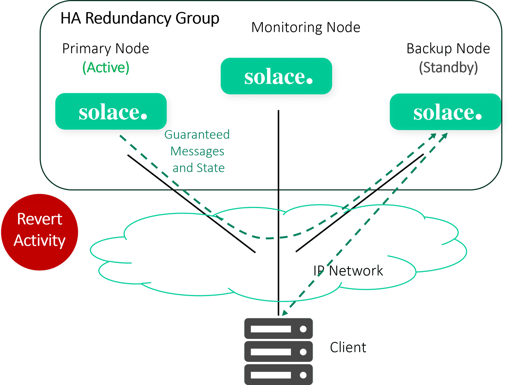

The Failback **Last step** control advances to a player state labeled **Step 4**. It contains only **START AGAIN** and the step navigation controls; it exposes no additional explanatory text or separate instructional image. The process is complete.

The Failback process exposes **Step 1**, **Step 2**, **Step 3**, and **Last step** controls. When it opened, the SCORM sidebar marked **What is High Availability with Solace? Completed** and the overall module showed **40% COMPLETE**.

The local images above are original PNG course assets served by the Academy lesson's exposed `assets/` paths. They were downloaded from those exact rendered image sources and visually checked. The original `` elements had no alt text, so the notes supply descriptive alt text. After opening both options, the lesson's internal progress indicator for this section reached **44% Completed**.

### Screen 5: Understanding the Administrator Perspective

The section is **Lesson 3 of 5**. Its introduction says administrators should check several settings on each router when configuring high availability. The sidebar shows **Understanding the Administrator Perspective — 13% Completed**, while the overall SCORM indicator remains **40% COMPLETE**.

For the **Primary Node as the Active Event Broker**, the course says **Redundancy Status** must be `Up`; **Operating Mode** must be `Message Routing Node` or `Monitoring Node`; **Active-Standby Role** must be `Primary`; and **Activity Status** must show `Local Active` for Primary and `Shutdown` for Backup. The displayed command and output are:

```text
primary_vmr(admin/config-sync)# show redundancy
Configuration Status     : Enabled
Redundancy Status        : Up
Operating Mode           : Message Routing Node
Switchover Mechanism     : Hostlist
Auto Revert              : No
Redundancy Mode          : Active/Standby
Active-Standby Role      : Primary
Mate Router Name         : backup_vmr
ADB Link To Mate         : Up
ADB Hello To Mate        : Up

                               Primary Virtual Router  Backup Virtual Router
                               ----------------------  ----------------------
Activity Status                Local Active            Shutdown
Routing Interface              intf0:1                 intf0:1
Routing Interface Status       Up
VRRP Status                    Initialize
VRRP Priority                  250
Message Spool Status           AD-Active
Priority Reported By Mate      Standby
```

For the **Backup Node as the Standby Event Broker**, the stated checks are **Redundancy Status** `Up`, **Operating Mode** `Message Routing Node`, **Active-Standby Role** `Backup`, Primary **Activity Status** `Shutdown`, Backup **Activity Status** `Mate Active`, and **Message Spool Status** `AD-Standby`. The displayed command and output are:

```text
backup_vmr(admin/config-sync)# show redundancy
Configuration Status     : Enabled
Redundancy Status        : Up
Operating Mode           : Message Routing Node
Switchover Mechanism     : Hostlist
Auto Revert              : No
Redundancy Mode          : Active/Standby
Active-Standby Role      : Backup
Mate Router Name         : primary_vmr
ADB Link To Mate         : Up
ADB Hello To Mate        : Up

                               Primary Virtual Router  Backup Virtual Router
                               ----------------------  ----------------------
Activity Status                Shutdown                Mate Active
Routing Interface              intf0:1                 intf0:1
Routing Interface Status                               Up
VRRP Status                                            Initialize
VRRP Priority                                          100
Message Spool Status                                   AD-Standby
Priority Reported By Mate                              Active
```

For the **Monitoring Node**, **Redundancy Status** must be `Up` and **Operating Mode** must be `Monitoring Node`.

Under **Controlled Failovers**, the course gives in-service upgrades as an example of a manually initiated failover and shows this command sequence:

```text
solace_primary# configure
solace_primary(configure)# redundancy
solace_primary(configure/redundancy)# release-activity
```

After running `release-activity`, the primary is instructed not to take activity back, including during an automatic or uncontrolled failover.

Under **Failback**, the course first shows how to let the primary accept activity again:

```text
solace_primary# configure
solace_primary(configure)# redundancy
solace_primary(configure/redundancy)# no release-activity
```

To return activity to the primary, it shows:

```text
solace_backup# admin
solace_backup(admin)# redundancy
solace_backup(admin/redundancy)# revert-activity
```

For an automatic failover, the course says only `revert-activity` on the backup is needed to return activity to the primary. Its recommendation is: **“Failbacks can be automatic or manual, but Solace always recommends a manual failback.”** The accompanying diagram depicts the primary and backup event broker nodes and a monitoring node in an HA redundancy group, with client connections and replication activity.


The original image is `assets/_JiLso/revert.png`, read from the visible image element and downloaded from that exact course URL; the PNG signature was checked and the image was visually inspected.

**Next:** Continue to **4 of 5 — Config-Sync** and record that screen before advancing.

### Screen 6: Config-Sync

This is **Lesson 4 of 5**. Under **What is it?**, the course defines configuration synchronization (config-sync) as a distributed-systems and fault-tolerance feature that keeps configuration settings consistent across all nodes or instances. In Solace systems, it automates consistency across pairs or groups of message/event brokers, including messaging-service, security, and operational settings, so other nodes can continue operating if a node fails.

The course compares config-sync to a corporate office distributing branding guidelines to franchise locations: each location follows consistent standards, just as each broker node maintains the same configuration. Its stated benefits are functional equivalence between two Solace message routers and the ability to make changes on either router in the pair and propagate those changes to its mate. This reduces operational complexity and the risk of mismatched configurations.

The course says a PubSub+ event broker maintains two types of configuration information: **system-level configuration information** and **configuration information for each message VPN**. In HA redundant pairs or replicated data centers, Config-Sync automatically propagates changes in both types between two event brokers. Config-Sync relies on **guaranteed messaging**, which must be configured and enabled on each participating broker.


The local original course image was read from the visible image element's exact `assets/AdobeStock_411448069.jpg` URL, downloaded, signature-checked as JPEG, and visually inspected. The original image element had no alt text, so this note supplies a descriptive alt.

On entering this section, the SCORM module showed **60% COMPLETE**; the sidebar showed **Understanding the Administrator Perspective Completed** and **Config-Sync Unstarted**. The course screen's progress indicator shows **33% Completed**. The Academy course overview still shows **6 of 14 lessons completed**, with Guaranteed Messaging at **0 of 1** and **In progress**.

**Next:** Open **5 of 5 — Quiz** and record each quiz screen, answer, and feedback before moving on.

### Screen 7: Quiz questions

The final section is **Lesson 5 of 5**. The quiz introduction says, **“Now let's see if we have enough information to help out Haroldo.”** The sidebar shows **What's the Scenario?**, **What is High Availability with Solace?**, **Understanding the Administrator Perspective**, and **Config-Sync** as **Completed**; **Quiz** is **Unstarted**. The overall module shows **80% COMPLETE**.

Three knowledge checks are visible:

1. **Fill in the blank:** “High Availability gives you what percentage of availability (to 2 integers beyond the decimal point)?”
2. **Multiple choice:** “What is the primary goal of implementing a high availability (HA) system?” Options: “to ensure system updates are applied simultaneously across all nodes”; “to maximize system downtime for maintenance”; “to ensure a system remains operational even in the event of a failure”; “to reduce the cost of system operations.”
3. **Multiple choice:** “Which of the following is a common strategy used to achieve high availability in distributed systems?” Options: “single point of failure”; “manual synchronization of system configurations”; “load balancing and redundant systems”; “decreasing system resources.”

1. For the fill-in question, submitted **`99.99`**. The exact course feedback was: **“Correct. Acceptable responses: 99.99, %99.99, 99.99%. Your answer: 99.99.”** The check is marked **Correct** and offers **TAKE AGAIN**.
2. For the primary-goal question, selected **“to ensure a system remains operational even in the event of a failure”**. The exact course feedback was: **“Correct. Correct answer: to ensure a system remains operational even in the event of a failure. Your answer: to ensure a system remains operational even in the event of a failure.”** The response is marked **Correct**; the other three choices are marked **Correctly unselected**.

3. For the distributed-systems strategy question, selected **“load balancing and redundant systems”**. The exact feedback was: **“Correct. Correct answer: load balancing and redundant systems. Your answer: load balancing and redundant systems.”** The selected option is marked **Correctly selected** and the other choices **Correctly unselected**. The question shows **Correct**.

After these three correct answers, the SCORM module shows **100% COMPLETE** and the sidebar marks **Quiz Completed**. The four preceding sections also show **Completed**. This establishes completion within the SCORM module; verify the Academy syllabus status after closing the module.

After closing the SCORM player, the Academy course page still reports **Course in progress, 6 of 14 lessons completed**. In the syllabus, **High Availability** remains **0 of 1 completed** and its individual row shows only **Content type: SCORM**, without a Completed status. The SCORM completion has therefore not propagated to the Academy lesson counter.

## Visuals

Key lesson diagrams are stored under `img/` and referenced above. Continue capturing other exposed original course visuals as their sections are opened.
